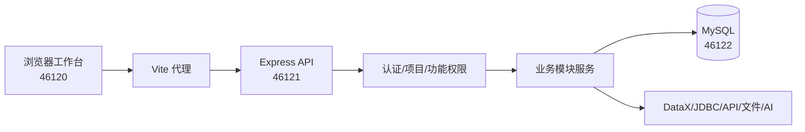

# 数据平台项目操作手册

> 扫描基线：`dev` / `d2eeaca4c3fb562b9f064a6229178365998e68e4` · 生成时间：2026-08-12T02:19:27.335Z
>
> 本手册由当前 dev 分支源码静态扫描生成。请求体字段以接口记录中的 validation schema 和对应控制器为准；敏感配置只通过环境变量或平台密钥注入。

## 1. 范围与快速结论

本版本包含 23 个后端挂载模块、596 条 HTTP 路由声明、84 个前端访问路径，覆盖资产检索、数据接入、数据开发、质量管控、数据地图、数据标准、数据建模实验室、数据服务、报表平台和系统管理。完整接口逐条目录见 [api-inventory.json](./api-inventory.json)。

## 2. 架构和请求链路



前端默认将 `/api/v1` 请求代理到后台；请求客户端会自动添加 `Authorization: Bearer <token>` 和当前项目的 `X-Project-Id`。文件上传使用 `multipart/form-data`，普通接口使用 JSON。

## 3. 启动、登录和项目上下文

### 3.1 启动

| 项目 | 命令/地址 | 用途 |
|---|---|---|
| 依赖 | `docker compose --env-file .env -f compose.dev.yml up -d mysql` | 启动开发 MySQL |
| 后台 | `cd backend && npm run dev` | 监听 `46121` |
| 前端 | `cd frontend && npm run dev -- --force` | 监听 `46120` |
| 工作台 | `http://127.0.0.1:46120/login` | 浏览器登录入口 |
| 健康检查 | `curl http://127.0.0.1:46121/api/health` | 返回 `status=ok` |
| 数据库 | `127.0.0.1:46122` | 开发 MySQL 映射端口 |

启动前复制 `.env.example` 为 `.env`，按本机环境填写；不要把 `.env` 或真实凭据提交到 Git。启动脚本还会执行种子资产导入，已有业务键冲突时应保留现有数据并检查导入日志。

### 3.2 登录与请求头

登录入口为 `/login`，对应 `POST /api/auth/login`（兼容路由 `POST /api/v1/auth/login`）。成功后将返回的 token 作为后续请求头：

```http
Authorization: Bearer <token>
X-Project-Id: <projectId>
Content-Type: application/json
```

未登录、token 过期或项目无权访问时通常返回 HTTP 401/403；请求体 schema 不通过时返回 HTTP 400。

### 3.3 响应包络

成功响应通常为：

```json
{
  "success": true,
  "data": {},
  "meta": {}
}
```

失败响应通常为：

```json
{
  "success": false,
  "message": "请求参数校验失败",
  "details": { }
}
```

## 4. 前端访问路径总览

| 模块 | 访问路径 |
|---|---|
| asset-search | /dashboard/asset-search<br>/dashboard/asset-search/business-data<br>/dashboard/asset-search/models |
| data-development | /dashboard/data-development/workbench2<br>/dashboard/data-development/operator-platform<br>/dashboard/data-development/datasources<br>/dashboard/data-development/sql-tasks<br>/dashboard/data-development/processing<br>/dashboard/data-development/scheduling<br>/dashboard/data-development/models<br>/dashboard/data-development<br>/dashboard/data-development/workbench<br>/dashboard/data-development/orchestration |
| data-file-imports | /dashboard/data-file-imports |
| data-ingestion-ai | /dashboard/data-ingestion-ai |
| data-ingestion-jobs | /dashboard/data-ingestion-jobs |
| data-ingestion-monitor | /dashboard/data-ingestion-monitor |
| data-map | /dashboard/data-map/resources<br>/dashboard/data-map/departments<br>/dashboard/data-map/systems<br>/dashboard/data-map/sources<br>/dashboard/data-map/models<br>/dashboard/data-map |
| data-modeling | /dashboard/data-modeling/model-overview<br>/dashboard/data-modeling/simulation<br>/dashboard/data-modeling/research<br>/dashboard/data-modeling/logical-models<br>/dashboard/data-modeling/scenes<br>/dashboard/data-modeling/prompts<br>/dashboard/data-modeling/physical-models<br>/dashboard/data-modeling/ai-business-data<br>/dashboard/data-modeling<br>/dashboard/data-modeling/data-sources |
| data-source-research | /dashboard/data-source-research |
| data-sources | /dashboard/data-sources |
| data-standards | /dashboard/data-standards/overview<br>/dashboard/data-standards/catalogs<br>/dashboard/data-standards/elements<br>/dashboard/data-standards/value-domains<br>/dashboard/data-standards/references<br>/dashboard/data-standards/mappings<br>/dashboard/data-standards/models<br>/dashboard/data-standards |
| overview | /dashboard/overview |
| processing | /dashboard/processing |
| processing-rules | /dashboard/processing-rules |
| processing-schedule | /dashboard/processing-schedule |
| quality-control | /dashboard/quality-control/data-sources<br>/dashboard/quality-control/insights<br>/dashboard/quality-control/rules<br>/dashboard/quality-control/strategies<br>/dashboard/quality-control/tasks<br>/dashboard/quality-control/analysis<br>/dashboard/quality-control/reports<br>/dashboard/quality-control/issues<br>/dashboard/quality-control/models<br>/dashboard/quality-control |
| reporting | /dashboard/reporting/overview<br>/dashboard/reporting/data-sources<br>/dashboard/reporting/datasets<br>/dashboard/reporting/workbench<br>/dashboard/reporting/chart-library<br>/dashboard/reporting/theme-templates<br>/dashboard/reporting/models<br>/dashboard/reporting |
| service-apps | /dashboard/service-apps |
| service-audit | /dashboard/service-audit |
| service-authorizations | /dashboard/service-authorizations |
| service-data-sources | /dashboard/service-data-sources |
| service-models | /dashboard/service-models |
| service-ops | /dashboard/service-ops |
| service-usage | /dashboard/service-usage |
| services | /dashboard/services |
| system | /dashboard/system |
| system-database-drivers | /dashboard/system-database-drivers |
| system-knowledge-bases | /dashboard/system-knowledge-bases/industry<br>/dashboard/system-knowledge-bases/platform<br>/dashboard/system-knowledge-bases/personal<br>/dashboard/system-knowledge-bases |
| system-models | /dashboard/system-models |
| system-projects | /dashboard/system-projects |
| system-roles | /dashboard/system-roles |
| system-services | /dashboard/system-services |
| system-users | /dashboard/system-users |

页面是否可见还受用户权限和 feature guard 影响；页面路径存在不等于当前账号一定可操作。

## 5. 模块操作指南

### 5.1 认证与会话（`auth`）

**目标：** 建立登录会话、读取当前用户并退出。
**页面：** 无独立前端路径或由其他页面调用。
**操作：** 打开登录页 → POST 登录 → 保存返回 token → 后续请求带 Bearer token。
**输入：** 用户名、密码（以 loginSchema 为准）。
**输出：** 用户信息、会话 token；失败返回 401 和 message。
**接口前缀：** `/api/v1/auth`；**路由数：** 4。
**核心入口示例：** `POST /api/v1/auth/login`、`GET /api/v1/auth/profile`、`POST /api/v1/auth/logout`、`POST /api/v1/auth/logout-beacon`。完整路由见第 6 节和 JSON 清单。

### 5.2 项目空间（`projects`）

**目标：** 选择项目上下文并管理项目资产包。
**页面：** 无独立前端路径或由其他页面调用。
**操作：** 创建/选择项目 → 导入前预览 → 确认导入 → 查看备份或导出。
**输入：** 项目基本信息、multipart 项目资产包、成员信息。
**输出：** 项目详情、资产导入预览/结果、备份下载流。
**接口前缀：** `/api/v1/projects`；**路由数：** 17。
**核心入口示例：** `GET /api/v1/projects/my`、`GET /api/v1/projects/asset-transfer-logs`、`POST /api/v1/projects/assets/import/preview`、`POST /api/v1/projects/assets/import`、`GET /api/v1/projects`。完整路由见第 6 节和 JSON 清单。

### 5.3 平台总览（`platform`）

**目标：** 查看平台总览与运行能力。
**页面：** 无独立前端路径或由其他页面调用。
**操作：** 进入运营总览 → 查看模块统计 → 检查数据库能力。
**输入：** 通常为查询参数。
**输出：** 平台统计、数据库驱动能力和运行状态。
**接口前缀：** `/api/v1/platform`；**路由数：** 1。
**核心入口示例：** `GET /api/v1/platform/overview`。完整路由见第 6 节和 JSON 清单。

### 5.4 资产检索（`asset-search`）

**目标：** 检索元数据和业务数据。
**页面：** `/dashboard/asset-search`、`/dashboard/asset-search/business-data`、`/dashboard/asset-search/models`。
**操作：** 选择标准数据元 → 输入精确值或关键词 → 执行检索 → 查看命中表/字段和样例。
**输入：** 检索条件、分页、项目上下文、标准数据元条件。
**输出：** 命中资源、字段映射、业务数据行和分面统计。
**接口前缀：** `/api/v1/asset-search`；**路由数：** 8。
**核心入口示例：** `POST /api/v1/asset-search/search`、`POST /api/v1/asset-search/business-data/search`、`GET /api/v1/asset-search/suggest`、`GET /api/v1/asset-search/facets`、`GET /api/v1/asset-search/ai-configs`。完整路由见第 6 节和 JSON 清单。

### 5.5 数据地图（`data-map`）

**目标：** 维护组织、业务系统、数据源和资源目录。
**页面：** `/dashboard/data-map/resources`、`/dashboard/data-map/departments`、`/dashboard/data-map/systems`、`/dashboard/data-map/sources`、`/dashboard/data-map/models`、`/dashboard/data-map`。
**操作：** 建立目录 → 注册数据源 → 同步资源 → 查看表字段画像和血缘。
**输入：** 组织/系统/数据源/资源表单，连接配置由运行环境提供。
**输出：** 目录对象、资源清单、字段画像、关系和采标信息。
**接口前缀：** `/api/v1/data-map`；**路由数：** 41。
**核心入口示例：** `GET /api/v1/data-map/overview`、`GET /api/v1/data-map/departments`、`POST /api/v1/data-map/departments`、`PUT /api/v1/data-map/departments/:id`、`DELETE /api/v1/data-map/departments/:id`。完整路由见第 6 节和 JSON 清单。

### 5.6 数据标准（`data-standards`）

**目标：** 维护数据标准、数据元和值域。
**页面：** `/dashboard/data-standards/overview`、`/dashboard/data-standards/catalogs`、`/dashboard/data-standards/elements`、`/dashboard/data-standards/value-domains`、`/dashboard/data-standards/references`、`/dashboard/data-standards/mappings`、`/dashboard/data-standards/models`、`/dashboard/data-standards`。
**操作：** 创建标准目录 → 定义标准数据元 → 配置值域/引用标准 → 建立字段采标映射。
**输入：** 标准目录、数据元、值域、引用标准、映射 JSON。
**输出：** 标准对象、版本、映射结果和校验消息。
**接口前缀：** `/api/v1/data-standards`；**路由数：** 31。
**核心入口示例：** `GET /api/v1/data-standards/overview`、`GET /api/v1/data-standards/import-templates`、`GET /api/v1/data-standards/exports`、`GET /api/v1/data-standards/imports`、`GET /api/v1/data-standards/imports/:id/errors`。完整路由见第 6 节和 JSON 清单。

### 5.7 数据源接入（`data-sources`）

**目标：** 登记可用于接入和治理的数据源。
**页面：** `/dashboard/data-sources`。
**操作：** 新增数据源 → 测试连接 → 浏览数据库/表/字段 → 保存并同步。
**输入：** 数据源类型和连接配置；密码只在运行环境注入。
**输出：** 连接状态、数据库/表/字段元数据。
**接口前缀：** `/api/v1/data-sources`；**路由数：** 9。
**核心入口示例：** `GET /api/v1/data-sources`、`GET /api/v1/data-sources/:id/tasks`、`GET /api/v1/data-sources/:id/tables`、`GET /api/v1/data-sources/:id/tables/:tableName/columns`、`GET /api/v1/data-sources/:id/tables/:tableName/sample`。完整路由见第 6 节和 JSON 清单。

### 5.8 数据调研（`data-source-research`）

**目标：** 对物理数据源做结构、关系和语义调研。
**页面：** `/dashboard/data-source-research`。
**操作：** 选择数据源 → 选择表 → 启动调研 → 查看字段/关系/报告 → 处理失败日志。
**输入：** 数据源、表范围、研究批次和可选 AI 配置。
**输出：** 调研运行、表字段快照、关系、报告和错误日志。
**接口前缀：** `/api/v1/data-source-research`；**路由数：** 18。
**核心入口示例：** `GET /api/v1/data-source-research/tasks`、`POST /api/v1/data-source-research/tasks`、`GET /api/v1/data-source-research/tasks/:taskId`、`PUT /api/v1/data-source-research/tasks/:taskId`、`DELETE /api/v1/data-source-research/tasks/:taskId`。完整路由见第 6 节和 JSON 清单。

### 5.9 建模数据源（`data-modeling-sources`）

**目标：** 提供建模场景可用的数据源。
**页面：** 无独立前端路径或由其他页面调用。
**操作：** 选择或登记建模数据源 → 浏览可建模表 → 供场景模型生成使用。
**输入：** 数据源和表筛选条件。
**输出：** 建模数据源及实体元数据。
**接口前缀：** `/api/v1/data-modeling-sources`；**路由数：** 9。
**核心入口示例：** `GET /api/v1/data-modeling-sources`、`GET /api/v1/data-modeling-sources/:id/scenes`、`GET /api/v1/data-modeling-sources/:id/tables`、`GET /api/v1/data-modeling-sources/:id/tables/:tableName/columns`、`GET /api/v1/data-modeling-sources/:id/tables/:tableName/sample`。完整路由见第 6 节和 JSON 清单。

### 5.10 接入任务（`ingestion-tasks`）

**目标：** 配置 API、数据库和文件接入任务。
**页面：** 无独立前端路径或由其他页面调用。
**操作：** 选择来源 → 配置目标和字段映射 → 预览 → 保存 → 启动/运行 → 查看运行日志。
**输入：** 来源配置、目标表、增量游标、字段映射、任务调度。
**输出：** 任务定义、运行记录、写入记录数和失败摘要。
**接口前缀：** `/api/v1/ingestion-tasks`；**路由数：** 14。
**核心入口示例：** `GET /api/v1/ingestion-tasks/monitor-overview`、`GET /api/v1/ingestion-tasks`、`GET /api/v1/ingestion-tasks/:id`、`POST /api/v1/ingestion-tasks`、`PUT /api/v1/ingestion-tasks/:id`。完整路由见第 6 节和 JSON 清单。

### 5.11 文件导入（`file-imports`）

**目标：** 上传文件并将资产导入平台。
**页面：** 无独立前端路径或由其他页面调用。
**操作：** 选择文件 → 预检 → 查看解析片段 → 确认导入 → 查看导入错误。
**输入：** multipart 文件、导入模式和项目字段。
**输出：** 解析状态、片段、导入任务和错误明细。
**接口前缀：** `/api/v1/file-imports`；**路由数：** 11。
**核心入口示例：** `GET /api/v1/file-imports`、`GET /api/v1/file-imports/:id`、`GET /api/v1/file-imports/:id/runs`、`GET /api/v1/file-imports/:id/runs/:runId/errors`、`POST /api/v1/file-imports/:id/runs/:runId/cancel`。完整路由见第 6 节和 JSON 清单。

### 5.12 模型提供商（`model-providers`）

**目标：** 配置并测试 AI 模型提供商。
**页面：** 无独立前端路径或由其他页面调用。
**操作：** 新增提供商 → 填写脱敏配置 → 测试连接 → 保存/更新。
**输入：** 提供商、模型名、端点和平台密钥引用。
**输出：** 连接测试结果、提供商配置（敏感值脱敏）。
**接口前缀：** `/api/v1/model-providers`；**路由数：** 5。
**核心入口示例：** `GET /api/v1/model-providers`、`POST /api/v1/model-providers/test-connection`、`POST /api/v1/model-providers`、`PUT /api/v1/model-providers/:id`、`DELETE /api/v1/model-providers/:id`。完整路由见第 6 节和 JSON 清单。

### 5.13 接入 AI 配置（`ingestion-ai-configs`）

**目标：** 配置数据接入场景的 AI 能力。
**页面：** 无独立前端路径或由其他页面调用。
**操作：** 查看配置 → 更新模型、提示词和参数 → 保存。
**输入：** 模型配置、提示词和限制参数。
**输出：** 版本化 AI 配置。
**接口前缀：** `/api/v1/ingestion-ai-configs`；**路由数：** 2。
**核心入口示例：** `GET /api/v1/ingestion-ai-configs`、`PUT /api/v1/ingestion-ai-configs/:id`。完整路由见第 6 节和 JSON 清单。

### 5.14 开发 AI 配置（`dev-ai-configs`）

**目标：** 配置数据开发 Copilot。
**页面：** 无独立前端路径或由其他页面调用。
**操作：** 选择模型 → 设置 SQL/编排辅助参数 → 保存并在工作台调用。
**输入：** 模型、提示词、token 限制和启用状态。
**输出：** 开发 AI 配置和 Copilot 会话。
**接口前缀：** `/api/v1/dev-ai-configs`；**路由数：** 2。
**核心入口示例：** `GET /api/v1/dev-ai-configs`、`PUT /api/v1/dev-ai-configs/:id`。完整路由见第 6 节和 JSON 清单。

### 5.15 报表 AI 配置（`reporting-ai-configs`）

**目标：** 配置报表 AI 分析和图表推荐。
**页面：** 无独立前端路径或由其他页面调用。
**操作：** 配置模型 → 在报表工作台调用分析/推荐 → 审核生成 SQL。
**输入：** 模型和图表分析参数。
**输出：** 分析建议、SQL 计划、字段映射和查询结果。
**接口前缀：** `/api/v1/reporting-ai-configs`；**路由数：** 2。
**核心入口示例：** `GET /api/v1/reporting-ai-configs`、`PUT /api/v1/reporting-ai-configs/:id`。完整路由见第 6 节和 JSON 清单。

### 5.16 系统管理（`system-management`）

**目标：** 管理服务、数据库驱动、用户和角色。
**页面：** 无独立前端路径或由其他页面调用。
**操作：** 查看系统项 → 执行启停/驱动校验 → 管理用户角色 → 检查操作日志。
**输入：** 服务动作、驱动包 multipart、用户/角色表单。
**输出：** 服务状态、驱动版本与日志、用户角色资源。
**接口前缀：** `/api/v1/system-management`；**路由数：** 27。
**核心入口示例：** `GET /api/v1/system-management/services`、`POST /api/v1/system-management/services`、`POST /api/v1/system-management/services/actions/restart-web-stack`、`POST /api/v1/system-management/services/actions/start-default`、`POST /api/v1/system-management/services/actions/run-kafka-demo-pump`。完整路由见第 6 节和 JSON 清单。

### 5.17 知识库（`system-knowledge-bases`）

**目标：** 维护平台/行业/个人知识库和文档。
**页面：** `/dashboard/system-knowledge-bases/industry`、`/dashboard/system-knowledge-bases/platform`、`/dashboard/system-knowledge-bases/personal`、`/dashboard/system-knowledge-bases`。
**操作：** 创建知识库 → 上传文档 → 解析/重新解析 → 浏览预览 → 下载或删除。
**输入：** 知识库表单、multipart 文档、关联孵化任务。
**输出：** 知识库详情、文档解析状态、预览内容或下载流。
**接口前缀：** `/api/v1/system-knowledge-bases`；**路由数：** 12。
**核心入口示例：** `GET /api/v1/system-knowledge-bases`、`POST /api/v1/system-knowledge-bases`、`POST /api/v1/system-knowledge-bases/documents/:documentId/reparse`、`GET /api/v1/system-knowledge-bases/documents/:documentId/preview`、`GET /api/v1/system-knowledge-bases/documents/:documentId/content`。完整路由见第 6 节和 JSON 清单。

### 5.18 数据开发（`data-development`）

**目标：** 执行 SQL、脚本、处理、编排和调度。
**页面：** `/dashboard/data-development/workbench2`、`/dashboard/data-development/operator-platform`、`/dashboard/data-development/datasources`、`/dashboard/data-development/sql-tasks`、`/dashboard/data-development/processing`、`/dashboard/data-development/scheduling`、`/dashboard/data-development/models`、`/dashboard/data-development`、`/dashboard/data-development/workbench`、`/dashboard/data-development/orchestration`。
**操作：** 配置数据源 → 建立脚本/任务 → 预览 SQL → 保存编排 → 校验/运行 → 查看实例日志。
**输入：** 数据源、SQL、脚本、节点图、调度配置和运行参数。
**输出：** 查询结果、脚本版本、编译 SQL、运行实例和日志。
**接口前缀：** `/api/v1/data-development`；**路由数：** 82。
**核心入口示例：** `POST /api/v1/data-development/datasources/test`、`GET /api/v1/data-development/datasources`、`GET /api/v1/data-development/datasources/:id`、`POST /api/v1/data-development/datasources`、`PUT /api/v1/data-development/datasources/:id`。完整路由见第 6 节和 JSON 清单。

### 5.19 数据建模实验室（`data-modeling`）

**目标：** 在数据实验室完成知识库、场景、逻辑/物理模型和模拟数据。
**页面：** `/dashboard/data-modeling/model-overview`、`/dashboard/data-modeling/simulation`、`/dashboard/data-modeling/research`、`/dashboard/data-modeling/logical-models`、`/dashboard/data-modeling/scenes`、`/dashboard/data-modeling/prompts`、`/dashboard/data-modeling/physical-models`、`/dashboard/data-modeling/ai-business-data`、`/dashboard/data-modeling`、`/dashboard/data-modeling/data-sources`。
**操作：** 创建知识库/场景 → 分析并生成 schema → 调整确认 → 生成策略/模型 → 部署或生成数据 → 查看质量报告。
**输入：** 知识库文档、场景配置、模型版本、生成计划和脏数据参数。
**输出：** 场景、schema/策略版本、物理模型、模拟数据批次和质量报告。
**接口前缀：** `/api/v1/data-modeling`；**路由数：** 135。
**核心入口示例：** `GET /api/v1/data-modeling/kb/list`、`GET /api/v1/data-modeling/kb/detail/:id`、`POST /api/v1/data-modeling/kb/create`、`POST /api/v1/data-modeling/kb/update/:id`、`POST /api/v1/data-modeling/kb/upload`。完整路由见第 6 节和 JSON 清单。

### 5.20 质量管控（`quality-control`）

**目标：** 配置数据质量规则、策略、任务并分析结果。
**页面：** `/dashboard/quality-control/data-sources`、`/dashboard/quality-control/insights`、`/dashboard/quality-control/rules`、`/dashboard/quality-control/strategies`、`/dashboard/quality-control/tasks`、`/dashboard/quality-control/analysis`、`/dashboard/quality-control/reports`、`/dashboard/quality-control/issues`、`/dashboard/quality-control/models`、`/dashboard/quality-control`。
**操作：** 登记质量数据源 → 配置规则/字典 → 建立策略 → 创建任务 → 运行 → 查看分析、报告和问题。
**输入：** 数据源、正则/字典规则、任务 SQL、策略和采样参数。
**输出：** 质量结果、批次统计、报告 Markdown/DOCX、问题与整改状态。
**接口前缀：** `/api/v1/quality-control`；**路由数：** 87。
**核心入口示例：** `GET /api/v1/quality-control/data-sources`、`POST /api/v1/quality-control/data-sources`、`PUT /api/v1/quality-control/data-sources/:sourceId`、`DELETE /api/v1/quality-control/data-sources/:sourceId`、`GET /api/v1/quality-control/data-sources/:sourceId/tables`。完整路由见第 6 节和 JSON 清单。

### 5.21 数据服务（`data-services`）

**目标：** 构建、发布和运营数据服务。
**页面：** 无独立前端路径或由其他页面调用。
**操作：** 登记服务数据源 → 定义服务/参数 → 配置应用与授权 → 发布 → 调试/调用 → 查看审计。
**输入：** 服务定义、查询配置、应用、授权和调用参数。
**输出：** 服务目录、调试结果、调用日志、运营指标。
**接口前缀：** `/api/v1/data-services`；**路由数：** 30。
**核心入口示例：** `GET /api/v1/data-services/overview`、`GET /api/v1/data-services/ops-dashboard`、`GET /api/v1/data-services/data-sources`、`POST /api/v1/data-services/data-sources`、`PUT /api/v1/data-services/data-sources/:id`。完整路由见第 6 节和 JSON 清单。

### 5.22 数据服务运行时（`service-runtime`）

**目标：** 调用已发布的数据服务运行时接口。
**页面：** 无独立前端路径或由其他页面调用。
**操作：** 使用服务运行时 URL → 按服务定义提交参数 → 读取分页结果。
**输入：** 服务标识、授权信息和业务查询参数。
**输出：** 服务数据结果、分页元数据和调用状态。
**接口前缀：** `/api/service`；**路由数：** 2。
**核心入口示例：** `GET /api/service/*`、`POST /api/service/*`。完整路由见第 6 节和 JSON 清单。

### 5.23 报表平台（`reporting`）

**目标：** 建设数据集、图表、主题和仪表盘。
**页面：** `/dashboard/reporting/overview`、`/dashboard/reporting/data-sources`、`/dashboard/reporting/datasets`、`/dashboard/reporting/workbench`、`/dashboard/reporting/chart-library`、`/dashboard/reporting/theme-templates`、`/dashboard/reporting/models`、`/dashboard/reporting`。
**操作：** 登记报表数据源 → 建数据集 → 配图表/主题 → 编排仪表盘 → 预览/发布。
**输入：** 数据源、数据集查询、图表配置、主题和仪表盘布局。
**输出：** 数据集预览、图表数据、仪表盘草稿/发布结果。
**接口前缀：** `/api/v1/reporting`；**路由数：** 41。
**核心入口示例：** `GET /api/v1/reporting/runtime/dashboards/:id/theme-templates`、`POST /api/v1/reporting/runtime/dashboards/:id/preview-chart`、`GET /api/v1/reporting/overview`、`POST /api/v1/reporting/ai/chart/analysis-suggestions`、`POST /api/v1/reporting/ai/chart/sql-plan`。完整路由见第 6 节和 JSON 清单。

## 6. 完整 API 接口目录

下面逐条列出静态扫描到的 HTTP 路由。`validation` 是代码中发现的 body/upload schema；若为 `—`，仍可能存在 query/path 参数约束。`authRequired=route-or-module` 表示模块或单路由中存在认证中间件，具体以源文件为准。

### 认证与会话 · `/api/v1/auth`（4 条）

| 方法 | 路径 | 控制器 | 输入校验 | 认证 | 功能权限 | 交互 | 源文件 |
|---|---|---|---|---|---|---|---|
| POST | `/api/v1/auth/login` | login | loginSchema | false | — | json-write | `backend/src/modules/auth/auth.routes.js` |
| GET | `/api/v1/auth/profile` | profile |  | route-or-module | — | json-read | `backend/src/modules/auth/auth.routes.js` |
| POST | `/api/v1/auth/logout` | logout |  | route-or-module | — | json-write | `backend/src/modules/auth/auth.routes.js` |
| POST | `/api/v1/auth/logout-beacon` | logoutBeacon |  | route-or-module | — | json-write | `backend/src/modules/auth/auth.routes.js` |

### 项目空间 · `/api/v1/projects`（17 条）

| 方法 | 路径 | 控制器 | 输入校验 | 认证 | 功能权限 | 交互 | 源文件 |
|---|---|---|---|---|---|---|---|
| GET | `/api/v1/projects/my` | listMyProjects |  | route-or-module | — | json-read | `backend/src/modules/project-spaces/project-space.routes.js` |
| GET | `/api/v1/projects/asset-transfer-logs` | listProjectAssetTransferLogs |  | route-or-module | — | json-read | `backend/src/modules/project-spaces/project-space.routes.js` |
| POST | `/api/v1/projects/assets/import/preview` | previewProjectAssetImport | multipart:file | route-or-module | — | multipart | `backend/src/modules/project-spaces/project-space.routes.js` |
| POST | `/api/v1/projects/assets/import` | importProjectAssets | multipart:file | route-or-module | — | multipart | `backend/src/modules/project-spaces/project-space.routes.js` |
| GET | `/api/v1/projects` | listProjects |  | route-or-module | — | json-read | `backend/src/modules/project-spaces/project-space.routes.js` |
| POST | `/api/v1/projects` | createProject | projectSchema | route-or-module | — | json-write | `backend/src/modules/project-spaces/project-space.routes.js` |
| GET | `/api/v1/projects/:id/assets/backups` | listProjectAssetBackups |  | route-or-module | — | json-read | `backend/src/modules/project-spaces/project-space.routes.js` |
| POST | `/api/v1/projects/:id/assets/backups` | createProjectAssetBackup |  | route-or-module | — | json-write | `backend/src/modules/project-spaces/project-space.routes.js` |
| GET | `/api/v1/projects/:id/assets/backups/:backupId/download` | downloadProjectAssetBackup |  | route-or-module | — | download | `backend/src/modules/project-spaces/project-space.routes.js` |
| GET | `/api/v1/projects/:id/assets/export` | exportProjectAssets |  | route-or-module | — | download | `backend/src/modules/project-spaces/project-space.routes.js` |
| GET | `/api/v1/projects/:id` | getProjectDetail |  | route-or-module | — | json-read | `backend/src/modules/project-spaces/project-space.routes.js` |
| PUT | `/api/v1/projects/:id` | updateProject | projectSchema | route-or-module | — | json-write | `backend/src/modules/project-spaces/project-space.routes.js` |
| DELETE | `/api/v1/projects/:id` | deleteProject |  | route-or-module | — | json-write | `backend/src/modules/project-spaces/project-space.routes.js` |
| POST | `/api/v1/projects/:id/default` | setDefaultProject |  | route-or-module | — | json-write | `backend/src/modules/project-spaces/project-space.routes.js` |
| POST | `/api/v1/projects/:id/status` | updateProjectStatus | projectStatusSchema | route-or-module | — | json-write | `backend/src/modules/project-spaces/project-space.routes.js` |
| POST | `/api/v1/projects/:id/members` | upsertProjectMember | projectMemberSchema | route-or-module | — | json-write | `backend/src/modules/project-spaces/project-space.routes.js` |
| DELETE | `/api/v1/projects/:id/members/:userId` | removeProjectMember |  | route-or-module | — | json-write | `backend/src/modules/project-spaces/project-space.routes.js` |

### 平台总览 · `/api/v1/platform`（1 条）

| 方法 | 路径 | 控制器 | 输入校验 | 认证 | 功能权限 | 交互 | 源文件 |
|---|---|---|---|---|---|---|---|
| GET | `/api/v1/platform/overview` | overview |  | route-or-module | "overview" | json-read | `backend/src/modules/platform/platform.routes.js` |

### 资产检索 · `/api/v1/asset-search`（8 条）

| 方法 | 路径 | 控制器 | 输入校验 | 认证 | 功能权限 | 交互 | 源文件 |
|---|---|---|---|---|---|---|---|
| POST | `/api/v1/asset-search/search` | search | searchSchema | route-or-module | ["data_map", "ingestion", "quality", "services"] | json-write | `backend/src/modules/asset-search/asset-search.routes.js` |
| POST | `/api/v1/asset-search/business-data/search` | businessDataSearch | businessDataSearchSchema | route-or-module | ["data_map", "ingestion", "quality", "services"] | json-write | `backend/src/modules/asset-search/asset-search.routes.js` |
| GET | `/api/v1/asset-search/suggest` | suggest |  | route-or-module | ["data_map", "ingestion", "quality", "services"] | json-read | `backend/src/modules/asset-search/asset-search.routes.js` |
| GET | `/api/v1/asset-search/facets` | facets |  | route-or-module | ["data_map", "ingestion", "quality", "services"] | json-read | `backend/src/modules/asset-search/asset-search.routes.js` |
| GET | `/api/v1/asset-search/ai-configs` | listAiConfigs |  | route-or-module | ["data_map", "ingestion", "quality", "services"] | json-read | `backend/src/modules/asset-search/asset-search.routes.js` |
| PUT | `/api/v1/asset-search/ai-configs/:id` | updateAiConfig | aiConfigSchema | route-or-module | ["data_map", "ingestion", "quality", "services"] | json-write | `backend/src/modules/asset-search/asset-search.routes.js` |
| GET | `/api/v1/asset-search/ai-runs` | listAiRuns |  | route-or-module | ["data_map", "ingestion", "quality", "services"] | json-read | `backend/src/modules/asset-search/asset-search.routes.js` |
| POST | `/api/v1/asset-search/feedback` | feedback | feedbackSchema | route-or-module | ["data_map", "ingestion", "quality", "services"] | json-write | `backend/src/modules/asset-search/asset-search.routes.js` |

### 数据地图 · `/api/v1/data-map`（41 条）

| 方法 | 路径 | 控制器 | 输入校验 | 认证 | 功能权限 | 交互 | 源文件 |
|---|---|---|---|---|---|---|---|
| GET | `/api/v1/data-map/overview` | getOverview |  | route-or-module | "data_map" | json-read | `backend/src/modules/data-map/data-map.routes.js` |
| GET | `/api/v1/data-map/departments` | listDepartments |  | route-or-module | "data_map" | json-read | `backend/src/modules/data-map/data-map.routes.js` |
| POST | `/api/v1/data-map/departments` | createDepartment | departmentSchema | route-or-module | "data_map" | json-write | `backend/src/modules/data-map/data-map.routes.js` |
| PUT | `/api/v1/data-map/departments/:id` | updateDepartment | departmentSchema | route-or-module | "data_map" | json-write | `backend/src/modules/data-map/data-map.routes.js` |
| DELETE | `/api/v1/data-map/departments/:id` | deleteDepartment |  | route-or-module | "data_map" | json-write | `backend/src/modules/data-map/data-map.routes.js` |
| GET | `/api/v1/data-map/business-systems` | listBusinessSystems |  | route-or-module | "data_map" | json-read | `backend/src/modules/data-map/data-map.routes.js` |
| POST | `/api/v1/data-map/business-systems` | createBusinessSystem | businessSystemSchema | route-or-module | "data_map" | json-write | `backend/src/modules/data-map/data-map.routes.js` |
| PUT | `/api/v1/data-map/business-systems/:id` | updateBusinessSystem | businessSystemSchema | route-or-module | "data_map" | json-write | `backend/src/modules/data-map/data-map.routes.js` |
| DELETE | `/api/v1/data-map/business-systems/:id` | deleteBusinessSystem |  | route-or-module | "data_map" | json-write | `backend/src/modules/data-map/data-map.routes.js` |
| GET | `/api/v1/data-map/data-sources/external` | listExternalDataSources |  | route-or-module | "data_map" | json-read | `backend/src/modules/data-map/data-map.routes.js` |
| GET | `/api/v1/data-map/data-sources` | listDataSources |  | route-or-module | "data_map" | json-read | `backend/src/modules/data-map/data-map.routes.js` |
| POST | `/api/v1/data-map/data-sources` | createDataSource | dataSourceSchema | route-or-module | "data_map" | json-write | `backend/src/modules/data-map/data-map.routes.js` |
| PUT | `/api/v1/data-map/data-sources/:id` | updateDataSource | dataSourceSchema | route-or-module | "data_map" | json-write | `backend/src/modules/data-map/data-map.routes.js` |
| DELETE | `/api/v1/data-map/data-sources/:id` | deleteDataSource |  | route-or-module | "data_map" | json-write | `backend/src/modules/data-map/data-map.routes.js` |
| POST | `/api/v1/data-map/data-sources/test-connection` | testDataSource | testDataSourceSchema | route-or-module | "data_map" | json-write | `backend/src/modules/data-map/data-map.routes.js` |
| GET | `/api/v1/data-map/data-sources/:id/tables` | listDataSourceTables |  | route-or-module | "data_map" | json-read | `backend/src/modules/data-map/data-map.routes.js` |
| GET | `/api/v1/data-map/data-sources/:id/tables/:tableName/columns` | listDataSourceColumns |  | route-or-module | "data_map" | json-read | `backend/src/modules/data-map/data-map.routes.js` |
| GET | `/api/v1/data-map/catalogs/tree` | listCatalogTree |  | route-or-module | "data_map" | json-read | `backend/src/modules/data-map/data-map.routes.js` |
| GET | `/api/v1/data-map/catalogs` | listCatalogs |  | route-or-module | "data_map" | json-read | `backend/src/modules/data-map/data-map.routes.js` |
| POST | `/api/v1/data-map/catalogs` | createCatalog | catalogSchema | route-or-module | "data_map" | json-write | `backend/src/modules/data-map/data-map.routes.js` |
| PUT | `/api/v1/data-map/catalogs/:id` | updateCatalog | catalogSchema | route-or-module | "data_map" | json-write | `backend/src/modules/data-map/data-map.routes.js` |
| DELETE | `/api/v1/data-map/catalogs/:id` | deleteCatalog |  | route-or-module | "data_map" | json-write | `backend/src/modules/data-map/data-map.routes.js` |
| POST | `/api/v1/data-map/catalogs/:id/register-resources` | registerResources | registerResourcesSchema | route-or-module | "data_map" | json-write | `backend/src/modules/data-map/data-map.routes.js` |
| POST | `/api/v1/data-map/lineage/refresh-ingestion` | refreshIngestionLineage |  | route-or-module | "data_map" | json-write | `backend/src/modules/data-map/data-map.routes.js` |
| GET | `/api/v1/data-map/ai-configs` | listAiConfigs |  | route-or-module | "data_map" | json-read | `backend/src/modules/data-map/data-map.routes.js` |
| PUT | `/api/v1/data-map/ai-configs/:id` | updateAiConfig | aiConfigSchema | route-or-module | "data_map" | json-write | `backend/src/modules/data-map/data-map.routes.js` |
| GET | `/api/v1/data-map/search/resources` | searchResources |  | route-or-module | "data_map" | json-read | `backend/src/modules/data-map/data-map.routes.js` |
| GET | `/api/v1/data-map/resources` | listResources |  | route-or-module | "data_map" | json-read | `backend/src/modules/data-map/data-map.routes.js` |
| POST | `/api/v1/data-map/resources/batch-delete` | deleteResources | batchDeleteResourcesSchema | route-or-module | "data_map" | json-write | `backend/src/modules/data-map/data-map.routes.js` |
| GET | `/api/v1/data-map/resources/:id` | getResourceDetail |  | route-or-module | "data_map" | json-read | `backend/src/modules/data-map/data-map.routes.js` |
| PUT | `/api/v1/data-map/resources/:id` | updateResource | updateResourceSchema | route-or-module | "data_map" | json-write | `backend/src/modules/data-map/data-map.routes.js` |
| DELETE | `/api/v1/data-map/resources/:id` | deleteResource |  | route-or-module | "data_map" | json-write | `backend/src/modules/data-map/data-map.routes.js` |
| PUT | `/api/v1/data-map/resources/:id/content` | updateResourceContent | resourceContentSchema | route-or-module | "data_map" | json-write | `backend/src/modules/data-map/data-map.routes.js` |
| PUT | `/api/v1/data-map/resources/:id/fields/:columnName` | updateResourceField | updateResourceFieldSchema | route-or-module | "data_map" | json-write | `backend/src/modules/data-map/data-map.routes.js` |
| GET | `/api/v1/data-map/resources/:id/profile` | getResourceProfile |  | route-or-module | "data_map" | json-read | `backend/src/modules/data-map/data-map.routes.js` |
| POST | `/api/v1/data-map/resources/:id/profile/refresh` | refreshResourceProfile | refreshResourceProfileSchema | route-or-module | "data_map" | json-write | `backend/src/modules/data-map/data-map.routes.js` |
| POST | `/api/v1/data-map/resources/:id/profile/content-ai-analyze` | analyzeResourceContentProfile | analyzeResourceProfileSchema | route-or-module | "data_map" | json-write | `backend/src/modules/data-map/data-map.routes.js` |
| POST | `/api/v1/data-map/resources/:id/profile/fields-ai-analyze` | analyzeResourceFieldProfile | analyzeResourceProfileSchema | route-or-module | "data_map" | json-write | `backend/src/modules/data-map/data-map.routes.js` |
| POST | `/api/v1/data-map/resources/:id/profile/ai-analyze` | analyzeResourceProfile | analyzeResourceProfileSchema | route-or-module | "data_map" | json-write | `backend/src/modules/data-map/data-map.routes.js` |
| GET | `/api/v1/data-map/resources/:id/lineage-graph` | getResourceLineageGraph |  | route-or-module | "data_map" | json-read | `backend/src/modules/data-map/data-map.routes.js` |
| GET | `/api/v1/data-map/resources/:id/sample` | sampleResourceRows |  | route-or-module | "data_map" | json-read | `backend/src/modules/data-map/data-map.routes.js` |

### 数据标准 · `/api/v1/data-standards`（31 条）

| 方法 | 路径 | 控制器 | 输入校验 | 认证 | 功能权限 | 交互 | 源文件 |
|---|---|---|---|---|---|---|---|
| GET | `/api/v1/data-standards/overview` | getOverview |  | route-or-module | "standards" | json-read | `backend/src/modules/data-standards/data-standards.routes.js` |
| GET | `/api/v1/data-standards/import-templates` | downloadImportTemplate |  | route-or-module | "standards" | download | `backend/src/modules/data-standards/data-standards.routes.js` |
| GET | `/api/v1/data-standards/exports` | exportStandards |  | route-or-module | "standards" | download | `backend/src/modules/data-standards/data-standards.routes.js` |
| GET | `/api/v1/data-standards/imports` | listImportBatches |  | route-or-module | "standards" | json-read | `backend/src/modules/data-standards/data-standards.routes.js` |
| GET | `/api/v1/data-standards/imports/:id/errors` | downloadImportErrors |  | route-or-module | "standards" | download | `backend/src/modules/data-standards/data-standards.routes.js` |
| POST | `/api/v1/data-standards/imports/preview` | previewImport |  | route-or-module | "standards" | multipart | `backend/src/modules/data-standards/data-standards.routes.js` |
| POST | `/api/v1/data-standards/imports` | commitImport |  | route-or-module | "standards" | multipart | `backend/src/modules/data-standards/data-standards.routes.js` |
| GET | `/api/v1/data-standards/catalogs/tree` | listCatalogTree |  | route-or-module | "standards" | json-read | `backend/src/modules/data-standards/data-standards.routes.js` |
| GET | `/api/v1/data-standards/catalogs` | listCatalogs |  | route-or-module | "standards" | json-read | `backend/src/modules/data-standards/data-standards.routes.js` |
| POST | `/api/v1/data-standards/catalogs` | createCatalog | catalogSchema | route-or-module | "standards" | json-write | `backend/src/modules/data-standards/data-standards.routes.js` |
| PUT | `/api/v1/data-standards/catalogs/:id` | updateCatalog | catalogSchema | route-or-module | "standards" | json-write | `backend/src/modules/data-standards/data-standards.routes.js` |
| DELETE | `/api/v1/data-standards/catalogs/:id` | deleteCatalog |  | route-or-module | "standards" | json-write | `backend/src/modules/data-standards/data-standards.routes.js` |
| GET | `/api/v1/data-standards/reference-standards` | listReferenceStandards |  | route-or-module | "standards" | json-read | `backend/src/modules/data-standards/data-standards.routes.js` |
| POST | `/api/v1/data-standards/reference-standards` | createReferenceStandard | referenceStandardSchema | route-or-module | "standards" | json-write | `backend/src/modules/data-standards/data-standards.routes.js` |
| PUT | `/api/v1/data-standards/reference-standards/:id` | updateReferenceStandard | referenceStandardSchema | route-or-module | "standards" | json-write | `backend/src/modules/data-standards/data-standards.routes.js` |
| DELETE | `/api/v1/data-standards/reference-standards/:id` | deleteReferenceStandard |  | route-or-module | "standards" | json-write | `backend/src/modules/data-standards/data-standards.routes.js` |
| GET | `/api/v1/data-standards/value-domains` | listValueDomains |  | route-or-module | "standards" | json-read | `backend/src/modules/data-standards/data-standards.routes.js` |
| GET | `/api/v1/data-standards/value-domains/:id` | getValueDomainDetail |  | route-or-module | "standards" | json-read | `backend/src/modules/data-standards/data-standards.routes.js` |
| POST | `/api/v1/data-standards/value-domains` | createValueDomain | valueDomainSchema | route-or-module | "standards" | json-write | `backend/src/modules/data-standards/data-standards.routes.js` |
| PUT | `/api/v1/data-standards/value-domains/:id` | updateValueDomain | valueDomainSchema | route-or-module | "standards" | json-write | `backend/src/modules/data-standards/data-standards.routes.js` |
| DELETE | `/api/v1/data-standards/value-domains/:id` | deleteValueDomain |  | route-or-module | "standards" | json-write | `backend/src/modules/data-standards/data-standards.routes.js` |
| GET | `/api/v1/data-standards/elements` | listDataElements |  | route-or-module | "standards" | json-read | `backend/src/modules/data-standards/data-standards.routes.js` |
| GET | `/api/v1/data-standards/elements/:id` | getDataElementDetail |  | route-or-module | "standards" | json-read | `backend/src/modules/data-standards/data-standards.routes.js` |
| POST | `/api/v1/data-standards/elements` | createDataElement | dataElementSchema | route-or-module | "standards" | json-write | `backend/src/modules/data-standards/data-standards.routes.js` |
| PUT | `/api/v1/data-standards/elements/:id` | updateDataElement | dataElementSchema | route-or-module | "standards" | json-write | `backend/src/modules/data-standards/data-standards.routes.js` |
| POST | `/api/v1/data-standards/elements/:id/publish` | publishDataElement | publishElementSchema | route-or-module | "standards" | json-write | `backend/src/modules/data-standards/data-standards.routes.js` |
| DELETE | `/api/v1/data-standards/elements/:id` | deleteDataElement |  | route-or-module | "standards" | json-write | `backend/src/modules/data-standards/data-standards.routes.js` |
| GET | `/api/v1/data-standards/mappings` | listFieldMappings |  | route-or-module | "standards" | json-read | `backend/src/modules/data-standards/data-standards.routes.js` |
| GET | `/api/v1/data-standards/ai-configs` | listAiConfigs |  | route-or-module | "standards" | json-read | `backend/src/modules/data-standards/data-standards.routes.js` |
| PUT | `/api/v1/data-standards/ai-configs/:id` | updateAiConfig | aiConfigSchema | route-or-module | "standards" | json-write | `backend/src/modules/data-standards/data-standards.routes.js` |
| POST | `/api/v1/data-standards/ai/suggest-elements` | suggestDataElements | aiSuggestElementSchema | route-or-module | "standards" | json-write | `backend/src/modules/data-standards/data-standards.routes.js` |

### 数据源接入 · `/api/v1/data-sources`（9 条）

| 方法 | 路径 | 控制器 | 输入校验 | 认证 | 功能权限 | 交互 | 源文件 |
|---|---|---|---|---|---|---|---|
| GET | `/api/v1/data-sources` | listDataSources |  | route-or-module | "ingestion" | json-read | `backend/src/modules/data-sources/data-source.routes.js` |
| GET | `/api/v1/data-sources/:id/tasks` | listReferencedTasks |  | route-or-module | "ingestion" | json-read | `backend/src/modules/data-sources/data-source.routes.js` |
| GET | `/api/v1/data-sources/:id/tables` | listTables |  | route-or-module | "ingestion" | json-read | `backend/src/modules/data-sources/data-source.routes.js` |
| GET | `/api/v1/data-sources/:id/tables/:tableName/columns` | listColumns |  | route-or-module | "ingestion" | json-read | `backend/src/modules/data-sources/data-source.routes.js` |
| GET | `/api/v1/data-sources/:id/tables/:tableName/sample` | sampleRows |  | route-or-module | "ingestion" | json-read | `backend/src/modules/data-sources/data-source.routes.js` |
| POST | `/api/v1/data-sources` | createDataSource | createDataSourceSchema | route-or-module | "ingestion" | json-write | `backend/src/modules/data-sources/data-source.routes.js` |
| PUT | `/api/v1/data-sources/:id` | updateDataSource | updateDataSourceSchema | route-or-module | "ingestion" | json-write | `backend/src/modules/data-sources/data-source.routes.js` |
| DELETE | `/api/v1/data-sources/:id` | deleteDataSource |  | route-or-module | "ingestion" | json-write | `backend/src/modules/data-sources/data-source.routes.js` |
| POST | `/api/v1/data-sources/test-connection` | testConnection |  | route-or-module | "ingestion" | json-write | `backend/src/modules/data-sources/data-source.routes.js` |

### 数据调研 · `/api/v1/data-source-research`（18 条）

| 方法 | 路径 | 控制器 | 输入校验 | 认证 | 功能权限 | 交互 | 源文件 |
|---|---|---|---|---|---|---|---|
| GET | `/api/v1/data-source-research/tasks` | listResearchTasks |  | route-or-module | "ingestion" | json-read | `backend/src/modules/data-source-research/data-source-research.routes.js` |
| POST | `/api/v1/data-source-research/tasks` | createResearchTask | createResearchTaskSchema | route-or-module | "ingestion" | json-write | `backend/src/modules/data-source-research/data-source-research.routes.js` |
| GET | `/api/v1/data-source-research/tasks/:taskId` | getResearchTask |  | route-or-module | "ingestion" | json-read | `backend/src/modules/data-source-research/data-source-research.routes.js` |
| PUT | `/api/v1/data-source-research/tasks/:taskId` | updateResearchTask | updateResearchTaskSchema | route-or-module | "ingestion" | json-write | `backend/src/modules/data-source-research/data-source-research.routes.js` |
| DELETE | `/api/v1/data-source-research/tasks/:taskId` | deleteResearchTask |  | route-or-module | "ingestion" | json-write | `backend/src/modules/data-source-research/data-source-research.routes.js` |
| GET | `/api/v1/data-source-research/tasks/:taskId/runs` | listResearchTaskRuns |  | route-or-module | "ingestion" | json-read | `backend/src/modules/data-source-research/data-source-research.routes.js` |
| POST | `/api/v1/data-source-research/tasks/:taskId/runs` | createResearchTaskRun |  | route-or-module | "ingestion" | json-write | `backend/src/modules/data-source-research/data-source-research.routes.js` |
| GET | `/api/v1/data-source-research/tasks/:taskId/comparisons` | listResearchComparisons |  | route-or-module | "ingestion" | json-read | `backend/src/modules/data-source-research/data-source-research.routes.js` |
| POST | `/api/v1/data-source-research/tasks/:taskId/compare` | compareResearchReports | compareResearchReportsSchema | route-or-module | "ingestion" | json-write | `backend/src/modules/data-source-research/data-source-research.routes.js` |
| GET | `/api/v1/data-source-research/comparisons/:comparisonId` | getResearchComparison |  | route-or-module | "ingestion" | json-read | `backend/src/modules/data-source-research/data-source-research.routes.js` |
| POST | `/api/v1/data-source-research/source/:sourceId/runs` | createResearchRun | createResearchRunSchema | route-or-module | "ingestion" | json-write | `backend/src/modules/data-source-research/data-source-research.routes.js` |
| GET | `/api/v1/data-source-research/source/:sourceId/runs` | listResearchRuns |  | route-or-module | "ingestion" | json-read | `backend/src/modules/data-source-research/data-source-research.routes.js` |
| GET | `/api/v1/data-source-research/runs/:runId` | getResearchRun |  | route-or-module | "ingestion" | json-read | `backend/src/modules/data-source-research/data-source-research.routes.js` |
| GET | `/api/v1/data-source-research/runs/:runId/logs` | listResearchLogs |  | route-or-module | "ingestion" | json-read | `backend/src/modules/data-source-research/data-source-research.routes.js` |
| GET | `/api/v1/data-source-research/runs/:runId/report` | getResearchReport |  | route-or-module | "ingestion" | json-read | `backend/src/modules/data-source-research/data-source-research.routes.js` |
| GET | `/api/v1/data-source-research/runs/:runId/report.docx` | downloadResearchReportWord |  | route-or-module | "ingestion" | download | `backend/src/modules/data-source-research/data-source-research.routes.js` |
| POST | `/api/v1/data-source-research/runs/:runId/terminate` | terminateResearchRun |  | route-or-module | "ingestion" | json-write | `backend/src/modules/data-source-research/data-source-research.routes.js` |
| DELETE | `/api/v1/data-source-research/runs/:runId` | deleteResearchRun |  | route-or-module | "ingestion" | json-write | `backend/src/modules/data-source-research/data-source-research.routes.js` |

### 建模数据源 · `/api/v1/data-modeling-sources`（9 条）

| 方法 | 路径 | 控制器 | 输入校验 | 认证 | 功能权限 | 交互 | 源文件 |
|---|---|---|---|---|---|---|---|
| GET | `/api/v1/data-modeling-sources` | listDataSources |  | route-or-module | "data_modeling" | json-read | `backend/src/modules/data-lab-sources/data-lab-source.routes.js` |
| GET | `/api/v1/data-modeling-sources/:id/scenes` | listReferencedScenes |  | route-or-module | "data_modeling" | json-read | `backend/src/modules/data-lab-sources/data-lab-source.routes.js` |
| GET | `/api/v1/data-modeling-sources/:id/tables` | listTables |  | route-or-module | "data_modeling" | json-read | `backend/src/modules/data-lab-sources/data-lab-source.routes.js` |
| GET | `/api/v1/data-modeling-sources/:id/tables/:tableName/columns` | listColumns |  | route-or-module | "data_modeling" | json-read | `backend/src/modules/data-lab-sources/data-lab-source.routes.js` |
| GET | `/api/v1/data-modeling-sources/:id/tables/:tableName/sample` | sampleRows |  | route-or-module | "data_modeling" | json-read | `backend/src/modules/data-lab-sources/data-lab-source.routes.js` |
| POST | `/api/v1/data-modeling-sources` | createDataSource | createDataSourceSchema | route-or-module | "data_modeling" | json-write | `backend/src/modules/data-lab-sources/data-lab-source.routes.js` |
| PUT | `/api/v1/data-modeling-sources/:id` | updateDataSource | updateDataSourceSchema | route-or-module | "data_modeling" | json-write | `backend/src/modules/data-lab-sources/data-lab-source.routes.js` |
| DELETE | `/api/v1/data-modeling-sources/:id` | deleteDataSource |  | route-or-module | "data_modeling" | json-write | `backend/src/modules/data-lab-sources/data-lab-source.routes.js` |
| POST | `/api/v1/data-modeling-sources/test-connection` | testConnection |  | route-or-module | "data_modeling" | json-write | `backend/src/modules/data-lab-sources/data-lab-source.routes.js` |

### 接入任务 · `/api/v1/ingestion-tasks`（14 条）

| 方法 | 路径 | 控制器 | 输入校验 | 认证 | 功能权限 | 交互 | 源文件 |
|---|---|---|---|---|---|---|---|
| GET | `/api/v1/ingestion-tasks/monitor-overview` | getMonitorOverview |  | route-or-module | "ingestion" | json-read | `backend/src/modules/ingestion-tasks/ingestion-task.routes.js` |
| GET | `/api/v1/ingestion-tasks` | listTasks |  | route-or-module | "ingestion" | json-read | `backend/src/modules/ingestion-tasks/ingestion-task.routes.js` |
| GET | `/api/v1/ingestion-tasks/:id` | getTask |  | route-or-module | "ingestion" | json-read | `backend/src/modules/ingestion-tasks/ingestion-task.routes.js` |
| POST | `/api/v1/ingestion-tasks` | createTask | createTaskSchema | route-or-module | "ingestion" | json-write | `backend/src/modules/ingestion-tasks/ingestion-task.routes.js` |
| PUT | `/api/v1/ingestion-tasks/:id` | updateTask | updateTaskSchema | route-or-module | "ingestion" | json-write | `backend/src/modules/ingestion-tasks/ingestion-task.routes.js` |
| DELETE | `/api/v1/ingestion-tasks/:id` | deleteTask |  | route-or-module | "ingestion" | json-write | `backend/src/modules/ingestion-tasks/ingestion-task.routes.js` |
| POST | `/api/v1/ingestion-tasks/recommend-config` | recommendTaskConfig | recommendTaskConfigSchema | route-or-module | "ingestion" | json-write | `backend/src/modules/ingestion-tasks/ingestion-task.routes.js` |
| POST | `/api/v1/ingestion-tasks/parse-api-document` | parseApiDocument |  | route-or-module | "ingestion" | multipart | `backend/src/modules/ingestion-tasks/ingestion-task.routes.js` |
| POST | `/api/v1/ingestion-tasks/preview-source` | previewSourceData | previewSourceSchema | route-or-module | "ingestion" | json-write | `backend/src/modules/ingestion-tasks/ingestion-task.routes.js` |
| POST | `/api/v1/ingestion-tasks/:id/start` | startTask |  | route-or-module | "ingestion" | json-write | `backend/src/modules/ingestion-tasks/ingestion-task.routes.js` |
| POST | `/api/v1/ingestion-tasks/:id/stop` | stopTask |  | route-or-module | "ingestion" | json-write | `backend/src/modules/ingestion-tasks/ingestion-task.routes.js` |
| POST | `/api/v1/ingestion-tasks/:id/run` | runTaskNow |  | route-or-module | "ingestion" | json-write | `backend/src/modules/ingestion-tasks/ingestion-task.routes.js` |
| GET | `/api/v1/ingestion-tasks/:id/runs` | getJobRuns |  | route-or-module | "ingestion" | json-read | `backend/src/modules/ingestion-tasks/ingestion-task.routes.js` |
| POST | `/api/v1/ingestion-tasks/:id/runs/:runId/analyze-failure` | analyzeJobRunFailure | analyzeFailureSchema | route-or-module | "ingestion" | json-write | `backend/src/modules/ingestion-tasks/ingestion-task.routes.js` |

### 文件导入 · `/api/v1/file-imports`（11 条）

| 方法 | 路径 | 控制器 | 输入校验 | 认证 | 功能权限 | 交互 | 源文件 |
|---|---|---|---|---|---|---|---|
| GET | `/api/v1/file-imports` | listTasks |  | route-or-module | "ingestion" | json-read | `backend/src/modules/file-imports/file-import.routes.js` |
| GET | `/api/v1/file-imports/:id` | getTask |  | route-or-module | "ingestion" | json-read | `backend/src/modules/file-imports/file-import.routes.js` |
| GET | `/api/v1/file-imports/:id/runs` | listRuns |  | route-or-module | "ingestion" | json-read | `backend/src/modules/file-imports/file-import.routes.js` |
| GET | `/api/v1/file-imports/:id/runs/:runId/errors` | listRunErrors |  | route-or-module | "ingestion" | json-read | `backend/src/modules/file-imports/file-import.routes.js` |
| POST | `/api/v1/file-imports/:id/runs/:runId/cancel` | cancelRun |  | route-or-module | "ingestion" | json-write | `backend/src/modules/file-imports/file-import.routes.js` |
| POST | `/api/v1/file-imports/preview` | previewFiles | multipart:files | route-or-module | "ingestion" | multipart | `backend/src/modules/file-imports/file-import.routes.js` |
| POST | `/api/v1/file-imports` | createTask | multipart:files | route-or-module | "ingestion" | multipart | `backend/src/modules/file-imports/file-import.routes.js` |
| POST | `/api/v1/file-imports/suggest-technical-names` | suggestTechnicalNames | suggestTechnicalNamesSchema | route-or-module | "ingestion" | json-write | `backend/src/modules/file-imports/file-import.routes.js` |
| PUT | `/api/v1/file-imports/:id` | updateTask |  | route-or-module | "ingestion" | json-write | `backend/src/modules/file-imports/file-import.routes.js` |
| POST | `/api/v1/file-imports/:id/run` | runTaskNow |  | route-or-module | "ingestion" | json-write | `backend/src/modules/file-imports/file-import.routes.js` |
| DELETE | `/api/v1/file-imports/:id` | deleteTask |  | route-or-module | "ingestion" | json-write | `backend/src/modules/file-imports/file-import.routes.js` |

### 模型提供商 · `/api/v1/model-providers`（5 条）

| 方法 | 路径 | 控制器 | 输入校验 | 认证 | 功能权限 | 交互 | 源文件 |
|---|---|---|---|---|---|---|---|
| GET | `/api/v1/model-providers` | listModelProviders |  | route-or-module | ["system_models", "data_map", "standards", "ingestion", "quality", "development", "services", "reporting", "data_modeling"] | json-read | `backend/src/modules/model-providers/model-provider.routes.js` |
| POST | `/api/v1/model-providers/test-connection` | testModelProvider | testModelProviderSchema | route-or-module | ["system_models", "data_map", "standards", "ingestion", "quality", "development", "services", "reporting", "data_modeling"] | json-write | `backend/src/modules/model-providers/model-provider.routes.js` |
| POST | `/api/v1/model-providers` | createModelProvider | createModelProviderSchema | route-or-module | ["system_models", "data_map", "standards", "ingestion", "quality", "development", "services", "reporting", "data_modeling"] | json-write | `backend/src/modules/model-providers/model-provider.routes.js` |
| PUT | `/api/v1/model-providers/:id` | updateModelProvider | updateModelProviderSchema | route-or-module | ["system_models", "data_map", "standards", "ingestion", "quality", "development", "services", "reporting", "data_modeling"] | json-write | `backend/src/modules/model-providers/model-provider.routes.js` |
| DELETE | `/api/v1/model-providers/:id` | deleteModelProvider |  | route-or-module | ["system_models", "data_map", "standards", "ingestion", "quality", "development", "services", "reporting", "data_modeling"] | json-write | `backend/src/modules/model-providers/model-provider.routes.js` |

### 接入 AI 配置 · `/api/v1/ingestion-ai-configs`（2 条）

| 方法 | 路径 | 控制器 | 输入校验 | 认证 | 功能权限 | 交互 | 源文件 |
|---|---|---|---|---|---|---|---|
| GET | `/api/v1/ingestion-ai-configs` | listConfigs |  | route-or-module | "ingestion" | json-read | `backend/src/modules/ingestion-ai-configs/ingestion-ai-config.routes.js` |
| PUT | `/api/v1/ingestion-ai-configs/:id` | updateConfig | updateIngestionAiConfigSchema | route-or-module | "ingestion" | json-write | `backend/src/modules/ingestion-ai-configs/ingestion-ai-config.routes.js` |

### 开发 AI 配置 · `/api/v1/dev-ai-configs`（2 条）

| 方法 | 路径 | 控制器 | 输入校验 | 认证 | 功能权限 | 交互 | 源文件 |
|---|---|---|---|---|---|---|---|
| GET | `/api/v1/dev-ai-configs` | listConfigs |  | route-or-module | "development" | json-read | `backend/src/modules/dev-ai-configs/dev-ai-config.routes.js` |
| PUT | `/api/v1/dev-ai-configs/:id` | updateConfig | updateDevAiConfigSchema | route-or-module | "development" | json-write | `backend/src/modules/dev-ai-configs/dev-ai-config.routes.js` |

### 报表 AI 配置 · `/api/v1/reporting-ai-configs`（2 条）

| 方法 | 路径 | 控制器 | 输入校验 | 认证 | 功能权限 | 交互 | 源文件 |
|---|---|---|---|---|---|---|---|
| GET | `/api/v1/reporting-ai-configs` | listConfigs |  | route-or-module | "reporting" | json-read | `backend/src/modules/reporting/reporting-ai-config.routes.js` |
| PUT | `/api/v1/reporting-ai-configs/:id` | updateConfig | updateReportingAiConfigSchema | route-or-module | "reporting" | json-write | `backend/src/modules/reporting/reporting-ai-config.routes.js` |

### 系统管理 · `/api/v1/system-management`（27 条）

| 方法 | 路径 | 控制器 | 输入校验 | 认证 | 功能权限 | 交互 | 源文件 |
|---|---|---|---|---|---|---|---|
| GET | `/api/v1/system-management/services` | listServices |  | route-or-module | — | json-read | `backend/src/modules/system-management/system-management.routes.js` |
| POST | `/api/v1/system-management/services` | createService | createServiceSchema | route-or-module | — | json-write | `backend/src/modules/system-management/system-management.routes.js` |
| POST | `/api/v1/system-management/services/actions/restart-web-stack` | restartWebStack |  | route-or-module | — | json-write | `backend/src/modules/system-management/system-management.routes.js` |
| POST | `/api/v1/system-management/services/actions/start-default` | startDefaultServices |  | route-or-module | — | json-write | `backend/src/modules/system-management/system-management.routes.js` |
| POST | `/api/v1/system-management/services/actions/run-kafka-demo-pump` | runKafkaDemoPump |  | route-or-module | — | json-write | `backend/src/modules/system-management/system-management.routes.js` |
| POST | `/api/v1/system-management/services/:id/actions/:action` | operateService |  | route-or-module | — | json-write | `backend/src/modules/system-management/system-management.routes.js` |
| PUT | `/api/v1/system-management/services/:id` | updateService | updateServiceSchema | route-or-module | — | json-write | `backend/src/modules/system-management/system-management.routes.js` |
| DELETE | `/api/v1/system-management/services/:id` | deleteService |  | route-or-module | — | json-write | `backend/src/modules/system-management/system-management.routes.js` |
| GET | `/api/v1/system-management/database-drivers` | listDatabaseDrivers |  | route-or-module | — | json-read | `backend/src/modules/system-management/system-management.routes.js` |
| POST | `/api/v1/system-management/database-drivers/upload-and-activate` | uploadAndActivateDatabaseDriver |  | route-or-module | — | multipart | `backend/src/modules/system-management/system-management.routes.js` |
| POST | `/api/v1/system-management/database-drivers/upload` | uploadDatabaseDriver |  | route-or-module | — | multipart | `backend/src/modules/system-management/system-management.routes.js` |
| POST | `/api/v1/system-management/database-drivers/rollback` | rollbackDatabaseDriver |  | route-or-module | — | json-write | `backend/src/modules/system-management/system-management.routes.js` |
| POST | `/api/v1/system-management/database-drivers/deactivate` | deactivateDatabaseDriver |  | route-or-module | — | json-write | `backend/src/modules/system-management/system-management.routes.js` |
| POST | `/api/v1/system-management/database-drivers/:id/validate` | validateDatabaseDriver |  | route-or-module | — | json-write | `backend/src/modules/system-management/system-management.routes.js` |
| POST | `/api/v1/system-management/database-drivers/:id/activate` | activateDatabaseDriver |  | route-or-module | — | json-write | `backend/src/modules/system-management/system-management.routes.js` |
| GET | `/api/v1/system-management/database-drivers/:id/logs` | listDatabaseDriverLogs |  | route-or-module | — | json-read | `backend/src/modules/system-management/system-management.routes.js` |
| DELETE | `/api/v1/system-management/database-drivers/:id` | deleteDatabaseDriver |  | route-or-module | — | json-write | `backend/src/modules/system-management/system-management.routes.js` |
| GET | `/api/v1/system-management/roles` | listRoles |  | route-or-module | — | json-read | `backend/src/modules/system-management/system-management.routes.js` |
| POST | `/api/v1/system-management/roles` | createRole | createRoleSchema | route-or-module | — | json-write | `backend/src/modules/system-management/system-management.routes.js` |
| PUT | `/api/v1/system-management/roles/:id` | updateRole | updateRoleSchema | route-or-module | — | json-write | `backend/src/modules/system-management/system-management.routes.js` |
| DELETE | `/api/v1/system-management/roles/:id` | deleteRole |  | route-or-module | — | json-write | `backend/src/modules/system-management/system-management.routes.js` |
| GET | `/api/v1/system-management/users` | listUsers |  | route-or-module | — | json-read | `backend/src/modules/system-management/system-management.routes.js` |
| POST | `/api/v1/system-management/users` | createUser | createUserSchema | route-or-module | — | json-write | `backend/src/modules/system-management/system-management.routes.js` |
| PUT | `/api/v1/system-management/users/:id` | updateUser | updateUserSchema | route-or-module | — | json-write | `backend/src/modules/system-management/system-management.routes.js` |
| DELETE | `/api/v1/system-management/users/:id` | deleteUser |  | route-or-module | — | json-write | `backend/src/modules/system-management/system-management.routes.js` |
| GET | `/api/v1/system-management/resources` | getResources |  | route-or-module | — | json-read | `backend/src/modules/system-management/system-management.routes.js` |
| GET | `/api/v1/system-management/database-architecture` | getDatabaseArchitecture |  | route-or-module | — | json-read | `backend/src/modules/system-management/system-management.routes.js` |

### 知识库 · `/api/v1/system-knowledge-bases`（12 条）

| 方法 | 路径 | 控制器 | 输入校验 | 认证 | 功能权限 | 交互 | 源文件 |
|---|---|---|---|---|---|---|---|
| GET | `/api/v1/system-knowledge-bases` | listKnowledgeBases |  | route-or-module | "system_services" | json-read | `backend/src/modules/system-knowledge-base/system-knowledge-base.routes.js` |
| POST | `/api/v1/system-knowledge-bases` | createKnowledgeBase | knowledgeBaseSchema | route-or-module | "system_services" | json-write | `backend/src/modules/system-knowledge-base/system-knowledge-base.routes.js` |
| POST | `/api/v1/system-knowledge-bases/documents/:documentId/reparse` | reparseKnowledgeDocument |  | route-or-module | "system_services" | json-write | `backend/src/modules/system-knowledge-base/system-knowledge-base.routes.js` |
| GET | `/api/v1/system-knowledge-bases/documents/:documentId/preview` | previewKnowledgeDocument |  | route-or-module | "system_services" | json-read | `backend/src/modules/system-knowledge-base/system-knowledge-base.routes.js` |
| GET | `/api/v1/system-knowledge-bases/documents/:documentId/content` | streamKnowledgeDocumentContent |  | route-or-module | "system_services" | stream | `backend/src/modules/system-knowledge-base/system-knowledge-base.routes.js` |
| GET | `/api/v1/system-knowledge-bases/documents/:documentId/download` | downloadKnowledgeDocument |  | route-or-module | "system_services" | download | `backend/src/modules/system-knowledge-base/system-knowledge-base.routes.js` |
| DELETE | `/api/v1/system-knowledge-bases/documents/:documentId` | deleteKnowledgeDocument |  | route-or-module | "system_services" | json-write | `backend/src/modules/system-knowledge-base/system-knowledge-base.routes.js` |
| POST | `/api/v1/system-knowledge-bases/sync/incubation/:incubationId` | syncIncubationKnowledgeBase | incubationKnowledgeSyncSchema | route-or-module | "system_services" | json-write | `backend/src/modules/system-knowledge-base/system-knowledge-base.routes.js` |
| POST | `/api/v1/system-knowledge-bases/:id/documents` | uploadKnowledgeDocument | multipart:file | route-or-module | "system_services" | multipart | `backend/src/modules/system-knowledge-base/system-knowledge-base.routes.js` |
| GET | `/api/v1/system-knowledge-bases/:id` | getKnowledgeBaseDetail |  | route-or-module | "system_services" | json-read | `backend/src/modules/system-knowledge-base/system-knowledge-base.routes.js` |
| PUT | `/api/v1/system-knowledge-bases/:id` | updateKnowledgeBase | knowledgeBaseSchema | route-or-module | "system_services" | json-write | `backend/src/modules/system-knowledge-base/system-knowledge-base.routes.js` |
| DELETE | `/api/v1/system-knowledge-bases/:id` | deleteKnowledgeBase |  | route-or-module | "system_services" | json-write | `backend/src/modules/system-knowledge-base/system-knowledge-base.routes.js` |

### 数据开发 · `/api/v1/data-development`（82 条）

| 方法 | 路径 | 控制器 | 输入校验 | 认证 | 功能权限 | 交互 | 源文件 |
|---|---|---|---|---|---|---|---|
| POST | `/api/v1/data-development/datasources/test` | testDatasourceConfig | schema.testDatasourceSchema | route-or-module | "development" | json-write | `backend/src/modules/data-development/data-development.routes.js` |
| GET | `/api/v1/data-development/datasources` | listDatasources |  | route-or-module | "development" | json-read | `backend/src/modules/data-development/data-development.routes.js` |
| GET | `/api/v1/data-development/datasources/:id` | getDatasource |  | route-or-module | "development" | json-read | `backend/src/modules/data-development/data-development.routes.js` |
| POST | `/api/v1/data-development/datasources` | createDatasource | schema.createDatasourceSchema | route-or-module | "development" | json-write | `backend/src/modules/data-development/data-development.routes.js` |
| PUT | `/api/v1/data-development/datasources/:id` | updateDatasource | schema.updateDatasourceSchema | route-or-module | "development" | json-write | `backend/src/modules/data-development/data-development.routes.js` |
| DELETE | `/api/v1/data-development/datasources/:id` | deleteDatasource |  | route-or-module | "development" | json-write | `backend/src/modules/data-development/data-development.routes.js` |
| POST | `/api/v1/data-development/datasources/:id/test` | testDatasource |  | route-or-module | "development" | json-write | `backend/src/modules/data-development/data-development.routes.js` |
| GET | `/api/v1/data-development/datasources/:id/databases` | listDatasourceDatabases |  | route-or-module | "development" | json-read | `backend/src/modules/data-development/data-development.routes.js` |
| GET | `/api/v1/data-development/datasources/:id/tables` | listDatasourceTables |  | route-or-module | "development" | json-read | `backend/src/modules/data-development/data-development.routes.js` |
| GET | `/api/v1/data-development/datasources/:id/columns` | listDatasourceColumns |  | route-or-module | "development" | json-read | `backend/src/modules/data-development/data-development.routes.js` |
| GET | `/api/v1/data-development/datasources/:id/functions` | listDatasourceFunctions |  | route-or-module | "development" | json-read | `backend/src/modules/data-development/data-development.routes.js` |
| GET | `/api/v1/data-development/script-folders` | listScriptFolders |  | route-or-module | "development" | json-read | `backend/src/modules/data-development/data-development.routes.js` |
| POST | `/api/v1/data-development/script-folders` | createScriptFolder | schema.createScriptFolderSchema | route-or-module | "development" | json-write | `backend/src/modules/data-development/data-development.routes.js` |
| PUT | `/api/v1/data-development/script-folders/:id` | updateScriptFolder | schema.updateScriptFolderSchema | route-or-module | "development" | json-write | `backend/src/modules/data-development/data-development.routes.js` |
| DELETE | `/api/v1/data-development/script-folders/:id` | deleteScriptFolder |  | route-or-module | "development" | json-write | `backend/src/modules/data-development/data-development.routes.js` |
| GET | `/api/v1/data-development/scripts` | listScripts |  | route-or-module | "development" | json-read | `backend/src/modules/data-development/data-development.routes.js` |
| GET | `/api/v1/data-development/scripts/:id` | getScript |  | route-or-module | "development" | json-read | `backend/src/modules/data-development/data-development.routes.js` |
| POST | `/api/v1/data-development/scripts` | createScript | schema.createScriptSchema | route-or-module | "development" | json-write | `backend/src/modules/data-development/data-development.routes.js` |
| PUT | `/api/v1/data-development/scripts/:id` | updateScript | schema.updateScriptSchema | route-or-module | "development" | json-write | `backend/src/modules/data-development/data-development.routes.js` |
| DELETE | `/api/v1/data-development/scripts/:id` | deleteScript |  | route-or-module | "development" | json-write | `backend/src/modules/data-development/data-development.routes.js` |
| POST | `/api/v1/data-development/scripts/:id/save-version` | saveScriptVersion |  | route-or-module | "development" | json-write | `backend/src/modules/data-development/data-development.routes.js` |
| GET | `/api/v1/data-development/scripts/:id/versions` | listScriptVersions |  | route-or-module | "development" | json-read | `backend/src/modules/data-development/data-development.routes.js` |
| POST | `/api/v1/data-development/scripts/:id/save-as` | saveScriptAs | schema.createScriptSchema | route-or-module | "development" | json-write | `backend/src/modules/data-development/data-development.routes.js` |
| POST | `/api/v1/data-development/queries/execute` | executeQuery | schema.executeQuerySchema | route-or-module | "development" | json-write | `backend/src/modules/data-development/data-development.routes.js` |
| GET | `/api/v1/data-development/queries/history` | listQueryHistory |  | route-or-module | "development" | json-read | `backend/src/modules/data-development/data-development.routes.js` |
| GET | `/api/v1/data-development/copilot/sessions` | listCopilotSessions |  | route-or-module | "development" | json-read | `backend/src/modules/data-development/data-development.routes.js` |
| GET | `/api/v1/data-development/copilot/sessions/:id/messages` | listCopilotSessionMessages |  | route-or-module | "development" | json-read | `backend/src/modules/data-development/data-development.routes.js` |
| POST | `/api/v1/data-development/copilot/stream` | runCopilotTaskStream | schema.copilotTaskSchema | route-or-module | "development" | stream | `backend/src/modules/data-development/data-development.routes.js` |
| POST | `/api/v1/data-development/copilot` | runCopilotTask | schema.copilotTaskSchema | route-or-module | "development" | json-write | `backend/src/modules/data-development/data-development.routes.js` |
| GET | `/api/v1/data-development/orchestrations` | listOrchestrationTasks |  | route-or-module | "development" | json-read | `backend/src/modules/data-development/data-development.routes.js` |
| GET | `/api/v1/data-development/orchestrations/:id` | getOrchestrationTask |  | route-or-module | "development" | json-read | `backend/src/modules/data-development/data-development.routes.js` |
| POST | `/api/v1/data-development/orchestrations` | createOrchestrationTask | schema.createOrchestrationTaskSchema | route-or-module | "development" | json-write | `backend/src/modules/data-development/data-development.routes.js` |
| PUT | `/api/v1/data-development/orchestrations/:id` | updateOrchestrationTask | schema.updateOrchestrationTaskSchema | route-or-module | "development" | json-write | `backend/src/modules/data-development/data-development.routes.js` |
| DELETE | `/api/v1/data-development/orchestrations/:id` | deleteOrchestrationTask |  | route-or-module | "development" | json-write | `backend/src/modules/data-development/data-development.routes.js` |
| PUT | `/api/v1/data-development/orchestrations/:id/graph` | saveOrchestrationGraph | schema.orchestrationGraphSchema | route-or-module | "development" | json-write | `backend/src/modules/data-development/data-development.routes.js` |
| GET | `/api/v1/data-development/orchestrations/:id/sql-preview` | compileOrchestrationSql |  | route-or-module | "development" | json-read | `backend/src/modules/data-development/data-development.routes.js` |
| GET | `/api/v1/data-development/orchestrations/:id/nodes/:nodeKey/preview` | previewOrchestrationNode |  | route-or-module | "development" | json-read | `backend/src/modules/data-development/data-development.routes.js` |
| POST | `/api/v1/data-development/orchestrations/:id/run` | runOrchestration |  | route-or-module | "development" | json-write | `backend/src/modules/data-development/data-development.routes.js` |
| GET | `/api/v1/data-development/operator-tasks` | listOrchestrationTasks |  | route-or-module | "development" | json-read | `backend/src/modules/data-development/data-development.routes.js` |
| GET | `/api/v1/data-development/operator-tasks/:id` | getOrchestrationTask |  | route-or-module | "development" | json-read | `backend/src/modules/data-development/data-development.routes.js` |
| POST | `/api/v1/data-development/operator-tasks` | createOrchestrationTask | schema.createOrchestrationTaskSchema | route-or-module | "development" | json-write | `backend/src/modules/data-development/data-development.routes.js` |
| PUT | `/api/v1/data-development/operator-tasks/:id` | updateOrchestrationTask | schema.updateOrchestrationTaskSchema | route-or-module | "development" | json-write | `backend/src/modules/data-development/data-development.routes.js` |
| DELETE | `/api/v1/data-development/operator-tasks/:id` | deleteOrchestrationTask |  | route-or-module | "development" | json-write | `backend/src/modules/data-development/data-development.routes.js` |
| PUT | `/api/v1/data-development/operator-tasks/:id/graph` | saveOrchestrationGraph | schema.orchestrationGraphSchema | route-or-module | "development" | json-write | `backend/src/modules/data-development/data-development.routes.js` |
| GET | `/api/v1/data-development/operator-tasks/:id/sql-preview` | compileOrchestrationSql |  | route-or-module | "development" | json-read | `backend/src/modules/data-development/data-development.routes.js` |
| GET | `/api/v1/data-development/operator-tasks/:id/nodes/:nodeKey/preview` | previewOrchestrationNode |  | route-or-module | "development" | json-read | `backend/src/modules/data-development/data-development.routes.js` |
| POST | `/api/v1/data-development/operator-tasks/:id/run` | runOrchestration |  | route-or-module | "development" | json-write | `backend/src/modules/data-development/data-development.routes.js` |
| GET | `/api/v1/data-development/processing/jobs` | listProcessingJobs |  | route-or-module | "development" | json-read | `backend/src/modules/data-development/data-development.routes.js` |
| GET | `/api/v1/data-development/processing/jobs/:id` | getProcessingJob |  | route-or-module | "development" | json-read | `backend/src/modules/data-development/data-development.routes.js` |
| POST | `/api/v1/data-development/processing/jobs/preview` | previewProcessingJobDraft | schema.previewProcessingJobSchema | route-or-module | "development" | json-write | `backend/src/modules/data-development/data-development.routes.js` |
| POST | `/api/v1/data-development/processing/jobs` | createProcessingJob | schema.createProcessingJobSchema | route-or-module | "development" | json-write | `backend/src/modules/data-development/data-development.routes.js` |
| PUT | `/api/v1/data-development/processing/jobs/:id` | updateProcessingJob | schema.updateProcessingJobSchema | route-or-module | "development" | json-write | `backend/src/modules/data-development/data-development.routes.js` |
| DELETE | `/api/v1/data-development/processing/jobs/:id` | deleteProcessingJob |  | route-or-module | "development" | json-write | `backend/src/modules/data-development/data-development.routes.js` |
| POST | `/api/v1/data-development/processing/jobs/:id/preview` | previewProcessingJob |  | route-or-module | "development" | json-write | `backend/src/modules/data-development/data-development.routes.js` |
| POST | `/api/v1/data-development/processing/jobs/:id/run` | runProcessingJob | schema.runProcessingJobSchema | route-or-module | "development" | json-write | `backend/src/modules/data-development/data-development.routes.js` |
| GET | `/api/v1/data-development/processing/jobs/:id/runs` | listProcessingJobRuns |  | route-or-module | "development" | json-read | `backend/src/modules/data-development/data-development.routes.js` |
| GET | `/api/v1/data-development/workflows` | listWorkflows |  | route-or-module | "development" | json-read | `backend/src/modules/data-development/data-development.routes.js` |
| GET | `/api/v1/data-development/workflows/:id` | getWorkflow |  | route-or-module | "development" | json-read | `backend/src/modules/data-development/data-development.routes.js` |
| POST | `/api/v1/data-development/workflows` | createWorkflow | schema.createWorkflowSchema | route-or-module | "development" | json-write | `backend/src/modules/data-development/data-development.routes.js` |
| POST | `/api/v1/data-development/workflows/from-task` | createWorkflowFromTask | schema.createWorkflowFromTaskSchema | route-or-module | "development" | json-write | `backend/src/modules/data-development/data-development.routes.js` |
| PUT | `/api/v1/data-development/workflows/:id` | updateWorkflow | schema.updateWorkflowSchema | route-or-module | "development" | json-write | `backend/src/modules/data-development/data-development.routes.js` |
| DELETE | `/api/v1/data-development/workflows/:id` | deleteWorkflow |  | route-or-module | "development" | json-write | `backend/src/modules/data-development/data-development.routes.js` |
| PUT | `/api/v1/data-development/workflows/:id/graph` | saveWorkflowGraph | schema.workflowGraphSchema | route-or-module | "development" | json-write | `backend/src/modules/data-development/data-development.routes.js` |
| POST | `/api/v1/data-development/workflows/:id/validate` | validateWorkflow |  | route-or-module | "development" | json-write | `backend/src/modules/data-development/data-development.routes.js` |
| POST | `/api/v1/data-development/workflows/:id/run` | runWorkflow | schema.runWorkflowSchema | route-or-module | "development" | json-write | `backend/src/modules/data-development/data-development.routes.js` |
| GET | `/api/v1/data-development/workflows/:id/runs` | listWorkflowRuns |  | route-or-module | "development" | json-read | `backend/src/modules/data-development/data-development.routes.js` |
| GET | `/api/v1/data-development/instances` | listInstances |  | route-or-module | "development" | json-read | `backend/src/modules/data-development/data-development.routes.js` |
| GET | `/api/v1/data-development/instances/:id` | getInstance |  | route-or-module | "development" | json-read | `backend/src/modules/data-development/data-development.routes.js` |
| GET | `/api/v1/data-development/instances/:id/logs` | listInstanceLogs |  | route-or-module | "development" | json-read | `backend/src/modules/data-development/data-development.routes.js` |
| GET | `/api/v1/data-development/scheduling/workflows` | listWorkflows |  | route-or-module | "development" | json-read | `backend/src/modules/data-development/data-development.routes.js` |
| GET | `/api/v1/data-development/scheduling/workflows/:id` | getWorkflow |  | route-or-module | "development" | json-read | `backend/src/modules/data-development/data-development.routes.js` |
| POST | `/api/v1/data-development/scheduling/workflows` | createWorkflow | schema.createWorkflowSchema | route-or-module | "development" | json-write | `backend/src/modules/data-development/data-development.routes.js` |
| POST | `/api/v1/data-development/scheduling/workflows/from-task` | createWorkflowFromTask | schema.createWorkflowFromTaskSchema | route-or-module | "development" | json-write | `backend/src/modules/data-development/data-development.routes.js` |
| PUT | `/api/v1/data-development/scheduling/workflows/:id` | updateWorkflow | schema.updateWorkflowSchema | route-or-module | "development" | json-write | `backend/src/modules/data-development/data-development.routes.js` |
| DELETE | `/api/v1/data-development/scheduling/workflows/:id` | deleteWorkflow |  | route-or-module | "development" | json-write | `backend/src/modules/data-development/data-development.routes.js` |
| PUT | `/api/v1/data-development/scheduling/workflows/:id/graph` | saveWorkflowGraph | schema.workflowGraphSchema | route-or-module | "development" | json-write | `backend/src/modules/data-development/data-development.routes.js` |
| POST | `/api/v1/data-development/scheduling/workflows/:id/validate` | validateWorkflow |  | route-or-module | "development" | json-write | `backend/src/modules/data-development/data-development.routes.js` |
| POST | `/api/v1/data-development/scheduling/workflows/:id/run` | runWorkflow | schema.runWorkflowSchema | route-or-module | "development" | json-write | `backend/src/modules/data-development/data-development.routes.js` |
| GET | `/api/v1/data-development/scheduling/workflows/:id/runs` | listWorkflowRuns |  | route-or-module | "development" | json-read | `backend/src/modules/data-development/data-development.routes.js` |
| GET | `/api/v1/data-development/scheduling/instances` | listInstances |  | route-or-module | "development" | json-read | `backend/src/modules/data-development/data-development.routes.js` |
| GET | `/api/v1/data-development/scheduling/instances/:id` | getInstance |  | route-or-module | "development" | json-read | `backend/src/modules/data-development/data-development.routes.js` |
| GET | `/api/v1/data-development/scheduling/instances/:id/logs` | listInstanceLogs |  | route-or-module | "development" | json-read | `backend/src/modules/data-development/data-development.routes.js` |

### 数据建模实验室 · `/api/v1/data-modeling`（135 条）

| 方法 | 路径 | 控制器 | 输入校验 | 认证 | 功能权限 | 交互 | 源文件 |
|---|---|---|---|---|---|---|---|
| GET | `/api/v1/data-modeling/kb/list` | listKnowledgeBases |  | route-or-module | "data_modeling" | json-read | `backend/src/modules/data-lab/data-lab.routes.js` |
| GET | `/api/v1/data-modeling/kb/detail/:id` | getKnowledgeBaseDetail |  | route-or-module | "data_modeling" | json-read | `backend/src/modules/data-lab/data-lab.routes.js` |
| POST | `/api/v1/data-modeling/kb/create` | createKnowledgeBase | knowledgeBaseSchema | route-or-module | "data_modeling" | json-write | `backend/src/modules/data-lab/data-lab.routes.js` |
| POST | `/api/v1/data-modeling/kb/update/:id` | updateKnowledgeBase | knowledgeBaseSchema | route-or-module | "data_modeling" | json-write | `backend/src/modules/data-lab/data-lab.routes.js` |
| POST | `/api/v1/data-modeling/kb/upload` | uploadKnowledgeDocument | multipart:file | route-or-module | "data_modeling" | multipart | `backend/src/modules/data-lab/data-lab.routes.js` |
| POST | `/api/v1/data-modeling/kb/doc/reparse/:docId` | reparseKnowledgeDocument |  | route-or-module | "data_modeling" | json-write | `backend/src/modules/data-lab/data-lab.routes.js` |
| POST | `/api/v1/data-modeling/kb/delete/:id` | deleteKnowledgeBase |  | route-or-module | "data_modeling" | json-write | `backend/src/modules/data-lab/data-lab.routes.js` |
| GET | `/api/v1/data-modeling/scene/list` | listScenes |  | route-or-module | "data_modeling" | json-read | `backend/src/modules/data-lab/data-lab.routes.js` |
| GET | `/api/v1/data-modeling/scene/detail/:id` | getSceneDetail |  | route-or-module | "data_modeling" | json-read | `backend/src/modules/data-lab/data-lab.routes.js` |
| POST | `/api/v1/data-modeling/scene/create` | createScene | sceneSchema | route-or-module | "data_modeling" | json-write | `backend/src/modules/data-lab/data-lab.routes.js` |
| POST | `/api/v1/data-modeling/scene/update` | updateScene | sceneSchema.extend({ id: z.coerce.number( | route-or-module | "data_modeling" | json-write | `backend/src/modules/data-lab/data-lab.routes.js` |
| POST | `/api/v1/data-modeling/scene/copy/:id` | copyScene |  | route-or-module | "data_modeling" | json-write | `backend/src/modules/data-lab/data-lab.routes.js` |
| POST | `/api/v1/data-modeling/scene/delete/:id` | deleteScene |  | route-or-module | "data_modeling" | json-write | `backend/src/modules/data-lab/data-lab.routes.js` |
| POST | `/api/v1/data-modeling/scene/analyze` | analyzeScene | sceneAnalyzeSchema | route-or-module | "data_modeling" | json-write | `backend/src/modules/data-lab/data-lab.routes.js` |
| POST | `/api/v1/data-modeling/scene/schema/generate` | generateSchema | schemaGenerateSchema | route-or-module | "data_modeling" | json-write | `backend/src/modules/data-lab/data-lab.routes.js` |
| POST | `/api/v1/data-modeling/scene/schema/adjust` | adjustSchema | schemaAdjustSchema | route-or-module | "data_modeling" | json-write | `backend/src/modules/data-lab/data-lab.routes.js` |
| POST | `/api/v1/data-modeling/scene/schema/save` | saveSchema | schemaSaveSchema | route-or-module | "data_modeling" | json-write | `backend/src/modules/data-lab/data-lab.routes.js` |
| POST | `/api/v1/data-modeling/scene/schema/confirm` | confirmSchema | schemaConfirmSchema | route-or-module | "data_modeling" | json-write | `backend/src/modules/data-lab/data-lab.routes.js` |
| POST | `/api/v1/data-modeling/scene/schema/deploy` | deploySceneSchema | schemaDeploySchema | route-or-module | "data_modeling" | json-write | `backend/src/modules/data-lab/data-lab.routes.js` |
| GET | `/api/v1/data-modeling/scene/schema/version/list/:sceneId` | listSchemaVersions |  | route-or-module | "data_modeling" | json-read | `backend/src/modules/data-lab/data-lab.routes.js` |
| GET | `/api/v1/data-modeling/scene/schema/version/detail/:sceneId/:versionId` | getSchemaVersionDetail |  | route-or-module | "data_modeling" | json-read | `backend/src/modules/data-lab/data-lab.routes.js` |
| GET | `/api/v1/data-modeling/scene/schema/version/diff/:sceneId` | getSchemaVersionDiff |  | route-or-module | "data_modeling" | json-read | `backend/src/modules/data-lab/data-lab.routes.js` |
| POST | `/api/v1/data-modeling/scene/schema/version/rollback` | rollbackSchemaVersion | z.object({ sceneId: z.coerce.number( | route-or-module | "data_modeling" | json-write | `backend/src/modules/data-lab/data-lab.routes.js` |
| POST | `/api/v1/data-modeling/scene/strategy/generate` | generateStrategy | strategyGenerateSchema | route-or-module | "data_modeling" | json-write | `backend/src/modules/data-lab/data-lab.routes.js` |
| POST | `/api/v1/data-modeling/scene/strategy/adjust` | adjustStrategy | strategyAdjustSchema | route-or-module | "data_modeling" | json-write | `backend/src/modules/data-lab/data-lab.routes.js` |
| POST | `/api/v1/data-modeling/scene/strategy/confirm` | confirmStrategy | strategyConfirmSchema | route-or-module | "data_modeling" | json-write | `backend/src/modules/data-lab/data-lab.routes.js` |
| GET | `/api/v1/data-modeling/scene/strategy/version/list/:sceneId` | listStrategyVersions |  | route-or-module | "data_modeling" | json-read | `backend/src/modules/data-lab/data-lab.routes.js` |
| GET | `/api/v1/data-modeling/scene/strategy/version/diff/:sceneId` | getStrategyVersionDiff |  | route-or-module | "data_modeling" | json-read | `backend/src/modules/data-lab/data-lab.routes.js` |
| POST | `/api/v1/data-modeling/scene/strategy/version/rollback` | rollbackStrategyVersion | z.object({ sceneId: z.coerce.number( | route-or-module | "data_modeling" | json-write | `backend/src/modules/data-lab/data-lab.routes.js` |
| POST | `/api/v1/data-modeling/scene/init/:id` | initScene |  | route-or-module | "data_modeling" | json-write | `backend/src/modules/data-lab/data-lab.routes.js` |
| POST | `/api/v1/data-modeling/scene/task/start/:id` | startSceneTask |  | route-or-module | "data_modeling" | json-write | `backend/src/modules/data-lab/data-lab.routes.js` |
| POST | `/api/v1/data-modeling/scene/task/stop/:id` | stopSceneTask |  | route-or-module | "data_modeling" | json-write | `backend/src/modules/data-lab/data-lab.routes.js` |
| POST | `/api/v1/data-modeling/scene/task/runOnce/:id` | runSceneOnce |  | route-or-module | "data_modeling" | json-write | `backend/src/modules/data-lab/data-lab.routes.js` |
| POST | `/api/v1/data-modeling/scene/task/rerunFailed/:id` | rerunFailedTasks |  | route-or-module | "data_modeling" | json-write | `backend/src/modules/data-lab/data-lab.routes.js` |
| POST | `/api/v1/data-modeling/scene/backfill/:id` | backfillScene | z.object({ rows: z.coerce.number( | route-or-module | "data_modeling" | json-write | `backend/src/modules/data-lab/data-lab.routes.js` |
| POST | `/api/v1/data-modeling/scene/realtime/start/:id` | startRealtime |  | route-or-module | "data_modeling" | json-write | `backend/src/modules/data-lab/data-lab.routes.js` |
| POST | `/api/v1/data-modeling/scene/realtime/stop/:id` | stopRealtime |  | route-or-module | "data_modeling" | json-write | `backend/src/modules/data-lab/data-lab.routes.js` |
| GET | `/api/v1/data-modeling/scene/topic/list/:sceneId` | listTopics |  | route-or-module | "data_modeling" | json-read | `backend/src/modules/data-lab/data-lab.routes.js` |
| GET | `/api/v1/data-modeling/scene/topic/message/preview` | previewTopicMessages |  | route-or-module | "data_modeling" | json-read | `backend/src/modules/data-lab/data-lab.routes.js` |
| POST | `/api/v1/data-modeling/scene/topic/create` | createTopic | topicSchema | route-or-module | "data_modeling" | json-write | `backend/src/modules/data-lab/data-lab.routes.js` |
| POST | `/api/v1/data-modeling/scene/topic/delete` | deleteTopic | deleteTopicSchema | route-or-module | "data_modeling" | json-write | `backend/src/modules/data-lab/data-lab.routes.js` |
| GET | `/api/v1/data-modeling/scene/topic/metrics/:sceneId` | getTopicMetrics |  | route-or-module | "data_modeling" | json-read | `backend/src/modules/data-lab/data-lab.routes.js` |
| GET | `/api/v1/data-modeling/scene/table/list/:sceneId` | listSceneTables |  | route-or-module | "data_modeling" | json-read | `backend/src/modules/data-lab/data-lab.routes.js` |
| GET | `/api/v1/data-modeling/scene/table/dataPreview` | previewSceneTableData |  | route-or-module | "data_modeling" | json-read | `backend/src/modules/data-lab/data-lab.routes.js` |
| GET | `/api/v1/data-modeling/scene/table/exportCsv` | exportSceneTableCsv |  | route-or-module | "data_modeling" | download | `backend/src/modules/data-lab/data-lab.routes.js` |
| POST | `/api/v1/data-modeling/scene/reviewRealism/:sceneId` | reviewSceneRealism | realismReviewSchema | route-or-module | "data_modeling" | json-write | `backend/src/modules/data-lab/data-lab.routes.js` |
| POST | `/api/v1/data-modeling/scene/dirty/script/:sceneId` | generateDirtyScript | dirtyScriptSchema | route-or-module | "data_modeling" | json-write | `backend/src/modules/data-lab/data-lab.routes.js` |
| GET | `/api/v1/data-modeling/scene/quality/report/:sceneId` | getQualityReport |  | route-or-module | "data_modeling" | json-read | `backend/src/modules/data-lab/data-lab.routes.js` |
| POST | `/api/v1/data-modeling/scene/quality/report/rebuild/:sceneId` | refreshQualityReport |  | route-or-module | "data_modeling" | json-write | `backend/src/modules/data-lab/data-lab.routes.js` |
| GET | `/api/v1/data-modeling/scene/run/log/:sceneId` | getRunLogs |  | route-or-module | "data_modeling" | json-read | `backend/src/modules/data-lab/data-lab.routes.js` |
| GET | `/api/v1/data-modeling/scenario-management/templates` | listBusinessSystemTemplates |  | route-or-module | "data_modeling" | json-read | `backend/src/modules/data-lab/data-lab.routes.js` |
| POST | `/api/v1/data-modeling/scenario-management/templates/build-jobs` | startBusinessSystemTemplateBuildJob | businessSystemTemplateSchema | route-or-module | "data_modeling" | json-write | `backend/src/modules/data-lab/data-lab.routes.js` |
| GET | `/api/v1/data-modeling/scenario-management/templates/build-jobs/:jobId` | getBusinessSystemTemplateBuildJob |  | route-or-module | "data_modeling" | json-read | `backend/src/modules/data-lab/data-lab.routes.js` |
| GET | `/api/v1/data-modeling/scenario-management/templates/:id/logical-model/versions` | listBusinessSystemTemplateLogicalVersions |  | route-or-module | "data_modeling" | json-read | `backend/src/modules/data-lab/data-lab.routes.js` |
| GET | `/api/v1/data-modeling/scenario-management/templates/:id` | getBusinessSystemTemplateDetail |  | route-or-module | "data_modeling" | json-read | `backend/src/modules/data-lab/data-lab.routes.js` |
| POST | `/api/v1/data-modeling/scenario-management/templates` | createBusinessSystemTemplate | businessSystemTemplateSchema | route-or-module | "data_modeling" | json-write | `backend/src/modules/data-lab/data-lab.routes.js` |
| POST | `/api/v1/data-modeling/scenario-management/templates/:id/update-basic` | updateBusinessSystemTemplateBasic | businessSystemTemplateUpdateSchema | route-or-module | "data_modeling" | json-write | `backend/src/modules/data-lab/data-lab.routes.js` |
| POST | `/api/v1/data-modeling/scenario-management/templates/:id/delete` | deleteBusinessSystemTemplate |  | route-or-module | "data_modeling" | json-write | `backend/src/modules/data-lab/data-lab.routes.js` |
| POST | `/api/v1/data-modeling/scenario-management/templates/:id/logical-model/save` | saveBusinessSystemTemplateLogicalModel | businessSystemLogicalModelSaveSchema | route-or-module | "data_modeling" | json-write | `backend/src/modules/data-lab/data-lab.routes.js` |
| POST | `/api/v1/data-modeling/scenario-management/instances` | createBusinessSystemInstance | businessSystemInstanceCreateSchema | route-or-module | "data_modeling" | json-write | `backend/src/modules/data-lab/data-lab.routes.js` |
| GET | `/api/v1/data-modeling/scenario-management/instances` | listBusinessSystemInstances |  | route-or-module | "data_modeling" | json-read | `backend/src/modules/data-lab/data-lab.routes.js` |
| GET | `/api/v1/data-modeling/scenario-management/instances/:id` | getBusinessSystemInstanceDetail |  | route-or-module | "data_modeling" | json-read | `backend/src/modules/data-lab/data-lab.routes.js` |
| POST | `/api/v1/data-modeling/scenario-management/instances/:id/delete` | deleteBusinessSystemInstance |  | route-or-module | "data_modeling" | json-write | `backend/src/modules/data-lab/data-lab.routes.js` |
| GET | `/api/v1/data-modeling/scenario-management/data-sources` | listIndustryDataSources |  | route-or-module | "data_modeling" | json-read | `backend/src/modules/data-lab/data-lab.routes.js` |
| GET | `/api/v1/data-modeling/scenario-management/data-sources/:id` | getIndustryDataSourceDetail |  | route-or-module | "data_modeling" | json-read | `backend/src/modules/data-lab/data-lab.routes.js` |
| GET | `/api/v1/data-modeling/scenario-management/data-sources/:id/entities/:entityId` | getIndustryDataSourceSharedEntityDetail |  | route-or-module | "data_modeling" | json-read | `backend/src/modules/data-lab/data-lab.routes.js` |
| POST | `/api/v1/data-modeling/scenario-management/data-sources` | createIndustryDataSource | industryDataSourceCreateSchema | route-or-module | "data_modeling" | json-write | `backend/src/modules/data-lab/data-lab.routes.js` |
| POST | `/api/v1/data-modeling/scenario-management/data-sources/:id/delete` | deleteIndustryDataSource |  | route-or-module | "data_modeling" | json-write | `backend/src/modules/data-lab/data-lab.routes.js` |
| POST | `/api/v1/data-modeling/scenario-management/data-sources/:id/rebuild-preview` | rebuildIndustryDataSourcePreview |  | route-or-module | "data_modeling" | json-write | `backend/src/modules/data-lab/data-lab.routes.js` |
| GET | `/api/v1/data-modeling/scenario-management/instances/:id/physical-model/versions` | listBusinessSystemInstancePhysicalVersions |  | route-or-module | "data_modeling" | json-read | `backend/src/modules/data-lab/data-lab.routes.js` |
| POST | `/api/v1/data-modeling/scenario-management/instances/:id/physical-model/generate` | generateBusinessSystemInstancePhysicalModel | businessSystemPhysicalModelGenerateSchema | route-or-module | "data_modeling" | json-write | `backend/src/modules/data-lab/data-lab.routes.js` |
| POST | `/api/v1/data-modeling/scenario-management/instances/:id/physical-model/save` | saveBusinessSystemInstancePhysicalModel | businessSystemPhysicalModelSaveSchema | route-or-module | "data_modeling" | json-write | `backend/src/modules/data-lab/data-lab.routes.js` |
| POST | `/api/v1/data-modeling/scenario-management/instances/:id/physical-model/versions/:versionId/delete` | deleteBusinessSystemInstancePhysicalVersion |  | route-or-module | "data_modeling" | json-write | `backend/src/modules/data-lab/data-lab.routes.js` |
| POST | `/api/v1/data-modeling/scenario-management/instances/:id/physical-model/design-doc` | exportBusinessSystemInstancePhysicalDesignDoc | businessSystemPhysicalDesignDocSchema | route-or-module | "data_modeling" | download | `backend/src/modules/data-lab/data-lab.routes.js` |
| POST | `/api/v1/data-modeling/scenario-management/instances/:id/physical-model/deploy` | deployBusinessSystemInstancePhysicalModel | businessSystemPhysicalModelDeploySchema | route-or-module | "data_modeling" | json-write | `backend/src/modules/data-lab/data-lab.routes.js` |
| GET | `/api/v1/data-modeling/scenario-management/instances/:id/generation-plan/versions` | listBusinessSystemInstanceGenerationVersions |  | route-or-module | "data_modeling" | json-read | `backend/src/modules/data-lab/data-lab.routes.js` |
| POST | `/api/v1/data-modeling/scenario-management/instances/:id/generation-plan/generate` | generateBusinessSystemInstanceGenerationPlan | businessSystemGenerationPlanGenerateSchema | route-or-module | "data_modeling" | json-write | `backend/src/modules/data-lab/data-lab.routes.js` |
| POST | `/api/v1/data-modeling/scenario-management/instances/:id/generation-plan/versions/:versionId/delete` | deleteBusinessSystemInstanceGenerationVersion |  | route-or-module | "data_modeling" | json-write | `backend/src/modules/data-lab/data-lab.routes.js` |
| GET | `/api/v1/data-modeling/scenario-management/instances/:id/dirty-data/versions` | listBusinessSystemInstanceDirtyVersions |  | route-or-module | "data_modeling" | json-read | `backend/src/modules/data-lab/data-lab.routes.js` |
| POST | `/api/v1/data-modeling/scenario-management/instances/:id/dirty-data/generate` | generateBusinessSystemInstanceDirtyData | businessSystemDirtyDataGenerateSchema | route-or-module | "data_modeling" | json-write | `backend/src/modules/data-lab/data-lab.routes.js` |
| POST | `/api/v1/data-modeling/scenario-management/instances/:id/dirty-data/versions/:versionId/delete` | deleteBusinessSystemInstanceDirtyVersion |  | route-or-module | "data_modeling" | json-write | `backend/src/modules/data-lab/data-lab.routes.js` |
| POST | `/api/v1/data-modeling/scenario-management/dirty-profiles/:versionId/patch` | patchBusinessSystemDirtyDataVersion | businessSystemDirtyDataPatchSchema | route-or-module | "data_modeling" | json-write | `backend/src/modules/data-lab/data-lab.routes.js` |
| GET | `/api/v1/data-modeling/scenario-management/instances/:id/quality-report` | getBusinessSystemInstanceQualityReport |  | route-or-module | "data_modeling" | json-read | `backend/src/modules/data-lab/data-lab.routes.js` |
| POST | `/api/v1/data-modeling/scenario-management/instances/:id/quality-report/rebuild` | rebuildBusinessSystemInstanceQualityReport |  | route-or-module | "data_modeling" | json-write | `backend/src/modules/data-lab/data-lab.routes.js` |
| GET | `/api/v1/data-modeling/scenario-management/instances/:id/ai-business-data/plans` | listAiBusinessDataPlans |  | route-or-module | "data_modeling" | json-read | `backend/src/modules/data-lab/data-lab.routes.js` |
| POST | `/api/v1/data-modeling/scenario-management/instances/:id/ai-business-data/plans/generate` | generateAiBusinessDataPlan | aiBusinessDataPlanGenerateSchema | route-or-module | "data_modeling" | json-write | `backend/src/modules/data-lab/data-lab.routes.js` |
| GET | `/api/v1/data-modeling/scenario-management/instances/:id/ai-business-data/batches` | listAiBusinessDataBatches |  | route-or-module | "data_modeling" | json-read | `backend/src/modules/data-lab/data-lab.routes.js` |
| POST | `/api/v1/data-modeling/scenario-management/instances/:id/ai-business-data/batches/generate` | generateAiBusinessDataBatch | aiBusinessDataBatchGenerateSchema | route-or-module | "data_modeling" | json-write | `backend/src/modules/data-lab/data-lab.routes.js` |
| POST | `/api/v1/data-modeling/scenario-management/instances/:id/ai-business-data/batches/:batchId/load` | loadAiBusinessDataBatch | aiBusinessDataBatchLoadSchema | route-or-module | "data_modeling" | json-write | `backend/src/modules/data-lab/data-lab.routes.js` |
| GET | `/api/v1/data-modeling/scenario-management/ai-business-data/tasks` | listAiBusinessDataTasks |  | route-or-module | "data_modeling" | json-read | `backend/src/modules/data-lab/data-lab.routes.js` |
| POST | `/api/v1/data-modeling/scenario-management/ai-business-data/tasks` | saveAiBusinessDataTask | aiBusinessDataTaskSaveSchema | route-or-module | "data_modeling" | json-write | `backend/src/modules/data-lab/data-lab.routes.js` |
| POST | `/api/v1/data-modeling/scenario-management/ai-business-data/tasks/:taskId/schedule` | updateAiBusinessDataTaskSchedule | aiBusinessDataTaskScheduleSchema | route-or-module | "data_modeling" | json-write | `backend/src/modules/data-lab/data-lab.routes.js` |
| POST | `/api/v1/data-modeling/scenario-management/ai-business-data/tasks/:taskId/run` | runAiBusinessDataTask |  | route-or-module | "data_modeling" | json-write | `backend/src/modules/data-lab/data-lab.routes.js` |
| POST | `/api/v1/data-modeling/scenario-management/ai-business-data/tasks/:taskId/delete` | deleteAiBusinessDataTask |  | route-or-module | "data_modeling" | json-write | `backend/src/modules/data-lab/data-lab.routes.js` |
| GET | `/api/v1/data-modeling/ops/dashboard` | getOpsDashboard |  | route-or-module | "data_modeling" | json-read | `backend/src/modules/data-lab/data-lab.routes.js` |
| GET | `/api/v1/data-modeling/model/list` | listLabModels |  | route-or-module | "data_modeling" | json-read | `backend/src/modules/data-lab/data-lab.routes.js` |
| POST | `/api/v1/data-modeling/model/save` | saveLabModel | modelProfileSchema | route-or-module | "data_modeling" | json-write | `backend/src/modules/data-lab/data-lab.routes.js` |
| POST | `/api/v1/data-modeling/model/delete/:id` | deleteLabModel |  | route-or-module | "data_modeling" | json-write | `backend/src/modules/data-lab/data-lab.routes.js` |
| POST | `/api/v1/data-modeling/model/setDefault/:id` | setDefaultLabModel |  | route-or-module | "data_modeling" | json-write | `backend/src/modules/data-lab/data-lab.routes.js` |
| POST | `/api/v1/data-modeling/model/debug` | debugLabModel | z.object({   profileId: z.coerce.number( | route-or-module | "data_modeling" | json-write | `backend/src/modules/data-lab/data-lab.routes.js` |
| GET | `/api/v1/data-modeling/prompt/list` | listPromptTemplates |  | route-or-module | "data_modeling" | json-read | `backend/src/modules/data-lab/data-lab.routes.js` |
| POST | `/api/v1/data-modeling/prompt/sync-defaults` | syncDefaultPromptTemplates |  | route-or-module | "data_modeling" | json-write | `backend/src/modules/data-lab/data-lab.routes.js` |
| POST | `/api/v1/data-modeling/prompt/save` | savePromptTemplate | z.object({   id: z.coerce.number( | route-or-module | "data_modeling" | json-write | `backend/src/modules/data-lab/data-lab.routes.js` |
| POST | `/api/v1/data-modeling/prompt/save-draft` | savePromptTemplateDraft | z.object({   promptType: z.string( | route-or-module | "data_modeling" | json-write | `backend/src/modules/data-lab/data-lab.routes.js` |
| POST | `/api/v1/data-modeling/prompt/publish` | publishPromptTemplate | z.object({   id: z.coerce.number( | route-or-module | "data_modeling" | json-write | `backend/src/modules/data-lab/data-lab.routes.js` |
| POST | `/api/v1/data-modeling/prompt/delete/:id` | deletePromptTemplate |  | route-or-module | "data_modeling" | json-write | `backend/src/modules/data-lab/data-lab.routes.js` |
| GET | `/api/v1/data-modeling/prompt/version/list/:promptType` | listPromptTemplateVersions |  | route-or-module | "data_modeling" | json-read | `backend/src/modules/data-lab/data-lab.routes.js` |
| POST | `/api/v1/data-modeling/prompt/debug` | debugPromptTemplate | z.object({   promptType: z.string( | route-or-module | "data_modeling" | json-write | `backend/src/modules/data-lab/data-lab.routes.js` |
| GET | `/api/v1/data-modeling/template/list` | listSceneTemplates |  | route-or-module | "data_modeling" | json-read | `backend/src/modules/data-lab/data-lab.routes.js` |
| POST | `/api/v1/data-modeling/template/save` | saveSceneTemplate | z.object({   id: z.coerce.number( | route-or-module | "data_modeling" | json-write | `backend/src/modules/data-lab/data-lab.routes.js` |
| POST | `/api/v1/data-modeling/template/delete/:id` | deleteSceneTemplate |  | route-or-module | "data_modeling" | json-write | `backend/src/modules/data-lab/data-lab.routes.js` |
| GET | `/api/v1/data-modeling/operation/logs` | listOperationLogs |  | route-or-module | "data_modeling" | json-read | `backend/src/modules/data-lab/data-lab.routes.js` |
| GET | `/api/v1/data-modeling/enhancement/list` | listScenarioEnhancements |  | route-or-module | "data_modeling" | json-read | `backend/src/modules/data-lab/data-lab.routes.js` |
| GET | `/api/v1/data-modeling/enhancement/detail/:id` | getScenarioEnhancementDetail |  | route-or-module | "data_modeling" | json-read | `backend/src/modules/data-lab/data-lab.routes.js` |
| POST | `/api/v1/data-modeling/enhancement/save` | saveScenarioEnhancement | z.object({   id: z.coerce.number( | route-or-module | "data_modeling" | json-write | `backend/src/modules/data-lab/data-lab.routes.js` |
| POST | `/api/v1/data-modeling/enhancement/delete/:id` | deleteScenarioEnhancement |  | route-or-module | "data_modeling" | json-write | `backend/src/modules/data-lab/data-lab.routes.js` |
| POST | `/api/v1/data-modeling/enhancement/preview` | previewScenarioRecognition | z.object({   sceneName: z.string( | route-or-module | "data_modeling" | json-write | `backend/src/modules/data-lab/data-lab.routes.js` |
| GET | `/api/v1/data-modeling/enhancement/export/:id` | exportScenarioEnhancement |  | route-or-module | "data_modeling" | download | `backend/src/modules/data-lab/data-lab.routes.js` |
| POST | `/api/v1/data-modeling/enhancement/import` | importScenarioEnhancement |  | route-or-module | "data_modeling" | multipart | `backend/src/modules/data-lab/data-lab.routes.js` |
| GET | `/api/v1/data-modeling/incubation/list` | listIndustryIncubations |  | route-or-module | "data_modeling" | json-read | `backend/src/modules/data-lab/data-lab.routes.js` |
| GET | `/api/v1/data-modeling/incubation/detail/:id` | getIndustryIncubationDetail |  | route-or-module | "data_modeling" | json-read | `backend/src/modules/data-lab/data-lab.routes.js` |
| GET | `/api/v1/data-modeling/incubation/stats/:id` | getIndustryIncubationStats |  | route-or-module | "data_modeling" | json-read | `backend/src/modules/data-lab/data-lab.routes.js` |
| GET | `/api/v1/data-modeling/incubation/logs/:id` | listIndustryIncubationLogs |  | route-or-module | "data_modeling" | json-read | `backend/src/modules/data-lab/data-lab.routes.js` |
| POST | `/api/v1/data-modeling/incubation/save` | saveIndustryIncubation | z.object({   id: z.coerce.number( | route-or-module | "data_modeling" | json-write | `backend/src/modules/data-lab/data-lab.routes.js` |
| POST | `/api/v1/data-modeling/incubation/delete/:id` | deleteIndustryIncubation |  | route-or-module | "data_modeling" | json-write | `backend/src/modules/data-lab/data-lab.routes.js` |
| POST | `/api/v1/data-modeling/incubation/category/delete/:id` | deleteIndustryCategory | z.object({   categoryCode: z.string( | route-or-module | "data_modeling" | json-write | `backend/src/modules/data-lab/data-lab.routes.js` |
| POST | `/api/v1/data-modeling/incubation/refresh-metadata/:id` | refreshIndustryMetadata |  | route-or-module | "data_modeling" | json-write | `backend/src/modules/data-lab/data-lab.routes.js` |
| POST | `/api/v1/data-modeling/incubation/run/start/:id` | startIndustryIncubationRun | z.object({   roundCount: z.coerce.number( | route-or-module | "data_modeling" | json-write | `backend/src/modules/data-lab/data-lab.routes.js` |
| POST | `/api/v1/data-modeling/incubation/run/stop/:id` | stopIndustryIncubationRun |  | route-or-module | "data_modeling" | json-write | `backend/src/modules/data-lab/data-lab.routes.js` |
| POST | `/api/v1/data-modeling/incubation/category-iteration/:id` | updateIndustryCategoryIteration | z.object({   categoryCode: z.string( | route-or-module | "data_modeling" | json-write | `backend/src/modules/data-lab/data-lab.routes.js` |
| POST | `/api/v1/data-modeling/incubation/round/generate` | generateIndustryIncubationRound | z.object({   incubationId: z.coerce.number( | route-or-module | "data_modeling" | json-write | `backend/src/modules/data-lab/data-lab.routes.js` |
| POST | `/api/v1/data-modeling/incubation/round/execute/:id` | executeIndustryIncubationRound |  | route-or-module | "data_modeling" | json-write | `backend/src/modules/data-lab/data-lab.routes.js` |
| POST | `/api/v1/data-modeling/incubation/round/update` | updateIndustryIncubationRound | z.object({   id: z.coerce.number( | route-or-module | "data_modeling" | json-write | `backend/src/modules/data-lab/data-lab.routes.js` |
| POST | `/api/v1/data-modeling/incubation/sync-enhancement/:id` | syncIndustryIncubationToEnhancement |  | route-or-module | "data_modeling" | json-write | `backend/src/modules/data-lab/data-lab.routes.js` |
| POST | `/api/v1/data-modeling/incubation/rebuild-dictionary-ownership/:id` | rebuildIndustryIncubationDictionaryOwnership |  | route-or-module | "data_modeling" | json-write | `backend/src/modules/data-lab/data-lab.routes.js` |

### 质量管控 · `/api/v1/quality-control`（87 条）

| 方法 | 路径 | 控制器 | 输入校验 | 认证 | 功能权限 | 交互 | 源文件 |
|---|---|---|---|---|---|---|---|
| GET | `/api/v1/quality-control/data-sources` | listQualitySources |  | route-or-module | "quality" | json-read | `backend/src/modules/quality-control/quality-control.routes.js` |
| POST | `/api/v1/quality-control/data-sources` | createQualitySource | qualitySourceSchema | route-or-module | "quality" | json-write | `backend/src/modules/quality-control/quality-control.routes.js` |
| PUT | `/api/v1/quality-control/data-sources/:sourceId` | updateQualitySource | qualitySourceSchema | route-or-module | "quality" | json-write | `backend/src/modules/quality-control/quality-control.routes.js` |
| DELETE | `/api/v1/quality-control/data-sources/:sourceId` | deleteQualitySource |  | route-or-module | "quality" | json-write | `backend/src/modules/quality-control/quality-control.routes.js` |
| GET | `/api/v1/quality-control/data-sources/:sourceId/tables` | listQualitySourceTables |  | route-or-module | "quality" | json-read | `backend/src/modules/quality-control/quality-control.routes.js` |
| GET | `/api/v1/quality-control/data-sources/:sourceId/tables/:tableName/columns` | listQualitySourceColumns |  | route-or-module | "quality" | json-read | `backend/src/modules/quality-control/quality-control.routes.js` |
| GET | `/api/v1/quality-control/data-sources/:sourceId/monitor` | getQualitySourceMonitor |  | route-or-module | "quality" | json-read | `backend/src/modules/quality-control/quality-control.routes.js` |
| POST | `/api/v1/quality-control/data-sources/:sourceId/monitor` | saveQualitySourceMonitor | monitorSourceSchema | route-or-module | "quality" | json-write | `backend/src/modules/quality-control/quality-control.routes.js` |
| POST | `/api/v1/quality-control/data-sources/:sourceId/sync-tables` | syncQualitySourceTables |  | route-or-module | "quality" | json-write | `backend/src/modules/quality-control/quality-control.routes.js` |
| GET | `/api/v1/quality-control/ai-configs` | listAiConfigs |  | route-or-module | "quality" | json-read | `backend/src/modules/quality-control/quality-control.routes.js` |
| GET | `/api/v1/quality-control/ai-configs/:id/versions` | listAiConfigVersions |  | route-or-module | "quality" | json-read | `backend/src/modules/quality-control/quality-control.routes.js` |
| PUT | `/api/v1/quality-control/ai-configs/:id` | updateAiConfig | updateAiConfigSchema | route-or-module | "quality" | json-write | `backend/src/modules/quality-control/quality-control.routes.js` |
| GET | `/api/v1/quality-control/rules/regex` | listRegexRules |  | route-or-module | "quality" | json-read | `backend/src/modules/quality-control/quality-control.routes.js` |
| POST | `/api/v1/quality-control/rules/regex/ai-analyze` | analyzeRegexRule | regexRuleAiAnalyzeSchema | route-or-module | "quality" | json-write | `backend/src/modules/quality-control/quality-control.routes.js` |
| POST | `/api/v1/quality-control/rules/regex` | saveRegexRule | regexRuleSchema | route-or-module | "quality" | json-write | `backend/src/modules/quality-control/quality-control.routes.js` |
| DELETE | `/api/v1/quality-control/rules/regex/:id` | deleteRegexRule |  | route-or-module | "quality" | json-write | `backend/src/modules/quality-control/quality-control.routes.js` |
| GET | `/api/v1/quality-control/rules/dictionaries` | listDictionaries |  | route-or-module | "quality" | json-read | `backend/src/modules/quality-control/quality-control.routes.js` |
| GET | `/api/v1/quality-control/rules/dictionaries/options/business-systems` | listDictionaryBusinessSystems |  | route-or-module | "quality" | json-read | `backend/src/modules/quality-control/quality-control.routes.js` |
| POST | `/api/v1/quality-control/rules/dictionaries/source-preview` | previewDictionarySourceRows | dictionarySourcePreviewSchema | route-or-module | "quality" | json-write | `backend/src/modules/quality-control/quality-control.routes.js` |
| POST | `/api/v1/quality-control/rules/dictionaries/preview` | previewDictionaryValues | dictionaryPreviewSchema | route-or-module | "quality" | json-write | `backend/src/modules/quality-control/quality-control.routes.js` |
| POST | `/api/v1/quality-control/rules/dictionaries/ai-analyze` | analyzeDictionaryTable | dictionaryAiAnalyzeSchema | route-or-module | "quality" | json-write | `backend/src/modules/quality-control/quality-control.routes.js` |
| POST | `/api/v1/quality-control/rules/dictionaries/batch` | batchSaveDictionaries | dictionaryBatchSchema | route-or-module | "quality" | json-write | `backend/src/modules/quality-control/quality-control.routes.js` |
| POST | `/api/v1/quality-control/rules/dictionaries/batch-delete` | batchDeleteDictionaries | dictionaryBatchDeleteSchema | route-or-module | "quality" | json-write | `backend/src/modules/quality-control/quality-control.routes.js` |
| GET | `/api/v1/quality-control/rules/dictionaries/:id` | getDictionaryDetail |  | route-or-module | "quality" | json-read | `backend/src/modules/quality-control/quality-control.routes.js` |
| POST | `/api/v1/quality-control/rules/dictionaries` | saveDictionary | dictionarySchema | route-or-module | "quality" | json-write | `backend/src/modules/quality-control/quality-control.routes.js` |
| DELETE | `/api/v1/quality-control/rules/dictionaries/:id` | deleteDictionary |  | route-or-module | "quality" | json-write | `backend/src/modules/quality-control/quality-control.routes.js` |
| GET | `/api/v1/quality-control/tasks/strategy-options` | listSubmittedStrategyOptions |  | route-or-module | "quality" | json-read | `backend/src/modules/quality-control/quality-control.routes.js` |
| GET | `/api/v1/quality-control/tasks` | listTasks |  | route-or-module | "quality" | json-read | `backend/src/modules/quality-control/quality-control.routes.js` |
| POST | `/api/v1/quality-control/tasks/preview-sql` | previewTaskSql | qualityTaskSchema | route-or-module | "quality" | json-write | `backend/src/modules/quality-control/quality-control.routes.js` |
| GET | `/api/v1/quality-control/tasks/:id` | getTaskDetail |  | route-or-module | "quality" | json-read | `backend/src/modules/quality-control/quality-control.routes.js` |
| POST | `/api/v1/quality-control/tasks` | createTask | qualityTaskSchema | route-or-module | "quality" | json-write | `backend/src/modules/quality-control/quality-control.routes.js` |
| POST | `/api/v1/quality-control/tasks/:id/preview-sql` | previewTaskSql | updateQualityTaskSchema | route-or-module | "quality" | json-write | `backend/src/modules/quality-control/quality-control.routes.js` |
| PUT | `/api/v1/quality-control/tasks/:id` | updateTask | updateQualityTaskSchema | route-or-module | "quality" | json-write | `backend/src/modules/quality-control/quality-control.routes.js` |
| DELETE | `/api/v1/quality-control/tasks/:id` | deleteTask |  | route-or-module | "quality" | json-write | `backend/src/modules/quality-control/quality-control.routes.js` |
| POST | `/api/v1/quality-control/tasks/:id/start` | startTask |  | route-or-module | "quality" | json-write | `backend/src/modules/quality-control/quality-control.routes.js` |
| POST | `/api/v1/quality-control/tasks/:id/stop` | stopTask |  | route-or-module | "quality" | json-write | `backend/src/modules/quality-control/quality-control.routes.js` |
| POST | `/api/v1/quality-control/tasks/:id/run` | runTaskNow |  | route-or-module | "quality" | json-write | `backend/src/modules/quality-control/quality-control.routes.js` |
| GET | `/api/v1/quality-control/tasks/:id/runs` | listTaskRuns |  | route-or-module | "quality" | json-read | `backend/src/modules/quality-control/quality-control.routes.js` |
| GET | `/api/v1/quality-control/strategies/tables` | listStrategyTables |  | route-or-module | "quality" | json-read | `backend/src/modules/quality-control/quality-control.routes.js` |
| DELETE | `/api/v1/quality-control/strategies/tables/:monitorTableId` | deleteStrategyTable |  | route-or-module | "quality" | json-write | `backend/src/modules/quality-control/quality-control.routes.js` |
| GET | `/api/v1/quality-control/strategies/tables/:monitorTableId` | getStrategyDetail |  | route-or-module | "quality" | json-read | `backend/src/modules/quality-control/quality-control.routes.js` |
| POST | `/api/v1/quality-control/strategies/tables/:monitorTableId/recommend` | recommendStrategy | recommendationSamplingSchema | route-or-module | "quality" | json-write | `backend/src/modules/quality-control/quality-control.routes.js` |
| POST | `/api/v1/quality-control/strategies/tables/:monitorTableId/recommendations` | startRecommendation | recommendationSamplingSchema | route-or-module | "quality" | json-write | `backend/src/modules/quality-control/quality-control.routes.js` |
| GET | `/api/v1/quality-control/strategies/tables/:monitorTableId/recommendations/:runId` | getRecommendationRun |  | route-or-module | "quality" | json-read | `backend/src/modules/quality-control/quality-control.routes.js` |
| POST | `/api/v1/quality-control/strategies/tables/:monitorTableId/recommendations/:runId/apply` | applyRecommendationRun | recommendationApplySchema | route-or-module | "quality" | json-write | `backend/src/modules/quality-control/quality-control.routes.js` |
| POST | `/api/v1/quality-control/strategies/tables/:monitorTableId/recommendations/:runId/reject` | rejectRecommendationRun |  | route-or-module | "quality" | json-write | `backend/src/modules/quality-control/quality-control.routes.js` |
| POST | `/api/v1/quality-control/strategies/tables/:monitorTableId/save-draft` | saveStrategyDraft | strategyDraftSchema | route-or-module | "quality" | json-write | `backend/src/modules/quality-control/quality-control.routes.js` |
| POST | `/api/v1/quality-control/strategies/tables/:monitorTableId/submit` | submitStrategy | strategyDraftSchema | route-or-module | "quality" | json-write | `backend/src/modules/quality-control/quality-control.routes.js` |
| GET | `/api/v1/quality-control/strategies/tables/:monitorTableId/versions` | listStrategyVersions |  | route-or-module | "quality" | json-read | `backend/src/modules/quality-control/quality-control.routes.js` |
| DELETE | `/api/v1/quality-control/strategies/tables/:monitorTableId/versions/:versionId` | deleteStrategyVersion |  | route-or-module | "quality" | json-write | `backend/src/modules/quality-control/quality-control.routes.js` |
| GET | `/api/v1/quality-control/strategies/versions/:versionId/sql` | getStrategyVersionSql |  | route-or-module | "quality" | json-read | `backend/src/modules/quality-control/quality-control.routes.js` |
| GET | `/api/v1/quality-control/analysis/:sourceId/overview` | getAnalysisOverview |  | route-or-module | "quality" | json-read | `backend/src/modules/quality-control/quality-control.routes.js` |
| GET | `/api/v1/quality-control/analysis/:sourceId/stats` | listAnalysisStats |  | route-or-module | "quality" | json-read | `backend/src/modules/quality-control/quality-control.routes.js` |
| GET | `/api/v1/quality-control/analysis/:sourceId/details` | listAnalysisDetails |  | route-or-module | "quality" | json-read | `backend/src/modules/quality-control/quality-control.routes.js` |
| DELETE | `/api/v1/quality-control/analysis/:sourceId/tables/:tableName` | deleteAnalysisTableResults |  | route-or-module | "quality" | json-write | `backend/src/modules/quality-control/quality-control.routes.js` |
| GET | `/api/v1/quality-control/insights/overview` | getQualityInsightsOverview |  | route-or-module | "quality" | json-read | `backend/src/modules/quality-control/quality-control.routes.js` |
| GET | `/api/v1/quality-control/insights/ops-dashboard` | getQualityOpsDashboard |  | route-or-module | "quality" | json-read | `backend/src/modules/quality-control/quality-control.routes.js` |
| GET | `/api/v1/quality-control/insights/ops-drilldown` | getQualityOpsDrilldown |  | route-or-module | "quality" | json-read | `backend/src/modules/quality-control/quality-control.routes.js` |
| GET | `/api/v1/quality-control/insights/systems` | listQualitySystemInsights |  | route-or-module | "quality" | json-read | `backend/src/modules/quality-control/quality-control.routes.js` |
| GET | `/api/v1/quality-control/insights/tables` | listQualityTableInsights |  | route-or-module | "quality" | json-read | `backend/src/modules/quality-control/quality-control.routes.js` |
| GET | `/api/v1/quality-control/insights/table-batches` | listQualityTableBatches |  | route-or-module | "quality" | json-read | `backend/src/modules/quality-control/quality-control.routes.js` |
| GET | `/api/v1/quality-control/insights/batch-comparison` | compareQualityBatches |  | route-or-module | "quality" | json-read | `backend/src/modules/quality-control/quality-control.routes.js` |
| GET | `/api/v1/quality-control/insights/observability` | getQualityObservability |  | route-or-module | "quality" | json-read | `backend/src/modules/quality-control/quality-control.routes.js` |
| GET | `/api/v1/quality-control/insights/tags` | listQualityTags |  | route-or-module | "quality" | json-read | `backend/src/modules/quality-control/quality-control.routes.js` |
| GET | `/api/v1/quality-control/insights/business-systems` | listQualityBusinessSystems |  | route-or-module | "quality" | json-read | `backend/src/modules/quality-control/quality-control.routes.js` |
| POST | `/api/v1/quality-control/insights/tags` | saveQualityTag |  | route-or-module | "quality" | json-write | `backend/src/modules/quality-control/quality-control.routes.js` |
| PUT | `/api/v1/quality-control/insights/tables/:monitorTableId/governance` | updateMonitorTableGovernance |  | route-or-module | "quality" | json-write | `backend/src/modules/quality-control/quality-control.routes.js` |
| GET | `/api/v1/quality-control/insights/report-center-overview` | getQualityReportCenterOverview |  | route-or-module | "quality" | json-read | `backend/src/modules/quality-control/quality-control.routes.js` |
| GET | `/api/v1/quality-control/insights/report-comparison-options` | listQualityReportComparisonOptions |  | route-or-module | "quality" | json-read | `backend/src/modules/quality-control/quality-control.routes.js` |
| POST | `/api/v1/quality-control/insights/report-comparisons/preview` | previewQualityReportComparison |  | route-or-module | "quality" | json-write | `backend/src/modules/quality-control/quality-control.routes.js` |
| POST | `/api/v1/quality-control/insights/reports` | createQualityReport |  | route-or-module | "quality" | json-write | `backend/src/modules/quality-control/quality-control.routes.js` |
| GET | `/api/v1/quality-control/insights/reports` | listQualityReports |  | route-or-module | "quality" | json-read | `backend/src/modules/quality-control/quality-control.routes.js` |
| GET | `/api/v1/quality-control/insights/reports/:id/report.md` | downloadQualityReportMarkdown |  | route-or-module | "quality" | download | `backend/src/modules/quality-control/quality-control.routes.js` |
| GET | `/api/v1/quality-control/insights/reports/:id/report.docx` | downloadQualityReportWord |  | route-or-module | "quality" | download | `backend/src/modules/quality-control/quality-control.routes.js` |
| DELETE | `/api/v1/quality-control/insights/reports/:id` | deleteQualityReport |  | route-or-module | "quality" | json-write | `backend/src/modules/quality-control/quality-control.routes.js` |
| GET | `/api/v1/quality-control/insights/reports/:id` | getQualityReportDetail |  | route-or-module | "quality" | json-read | `backend/src/modules/quality-control/quality-control.routes.js` |
| GET | `/api/v1/quality-control/insights/findings` | listQualityFindings |  | route-or-module | "quality" | json-read | `backend/src/modules/quality-control/quality-control.routes.js` |
| GET | `/api/v1/quality-control/insights/assignable-users` | listQualityAssignableUsers |  | route-or-module | "quality" | json-read | `backend/src/modules/quality-control/quality-control.routes.js` |
| POST | `/api/v1/quality-control/insights/findings/:id/review` | reviewQualityFinding |  | route-or-module | "quality" | json-write | `backend/src/modules/quality-control/quality-control.routes.js` |
| GET | `/api/v1/quality-control/insights/issues` | listQualityIssues |  | route-or-module | "quality" | json-read | `backend/src/modules/quality-control/quality-control.routes.js` |
| GET | `/api/v1/quality-control/insights/issues/:id` | getQualityIssueDetail |  | route-or-module | "quality" | json-read | `backend/src/modules/quality-control/quality-control.routes.js` |
| POST | `/api/v1/quality-control/insights/issues/:id/status` | updateQualityIssueStatus |  | route-or-module | "quality" | json-write | `backend/src/modules/quality-control/quality-control.routes.js` |
| POST | `/api/v1/quality-control/insights/findings/refresh` | materializeQualityFindings |  | route-or-module | "quality" | json-write | `backend/src/modules/quality-control/quality-control.routes.js` |
| POST | `/api/v1/quality-control/insights/ai-analysis` | runQualityAiAnalysis |  | route-or-module | "quality" | json-write | `backend/src/modules/quality-control/quality-control.routes.js` |
| GET | `/api/v1/quality-control/insights/robot/sessions` | listQualityOpsRobotSessions |  | route-or-module | "quality" | json-read | `backend/src/modules/quality-control/quality-control.routes.js` |
| GET | `/api/v1/quality-control/insights/robot/sessions/:id/messages` | getQualityOpsRobotSessionMessages |  | route-or-module | "quality" | json-read | `backend/src/modules/quality-control/quality-control.routes.js` |
| POST | `/api/v1/quality-control/insights/robot/query` | queryQualityOpsRobot |  | route-or-module | "quality" | json-write | `backend/src/modules/quality-control/quality-control.routes.js` |

### 数据服务 · `/api/v1/data-services`（30 条）

| 方法 | 路径 | 控制器 | 输入校验 | 认证 | 功能权限 | 交互 | 源文件 |
|---|---|---|---|---|---|---|---|
| GET | `/api/v1/data-services/overview` | getOverview |  | route-or-module | "services" | json-read | `backend/src/modules/data-services/data-service.routes.js` |
| GET | `/api/v1/data-services/ops-dashboard` | getOpsDashboard |  | route-or-module | "services" | json-read | `backend/src/modules/data-services/data-service.routes.js` |
| GET | `/api/v1/data-services/data-sources` | listServiceDataSources |  | route-or-module | "services" | json-read | `backend/src/modules/data-services/data-service.routes.js` |
| POST | `/api/v1/data-services/data-sources` | createServiceDataSource | serviceDataSourceSchema | route-or-module | "services" | json-write | `backend/src/modules/data-services/data-service.routes.js` |
| PUT | `/api/v1/data-services/data-sources/:id` | updateServiceDataSource | serviceDataSourceSchema | route-or-module | "services" | json-write | `backend/src/modules/data-services/data-service.routes.js` |
| DELETE | `/api/v1/data-services/data-sources/:id` | deleteServiceDataSource |  | route-or-module | "services" | json-write | `backend/src/modules/data-services/data-service.routes.js` |
| POST | `/api/v1/data-services/data-sources/test-connection` | testServiceDataSourceConnection | serviceDataSourceSchema | route-or-module | "services" | json-write | `backend/src/modules/data-services/data-service.routes.js` |
| GET | `/api/v1/data-services/data-sources/:id/tables` | listServiceDataSourceTables |  | route-or-module | "services" | json-read | `backend/src/modules/data-services/data-service.routes.js` |
| GET | `/api/v1/data-services/data-sources/:id/tables/:tableName/columns` | listServiceDataSourceColumns |  | route-or-module | "services" | json-read | `backend/src/modules/data-services/data-service.routes.js` |
| GET | `/api/v1/data-services/data-sources/:id/tables/:tableName/sample` | sampleServiceDataSourceRows |  | route-or-module | "services" | json-read | `backend/src/modules/data-services/data-service.routes.js` |
| POST | `/api/v1/data-services/data-sources/sql-preview` | previewServiceSql | serviceSqlPreviewSchema | route-or-module | "services" | json-write | `backend/src/modules/data-services/data-service.routes.js` |
| GET | `/api/v1/data-services/services` | listServices |  | route-or-module | "services" | json-read | `backend/src/modules/data-services/data-service.routes.js` |
| POST | `/api/v1/data-services/services/recommend-config` | recommendServiceConfig | serviceRecommendSchema | route-or-module | "services" | json-write | `backend/src/modules/data-services/data-service.routes.js` |
| POST | `/api/v1/data-services/services` | createService | serviceConfigSchema | route-or-module | "services" | json-write | `backend/src/modules/data-services/data-service.routes.js` |
| PUT | `/api/v1/data-services/services/:id/status` | updateServiceStatus | serviceStatusSchema | route-or-module | "services" | json-write | `backend/src/modules/data-services/data-service.routes.js` |
| PUT | `/api/v1/data-services/services/:id` | updateService | serviceConfigSchema | route-or-module | "services" | json-write | `backend/src/modules/data-services/data-service.routes.js` |
| DELETE | `/api/v1/data-services/services/:id` | deleteService |  | route-or-module | "services" | json-write | `backend/src/modules/data-services/data-service.routes.js` |
| GET | `/api/v1/data-services/services/:id/docx` | exportServiceInterfaceDoc |  | route-or-module | "services" | download | `backend/src/modules/data-services/data-service.routes.js` |
| POST | `/api/v1/data-services/services/:id/debug` | debugService |  | route-or-module | "services" | json-write | `backend/src/modules/data-services/data-service.routes.js` |
| GET | `/api/v1/data-services/ai-configs` | listServiceAiConfigs |  | route-or-module | "services" | json-read | `backend/src/modules/data-services/data-service.routes.js` |
| PUT | `/api/v1/data-services/ai-configs/:id` | updateServiceAiConfig | serviceAiConfigSchema | route-or-module | "services" | json-write | `backend/src/modules/data-services/data-service.routes.js` |
| GET | `/api/v1/data-services/apps` | listServiceApps |  | route-or-module | "services" | json-read | `backend/src/modules/data-services/data-service.routes.js` |
| POST | `/api/v1/data-services/apps` | createServiceApp | serviceAppSchema | route-or-module | "services" | json-write | `backend/src/modules/data-services/data-service.routes.js` |
| PUT | `/api/v1/data-services/apps/:id` | updateServiceApp | serviceAppSchema | route-or-module | "services" | json-write | `backend/src/modules/data-services/data-service.routes.js` |
| DELETE | `/api/v1/data-services/apps/:id` | deleteServiceApp |  | route-or-module | "services" | json-write | `backend/src/modules/data-services/data-service.routes.js` |
| GET | `/api/v1/data-services/authorizations` | listAuthorizations |  | route-or-module | "services" | json-read | `backend/src/modules/data-services/data-service.routes.js` |
| POST | `/api/v1/data-services/authorizations` | createAuthorization | authorizationSchema | route-or-module | "services" | json-write | `backend/src/modules/data-services/data-service.routes.js` |
| PUT | `/api/v1/data-services/authorizations/:id` | updateAuthorization | authorizationSchema | route-or-module | "services" | json-write | `backend/src/modules/data-services/data-service.routes.js` |
| DELETE | `/api/v1/data-services/authorizations/:id` | deleteAuthorization |  | route-or-module | "services" | json-write | `backend/src/modules/data-services/data-service.routes.js` |
| GET | `/api/v1/data-services/logs` | listServiceLogs |  | route-or-module | "services" | json-read | `backend/src/modules/data-services/data-service.routes.js` |

### 数据服务运行时 · `/api/service`（2 条）

| 方法 | 路径 | 控制器 | 输入校验 | 认证 | 功能权限 | 交互 | 源文件 |
|---|---|---|---|---|---|---|---|
| GET | `/api/service/*` | handleInvoke |  | true | "services" | json-read | `backend/src/modules/data-services/data-service.runtime.routes.js` |
| POST | `/api/service/*` | handleInvoke |  | true | "services" | json-write | `backend/src/modules/data-services/data-service.runtime.routes.js` |

### 报表平台 · `/api/v1/reporting`（41 条）

| 方法 | 路径 | 控制器 | 输入校验 | 认证 | 功能权限 | 交互 | 源文件 |
|---|---|---|---|---|---|---|---|
| GET | `/api/v1/reporting/runtime/dashboards/:id/theme-templates` | listRuntimeReportThemeTemplates |  | route-or-module | "reporting" | json-read | `backend/src/modules/reporting/reporting.routes.js` |
| POST | `/api/v1/reporting/runtime/dashboards/:id/preview-chart` | previewRuntimeDashboardChart | dashboardPreviewSchema | route-or-module | "reporting" | json-write | `backend/src/modules/reporting/reporting.routes.js` |
| GET | `/api/v1/reporting/overview` | getOverview |  | route-or-module | "reporting" | json-read | `backend/src/modules/reporting/reporting.routes.js` |
| POST | `/api/v1/reporting/ai/chart/analysis-suggestions` | suggestAiChartAnalysis | aiChartAnalysisSuggestionSchema | route-or-module | "reporting" | json-write | `backend/src/modules/reporting/reporting.routes.js` |
| POST | `/api/v1/reporting/ai/chart/sql-plan` | planAiChartSql | aiChartSqlPlanSchema | route-or-module | "reporting" | json-write | `backend/src/modules/reporting/reporting.routes.js` |
| POST | `/api/v1/reporting/ai/chart/sql-revise` | reviseAiChartSql | aiChartSqlRevisionSchema | route-or-module | "reporting" | json-write | `backend/src/modules/reporting/reporting.routes.js` |
| POST | `/api/v1/reporting/ai/chart/query` | runAiChartQuery | aiChartQuerySchema | route-or-module | "reporting" | json-write | `backend/src/modules/reporting/reporting.routes.js` |
| POST | `/api/v1/reporting/ai/chart/recommend` | recommendAiChart | aiChartRecommendSchema | route-or-module | "reporting" | json-write | `backend/src/modules/reporting/reporting.routes.js` |
| POST | `/api/v1/reporting/ai/chart/field-map` | allocateAiChartFieldMap | aiChartFieldMapSchema | route-or-module | "reporting" | json-write | `backend/src/modules/reporting/reporting.routes.js` |
| GET | `/api/v1/reporting/data-sources` | listReportDataSources |  | route-or-module | "reporting" | json-read | `backend/src/modules/reporting/reporting.routes.js` |
| POST | `/api/v1/reporting/data-sources` | createReportDataSource | reportDataSourceSchema | route-or-module | "reporting" | json-write | `backend/src/modules/reporting/reporting.routes.js` |
| PUT | `/api/v1/reporting/data-sources/:id` | updateReportDataSource | reportDataSourceSchema | route-or-module | "reporting" | json-write | `backend/src/modules/reporting/reporting.routes.js` |
| DELETE | `/api/v1/reporting/data-sources/:id` | deleteReportDataSource |  | route-or-module | "reporting" | json-write | `backend/src/modules/reporting/reporting.routes.js` |
| POST | `/api/v1/reporting/data-sources/test-connection` | testReportDataSourceConnection | reportDataSourceTestSchema | route-or-module | "reporting" | json-write | `backend/src/modules/reporting/reporting.routes.js` |
| GET | `/api/v1/reporting/data-sources/:id/tables` | listReportDataSourceTables |  | route-or-module | "reporting" | json-read | `backend/src/modules/reporting/reporting.routes.js` |
| GET | `/api/v1/reporting/data-sources/:id/tables/:tableName/columns` | listReportDataSourceColumns |  | route-or-module | "reporting" | json-read | `backend/src/modules/reporting/reporting.routes.js` |
| GET | `/api/v1/reporting/data-sources/:id/tables/:tableName/sample` | sampleReportDataSourceRows |  | route-or-module | "reporting" | json-read | `backend/src/modules/reporting/reporting.routes.js` |
| GET | `/api/v1/reporting/dataset-folders` | listReportDatasetFolders |  | route-or-module | "reporting" | json-read | `backend/src/modules/reporting/reporting.routes.js` |
| POST | `/api/v1/reporting/dataset-folders` | createReportDatasetFolder | reportDatasetFolderSchema | route-or-module | "reporting" | json-write | `backend/src/modules/reporting/reporting.routes.js` |
| PUT | `/api/v1/reporting/dataset-folders/:id` | updateReportDatasetFolder | reportDatasetFolderSchema | route-or-module | "reporting" | json-write | `backend/src/modules/reporting/reporting.routes.js` |
| DELETE | `/api/v1/reporting/dataset-folders/:id` | deleteReportDatasetFolder |  | route-or-module | "reporting" | json-write | `backend/src/modules/reporting/reporting.routes.js` |
| GET | `/api/v1/reporting/datasets` | listReportDatasets |  | route-or-module | "reporting" | json-read | `backend/src/modules/reporting/reporting.routes.js` |
| POST | `/api/v1/reporting/datasets/preview` | previewReportDataset | datasetPreviewSchema | route-or-module | "reporting" | json-write | `backend/src/modules/reporting/reporting.routes.js` |
| POST | `/api/v1/reporting/datasets` | createReportDataset | reportDatasetSchema | route-or-module | "reporting" | json-write | `backend/src/modules/reporting/reporting.routes.js` |
| PUT | `/api/v1/reporting/datasets/:id` | updateReportDataset | reportDatasetSchema | route-or-module | "reporting" | json-write | `backend/src/modules/reporting/reporting.routes.js` |
| DELETE | `/api/v1/reporting/datasets/:id` | deleteReportDataset |  | route-or-module | "reporting" | json-write | `backend/src/modules/reporting/reporting.routes.js` |
| GET | `/api/v1/reporting/chart-assets` | listReportChartAssets |  | route-or-module | "reporting" | json-read | `backend/src/modules/reporting/reporting.routes.js` |
| POST | `/api/v1/reporting/chart-assets` | createReportChartAsset | reportChartAssetSchema | route-or-module | "reporting" | json-write | `backend/src/modules/reporting/reporting.routes.js` |
| PUT | `/api/v1/reporting/chart-assets/:id` | updateReportChartAsset | reportChartAssetSchema | route-or-module | "reporting" | json-write | `backend/src/modules/reporting/reporting.routes.js` |
| DELETE | `/api/v1/reporting/chart-assets/:id` | deleteReportChartAsset |  | route-or-module | "reporting" | json-write | `backend/src/modules/reporting/reporting.routes.js` |
| GET | `/api/v1/reporting/theme-templates` | listReportThemeTemplates |  | route-or-module | "reporting" | json-read | `backend/src/modules/reporting/reporting.routes.js` |
| POST | `/api/v1/reporting/theme-templates` | createReportThemeTemplate | reportThemeTemplateSchema | route-or-module | "reporting" | json-write | `backend/src/modules/reporting/reporting.routes.js` |
| PUT | `/api/v1/reporting/theme-templates/:id` | updateReportThemeTemplate | reportThemeTemplateSchema | route-or-module | "reporting" | json-write | `backend/src/modules/reporting/reporting.routes.js` |
| DELETE | `/api/v1/reporting/theme-templates/:id` | deleteReportThemeTemplate |  | route-or-module | "reporting" | json-write | `backend/src/modules/reporting/reporting.routes.js` |
| GET | `/api/v1/reporting/dashboards` | listReportDashboards |  | route-or-module | "reporting" | json-read | `backend/src/modules/reporting/reporting.routes.js` |
| GET | `/api/v1/reporting/dashboards/:id` | getReportDashboard |  | route-or-module | "reporting" | json-read | `backend/src/modules/reporting/reporting.routes.js` |
| POST | `/api/v1/reporting/dashboards/:id/publish` | publishReportDashboard |  | route-or-module | "reporting" | json-write | `backend/src/modules/reporting/reporting.routes.js` |
| POST | `/api/v1/reporting/dashboards/preview-chart` | previewDashboardChart | dashboardPreviewSchema | route-or-module | "reporting" | json-write | `backend/src/modules/reporting/reporting.routes.js` |
| POST | `/api/v1/reporting/dashboards` | createReportDashboard | reportDashboardSchema | route-or-module | "reporting" | json-write | `backend/src/modules/reporting/reporting.routes.js` |
| PUT | `/api/v1/reporting/dashboards/:id` | updateReportDashboard | reportDashboardSchema | route-or-module | "reporting" | json-write | `backend/src/modules/reporting/reporting.routes.js` |
| DELETE | `/api/v1/reporting/dashboards/:id` | deleteReportDashboard |  | route-or-module | "reporting" | json-write | `backend/src/modules/reporting/reporting.routes.js` |

### 应用级直接接口

| 方法 | 路径 | 认证 | 交互 | 说明 |
|---|---|---|---|---|
| GET | `/api/health` | false | json-read | 无需登录，用于工作台健康检查 |
| GET | `/api/v1/platform/database-capabilities` | false | json-read | 应用级直接挂载接口 |
| GET | `/api/v1/jobs/:id` | false | json-read | 应用级直接挂载接口 |
| POST | `/api/auth/login` | false | json-write | 应用级直接挂载接口 |
| GET | `/api/auth/profile` | true | json-read | 应用级直接挂载接口 |
| GET | `/api/v1/reporting/runtime/dashboards/:id` | false | json-read | 应用级直接挂载接口 |

## 7. 航空 Demo 推荐验证流程

1. 登录后选择航空本体项目，并确认 `X-Project-Id` 已随请求发送。
2. 在数据接入中检查航空气象/航班 API 或文件任务的预览、字段映射、目标 ODS 表和增量游标。
3. 在数据地图/数据调研中同步物理表、字段注释、主键/业务唯一键和字段关系。
4. 在数据标准中确认航班号、起飞机场 ICAO、到达机场 ICAO、计划起飞时间等标准数据元可检索。
5. 在业务数据检索中用标准数据元“航班号”配合示例值 `CA1501` 验证命中 `ods_flight_schedule`；不要把真实 API Key 写入请求或文档。
6. 在数据开发/数据建模中先预览 SQL 或模型，再执行；在质量管控中查看任务运行、报告和问题闭环。
7. 在数据服务中配置服务、授权和测试调用，最后从服务审计查看请求状态、延迟和失败原因；在报表平台用服务或数据集构建航空延误处置报表。

## 8. 运维与故障排查

| 现象 | 检查 | 处理 |
|---|---|---|
| 页面打不开 | `curl -I http://127.0.0.1:46120`、检查 Vite 日志 | 重启前端并确认端口未被无关进程占用 |
| API 失败 | `curl http://127.0.0.1:46121/api/health`、查看后台日志 | 确认后台、数据库和 `.env` 配置 |
| 401/403 | 检查 Bearer token、X-Project-Id、用户权限和 feature guard | 重新登录、切换有权限项目或联系管理员 |
| 400 参数校验失败 | 查看响应 `message/details.fieldErrors` 和接口 `validation` | 按 schema 修正请求体；不要猜字段名 |
| 上传超过限制 | 响应 message 为“上传文件超过服务限制” | 减小文件或调整受控环境变量的上传限制 |
| 数据库连接失败 | 检查 MySQL 容器、`DB_HOST/DB_PORT/DB_NAME` 和目标驱动 | 先恢复依赖，再重试业务接口 |
| 种子导入重复键 | 查看导入日志中的业务键 | 保留已有业务数据，使用幂等导入/修复脚本，不要清库 |

## 9. 静态扫描证据与边界

- 扫描提交：`d2eeaca4c3fb562b9f064a6229178365998e68e4`，分支：`dev`。
- 路由源文件：24 个；HTTP 路由：596 条；前端路径：84 条。
- 输入字段的最终权威来源是每个路由的 Zod/schema 定义和控制器；本手册不复制全部 schema，避免文档与代码漂移。
- 实际可用的数据资产、项目和权限取决于当前数据库；手册只描述代码支持的操作，不声称每个环境已经存在对应数据。
- JSON 清单适合作为后续 OpenAPI/测试生成的输入，但当前不替代正式 OpenAPI 文档。

## 10. 相关文件

- [机器可读接口清单](./api-inventory.json)
- [交互式项目操作知识图谱](./project-operation-knowledge-graph.html)
- `compose.dev.yml`、`.env.example`、`scripts/start-dev.ps1`、`scripts/stop-dev.ps1`
