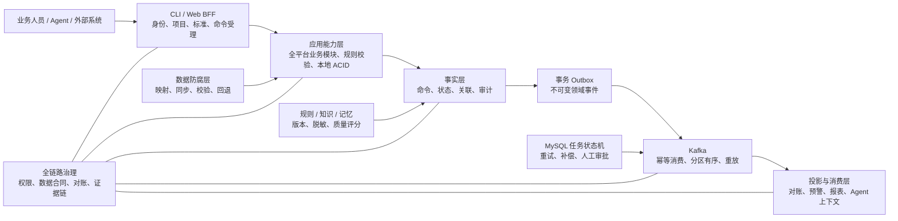

> Languages: [English](./2026-08-12-data-platform-cli-design.en.md) | [简体中文](./2026-08-12-data-platform-cli-design.zh-CN.md)

# Data Platform Full-Platform CLI Architecture Design

> Design Version: 1.4 · Coverage Manifest Baseline: `dev@d2eeaca4c3fb562b9f064a6229178365998e68e4` · Manifest Generation Time: 2026-08-12T02:19:27.335Z

## 1. Conclusion

Data Platform will introduce a new `data-platform` CLI installable globally via npm. Instead of starting or calling an Express HTTP service, the CLI operates within an independent Node.js process. It leverages the publishable `@johnason/data-platform-core` aggregate package to reuse the same application capabilities, permission policies, project contexts, and data access layers as the Web version, connecting directly to MySQL, DataX, Kafka, and JDBC runtimes. Shared capabilities are provided by a transport-neutral kernel and 21 exact version business module packages; the CLI does not reference repository-local backend source code.

The architecture adopts a "deterministic synchronous command processing with asynchronous event-driven aggregation" pattern: synchronous commands complete business validation, authoritative data writes, audit facts, and transaction Outbox appending within a local ACID transaction; a daemon publishes Outbox events to Kafka, and consumers use an Inbox to perform deduplication for reconciliation, alerting, reporting, and Agent context projection. Cross-module long-running tasks utilize a MySQL-persisted state machine and daemon workers, without introducing Temporal.

This design uses the user-provided Data Platform functional entry points and API manifests as the coverage baseline, explicitly including 84 frontend access points, 23 mounted business modules, 590 module routes, and 6 application-level direct interfaces, totaling 596 APIs. Existing Web API routes and behaviors remain compatible; the CLI shall not serve as a backdoor to bypass user permissions, read-only restrictions, or project isolation.

## 2. Goals and Non-Goals

### 2.1 Goals

- Install via `npm install -g @johnason/data-platform-cli`, with the primary command being `data-platform`.
- Cover all platform business domains and establish a CLI capability mapping for every existing Express route, or provide written justification for non-applicability.
- Support both one-shot subcommands and a default REPL, both utilizing the same command registry.
- Support human, JSON, NDJSON, and explicit file outputs to satisfy requirements for personnel, scripts, and Agents.
- Strictly enforce current valid platform login sessions, user status, module permissions, read-only restrictions, project membership, and project isolation rules.
- Use the system keychain to store database passwords and short-term platform sessions; platform user passwords shall not be stored.
- Support reliable asynchronous processing via transactional Outbox, Kafka, Inbox, task state machines, retries, dead-letter queues, compensation, and evidence chains.
- Provide a headless HTTP daemon to host the scheduler, worker, Kafka consumer, and necessary data service runtime.
- Maintain Web API behavior compatibility and progressively enable Web and CLI to share the same application services.
- Publish shared capabilities as a kernel, 21 independent business module packages, and an aggregate core; each module must pass itemized risk gate, real package rollback, and re-upgrade acceptance.
- Use a machine-verifiable traceability matrix to prove that `596/596` APIs and `84/84` frontend entry points have been assigned CLI capability surfaces; any addition, deletion, or modification of an entry point must update the matrix first.

### 2.2 Non-Goals

- Do not call the local or remote Data Platform backend via HTTP.
- Do not allow the CLI to bypass application services to operate on the repository directly.
- Do not introduce Temporal or other external workflow engines.
- Do not implement license or activation logic in the first phase. Existing `activation` and `license-feature` are empty implementations; the CLI will maintain the same behavior but reserve shared policy extension points.
- Do not provide an implicit administrator mode or permission bypass parameters.
- Do not write passwords, Tokens, model keys, or other sensitive information into plain configuration files, logs, or command outputs.

### 2.3 Coverage Manifest Sources and Version Boundaries

This design utilizes the following three assets rather than inferring functionality solely from repository directories or example routes:

| Asset | Purpose | SHA-256 |
|---|---|---|
| `api-inventory.json` | Machine manifest of 596 APIs, 23 modules, and 84 frontend entry points | `6cd896d1e38fb54ebd8317842eb618c4a28ede4eecf5e09f5bfb16374d696d0f` |
| `PROJECT_OPERATION_MANUAL.md` | Module objectives, operational steps, I/O, full interface directory, and runtime boundaries | `619cf9c139ebd49788acd8a1a7440d5d8574cb9034b4bb7e13de1a14ca8db350` |
| `project-operation-knowledge-graph.html` | Relationships between personnel, pages, modules, APIs, data, infrastructure, and governance rules | `1fa8acde4615bc6bed8af23ad277fde1089643781bbb1414dd45d5302c03468f` |

The manifest scanning baseline is `dev@d2eeaca4c3fb562b9f064a6229178365998e68e4`. Before CLI implementation, this commit must be inventory-diffed against the actual implementation branch: new interfaces enter the scope, deleted interfaces retain migration notes, and signature changes update input/output contracts. Passing tests on older branches cannot substitute for manifest alignment.

The machine traceability file is [`data-platform-cli-coverage-baseline.json`](./data-platform-cli-coverage-baseline.json), generated by `scripts/generate-cli-coverage-baseline.js`. Each API in the traceability file includes the suggested CLI command, action, interaction type, I/O method, sync/async mode, authentication, project scope, feature guard, validation schema, confirmation requirements, and source code location; each frontend entry point includes its corresponding CLI capability surface.

### 2.4 Full API Coverage Matrix

The route coverage for the 23 business modules is as follows, totaling 590 module routes:

| API module | Route count | CLI capability |
|---|---:|---|
| Authentication & Session `auth` | 4 | `auth` |
| Project Space `projects` | 17 | `project` |
| Platform Overview `platform` | 1 | `platform` |
| Asset Search `asset-search` | 8 | `asset-search` |
| Data Map `data-map` | 41 | `data-map` |
| Data Standards `data-standards` | 31 | `standard` |
| Data Source Ingestion `data-sources` | 9 | `datasource` |
| Data Research `data-source-research` | 18 | `source-research` |
| Data Modeling Sources `data-modeling-sources` | 9 | `data-lab source` |
| Ingestion Tasks `ingestion-tasks` | 14 | `ingestion` |
| File Imports `file-imports` | 11 | `file-import` |
| Model Providers `model-providers` | 5 | `model-provider` |
| Ingestion AI Configs `ingestion-ai-configs` | 2 | `ingestion ai-config` |
| Development AI Configs `dev-ai-configs` | 2 | `development ai-config` |
| Reporting AI Configs `reporting-ai-configs` | 2 | `reporting ai-config` |
| System Management `system-management` | 27 | `system` |
| Knowledge Bases `system-knowledge-bases` | 12 | `knowledge-base` |
| Data Development `data-development` | 82 | `development` |
| Data Modeling Lab `data-modeling` | 135 | `data-lab` |
| Quality Control `quality-control` | 87 | `quality` |
| Data Services `data-services` | 30 | `service` |
| Data Service Runtime `service-runtime` | 2 | `service invoke` |
| Reporting Platform `reporting` | 41 | `reporting` |

The list also includes 6 application-level direct interfaces not present in the module route files above; these must be explicitly mapped, and omissions are prohibited:

| Direct Interface | CLI Mapping |
|---|---|
| `GET /api/health` | `system doctor health` |
| `GET /api/v1/platform/database-capabilities` | `system doctor database-capabilities` |
| `GET /api/v1/jobs/:id` | `job show <id>` |
| `POST /api/auth/login` | Compatibility entry for `auth login`; do not duplicate business logic |
| `GET /api/auth/profile` | Compatibility entry for `auth profile`; do not duplicate business logic |
| `GET /api/v1/reporting/runtime/dashboards/:id` | `reporting runtime dashboard show <id>` |

The 596 APIs are categorized by transport type into 230 JSON reads, 339 JSON writes, 12 multipart uploads, 13 downloads, and 2 streaming interfaces. The CLI uses a unified adaptation for each type:

| API Interaction | Quantity | CLI I/O Contract |
|---|---:|---|
| `json-read` | 230 | flags/query → human table/detail or JSON envelope |
| `json-write` | 339 | flags or `--file` JSON/YAML → JSON envelope; write operations are subject to idempotency and auditing |
| `multipart` | 12 | `--file`/`--files` + flags; preserves filename, type, size, and checksum evidence |
| `download` | 13 | `--output` must be specified; validates file existence, size, checksum, and format |
| `stream` | 2 | human stream or NDJSON; logs to stderr; cancellation signals allow for safe termination |

### 2.5 Full Coverage of Frontend Functional Entry Points

The 84 frontend entry points are grouped by CLI capability domain as follows. The traceability matrix must retain every specific path; completion cannot be declared based solely on the summary counts in this table:

| Functional Entry Domain | Entry Count | CLI Capability |
|---|---:|---|
| Asset Search | 3 | `asset-search` |
| Data Development & Processing | 13 | `development`, `development processing`, `development scheduling` |
| Data Ingestion, Files & Research | 6 | `datasource`, `source-research`, `ingestion`, `file-import` |
| Data Map | 6 | `data-map` |
| Data Modeling | 10 | `data-lab` |
| Data Standards | 8 | `standard` |
| Platform Overview | 1 | `platform` |
| Quality Control | 10 | `quality` |
| Reporting Platform | 8 | `reporting` |
| Data Services | 8 | `service` and its datasource/app/authorization/usage/audit/ops subgroups |
| System Management | 11 | `system`, `project`, `model-provider`, `knowledge-base` |

For each page entry, the CLI coverage target is the business actions triggered by the user and the readable business states on the page, rather than presentation layer details such as page layout, CSS, or drag-and-drop gestures. A page can only be marked `verified` when all the following conditions are met:

1. All APIs called by the page are associated with at least one implemented CLI capability;
2. Purely frontend operations that carry business significance have an equivalent CLI input (e.g., a graph editor using `--file` to receive a graph model);
3. Downloads, uploads, streaming, previews, and long-running tasks generated by the page all have corresponding CLI I/O contracts;
4. Page permissions, project isolation, and read-only restrictions are covered by Web/CLI contract testing;
5. Purely presentational functions with no CLI significance must be individually marked `notApplicable` with a provided reason; whole-page exemptions are not permitted.

### 2.6 Coverage Status and Hard Gates

The traceability matrix uses four statuses:

- `designed`: CLI capability and I/O strategy assigned, but implementation is not claimed.
- `implemented`: Command registry, application service, and adapter are all present.
- `verified`: Web/CLI contract tests and CLI subprocess tests passed.
- `notApplicable`: Only permitted for presentation-layer capabilities without business semantics; requires written justification and review records.

CI must perform coverage validation and satisfy:

```text
API inventory total       = 596
API mapped                = 596
API unmapped              = 0
Frontend entry total      = 84
Frontend entry mapped     = 84
Frontend entry unmapped   = 0
Duplicate API key         = 0
Unknown CLI group         = 0
Stale source fingerprint  = 0
```

Official release also requires all entries to converge from `designed` to `verified` or reviewed `notApplicable`. Mapping command names alone does not constitute completion.

## 3. Overall Architecture



A successful synchronous command indicates deterministic acceptance by the platform, rather than the completion of all asynchronous projections. Callers requiring final state must use `--wait`, `job wait`, or query the corresponding authoritative entity.

## 4. CLI Product Model

### 4.1 Invocation Methods

```bash
data-platform --json datasource list
data-platform --project prj_01 development query execute --sql-file query.sql
data-platform quality task run task_01 --wait
data-platform reporting dashboard export dash_01 --format docx --output report.docx

# 无子命令时进入 REPL
data-platform
data-platform[prod/project-a]> datasource list
```

One-off commands and REPL share command definitions, validation, permission metadata, output formats, and execution contexts, avoiding dual implementations.

### 4.2 Business Command Groups

- Foundation: `auth`, `config`, `project`, `platform`.
- Data Assets: `asset-search`, `data-map`, `standard`.
- Data Ingestion: `datasource`, `source-research`, `ingestion`, `ingestion ai-config`, `file-import`.
- Model & Modeling: `model-provider`, `data-lab`.
- Development & Quality: `development`, `development ai-config`, `quality`.
- Service & Reporting: `service`, `service invoke`, `reporting`, `reporting ai-config`.
- Platform Management: `knowledge-base`, `system`, `system doctor`.
- Semantics & Acceptance: `ontology`, `acceptance aviation-ontology`.
- Governance & Reliability: `event`, `job`, `reconcile`, `audit`, `daemon`.

Command groups allow multiple API aliases or multiple page entries to converge into the same application capability, but each command must reverse-list its coverage sources via `sourceApiKeys` and `sourceFrontendKeys`. An API can only share a capability with another API when explicitly marked as an alias, preventing "similar-looking commands" from omitting different business semantics.

### 4.3 Unified Command Rules

- All commands support `--help` and global `--json`.
- List commands uniformly support pagination, filtering, and field selection.
- Complex creation or updates are handled via JSON/YAML through `--file`; sensitive values are provided via interactive input, stdin, or keychain references.
- Long-running tasks uniformly support `--wait` and `--timeout`, returning a task ID usable with `job status`.
- Dangerous commands such as delete, overwrite, publish, production execution, replay, and compensation require interactive confirmation; non-interactive calls must explicitly pass `--yes`.
- Idempotent write commands accept `--idempotency-key`. Duplicate keys return the original acceptance result without re-executing business side effects.
- When business logic supports it, `--dry-run` is provided, with results clearly marked as not committed.
- CLI output includes `auditId`; asynchronous operations also include `commandId`, `jobId`, or event-related IDs.

## 5. Command Registry and Business Adaptation

The command registry is the single source of truth for help text, parameter schema, permission validation, risk level, documentation, and `SKILL.md`. Each command declares:

```js
{
  command: "quality task run",
  capabilityId: "quality.task.run",
  sourceApiKeys: ["POST /api/v1/quality-control/tasks/:id/run"],
  sourceFrontendKeys: ["/dashboard/quality-control/tasks"],
  executionTargets: [
    { kind: "database", engine: "mysql", role: "platform-authority" },
    { kind: "database", engine: "postgresql", role: "business-datasource" }
  ],
  modules: ["quality"],
  action: "execute",
  mutates: true,
  destructive: false,
  idempotent: true,
  inputSchema,
  outputSchema,
  handler
}
```

Command data flow:

```text
参数 / stdin / JSON或YAML文件
          ↓
Command Schema（解析、默认值、Zod 校验）
          ↓
ExecutionContext（会话、权限、项目、审计）
          ↓
Aggregate Core → Versioned Module Capability（Web 与 CLI 共享）
          ↓
Repository / MySQL / DataX / Kafka / JDBC
          ↓
Result DTO → human table / JSON / NDJSON / 文件
```

Directory responsibilities are as follows; module versioning, risk gate, and progressive upgrade/rollback details for test environments are subject to [`2026-08-12-shared-core-risk-gates-and-rollback-design.md`](./2026-08-12-shared-core-risk-gates-and-rollback-design.md):

```text
packages/data-platform-core-kernel/
├── contracts/                    # capability、错误、结果、模块版本合同
├── runtime/                      # 会话、权限、项目、事务与 ExecutionContext
└── infrastructure/               # Outbox、Inbox、Kafka、任务状态机

packages/data-platform-module-*/  # 21 个独立版本业务模块
├── package.json                  # 精确 module/schema 版本
└── src/                          # capability、Service、Repository、adapter

packages/data-platform-core/      # 聚合 manifest、能力目录与运行时工厂

backend/src/
├── common/middleware/            # Express policy adapter
└── modules/                      # route/controller 与迁移期兼容导出

packages/data-platform-cli/
├── package.json                  # @johnason/data-platform-cli
├── bin/data-platform.js
└── src/
    ├── commands/<domain>/        # 参数与 Result DTO 适配
    ├── registry/                 # 命令元数据与能力清单
    ├── runtime/                  # profile、钥匙串、连接池、上下文、审计
    ├── output/                   # human、JSON、NDJSON、文件、脱敏
    ├── repl/                     # 默认交互模式
    └── daemon/                   # scheduler、worker、PID、锁、日志
```

Existing controllers are not called by the CLI. Orchestration logic for shared controllers must be moved into versioned module capabilities; controllers should only handle HTTP I/O, while CLI adapters handle command-line I/O. Web and CLI must only depend on the aggregate core; cross-package references to `src` paths are prohibited.

## 6. Profile, Keychain, and Login Sessions

### 6.1 Environment Profile

`data-platform config profile add <name>` creates an environment. Standard configuration files only store:

- Profile name;
- MySQL host, port, database name, and username;
- Non-sensitive runtime locations or references for Kafka, DataX, JDBC, etc.;
- Current profile and current project.

Database passwords are stored in macOS Keychain, Windows Credential Manager, or Linux Secret Service. If the platform cannot use the system keychain, the command must explicitly fail with repair instructions rather than degrading to plaintext files.

### 6.2 Login

`data-platform auth login` reads database credentials from the keychain, reads the platform user password via hidden input, and calls the existing `authService.login()`. User passwords exist only briefly within the current process and are not saved. Generated short-term JWTs and session identifiers are stored in the system keychain.

`auth logout` revokes the database session and deletes the short-term token from the keychain. Session idle timeouts, expiration, revocation, user deactivation, or permission changes take effect upon the execution of the next command.

## 7. ExecutionContext and Permission Consistency

Every business command requiring login executes the following workflow:

1. Establishes an isolated MySQL connection pool based on the profile.
2. Verifies the JWT signature and validates the active session in `auth_sessions`.
3. Updates the session activity timestamp and re-reads the user profile.
4. Checks module permissions and read-only action permissions against the command registry.
5. Parses `--project`, the profile's current project, or the user's default project to verify project membership.
6. Creates `auditId`, `commandId`, principal, and trace context.
7. Invokes the application service using the existing `AsyncLocalStorage` project context.
8. Completes output masking and releases resources (connections, Kafka/JDBC, etc.) used during the call.

Web middleware will also progressively call the same policy instead of continuing to maintain implicit URL-to-permission rules separately. Contract tests are retained during migration to ensure existing API permission behavior remains unchanged.

The License and activation policy initially returns "allowed," consistent with current empty middleware behavior; the calling points and interfaces must physically exist so that Web and CLI can be synchronized when rules are enabled in the future.

## 8. Synchronous Transactions, Facts, and Outbox

### 8.1 Local Transaction Boundary

A write command completes within a single MySQL transaction:

1. Idempotency key acquisition or original result query;
2. Writing authoritative business data;
3. Appending command acceptance and audit facts;
4. Appending one or more Outbox events;
5. Finalizing the idempotency result;
6. Committing the transaction.

If any step fails, everything is rolled back. The CLI returns success only after a successful commit.

### 8.2 Immutable Facts

Outbox business facts are append-only; delivery is not marked by updating the event body. An event must include at least:

- `eventId`, `eventType`, `eventVersion`;
- `occurredAt`, `projectId`, `aggregateType`, `aggregateId`;
- `actor`, `commandId`, `auditId`, `correlationId`, `causationId`;
- Data contract version, masked payload, and verifiable digest.

Delivery leases, retry counts, Kafka offset, and the last error are stored in a separate delivery table to preserve original event evidence.

## 9. Kafka, Inbox, and Projections

- Kafka keys use `projectId + aggregateType + aggregateId` to ensure ordering within a partition for the same business entity.
- The producer uses stable event IDs; the consumer writes an idempotency record to the Inbox before executing projections or side effects.
- Consumer failures are categorized into immediate retry, delayed retry, or dead-letter; non-retryable errors go directly to manual intervention.
- `event replay` replays only a selected event range and requires authorization, reason, confirmation, and auditing; replay does not modify original events.
- Reconciliation, alerts, reports, and Agent context prioritize reading derived projections; transaction states and strong consistency checks read authoritative business tables.
- Projections must be rebuildable from immutable events and must record the projection checkpoint, version, and data contract.

## 10. No HTTP Daemon and Task State Machine

### 10.1 Daemon Responsibilities

The `data-platform daemon` does not start Express and does not listen on HTTP ports. Each profile runs at most one daemon, responsible for:

- Outbox publishing;
- Kafka consumer and projections;
- Existing schedulers (ingestion, development, data-lab, quality, backup, etc.);
- MySQL persistent task workers;
- Necessary data service runtimes;
- Retries, dead-letter, compensation, and recovery after manual approval.

Commands include `start`, `status`, `logs`, `restart`, `stop`, and foreground `run`. PID files and process locks prevent duplicate starts within the same profile.

At startup, it checks database connections, schema versions, DataX, Kafka, JDBC, and driver status, but does not implicitly execute migrate or seed. Migrations and initialization must be completed via explicit `system migrate` and `system seed`.

### 10.2 Task State Machine

Task states are:

```text
pending → running → succeeded
             ├──→ waiting_approval → pending
             ├──→ compensating → succeeded | failed
             └──→ failed
```

Workers use database leases to preempt tasks; the lease includes owner, deadline, and heartbeat. If a daemon crashes, expired leases can be reclaimed by other workers. Retry strategies save attempt counts, next execution time, error classification, and backoff parameters.

No general-purpose distributed transactions are implemented. Cross-module failures are handled via explicit compensation commands; both original and compensation events are preserved. Manual approval records the approver, reason, pre/post states, and the chain of evidence.

Standard tasks execute with the task creator as the execution principal; account, module permissions, and project membership are re-verified before every actual run. System cleanup, session expiration, and backup tasks use an explicit `system` principal and write audit records.

Upon daemon exit, it stops accepting new tasks, waits for current transactions to reach a safe point, commits checkpoints, and then closes connection pools, Kafka, and JDBC resources.

## 11. Anti-Corruption Layer and Rules, Knowledge, Memory

DataX, external databases, Kafka, model providers, and file imports enter the application layer uniformly through an adapter. The adapter is responsible for:

- Mapping external fields to platform data contracts;
- Validation of types, versions, required fields, and boundaries;
- Classification of retryable and non-retryable errors;
- Timeout, rollback, and circuit breaker boundaries;
- Credential referencing and output masking;
- Associating external requests with internal audit IDs.

Rules, knowledge, and Agent memory all include versioning, project scope, source, masking level, and quality scores. Agent context is generated from governed facts and projections, rather than directly concatenating raw database records or logs.

## 12. Output, Files, and Error Contracts

### 12.1 Output

- human mode uses tables, summaries, and clear diagnostics.
- JSON mode stdout outputs only a single `{success,data,meta,auditId}` document; logs are written to stderr.
- AI streaming events and runtime logs use NDJSON in JSON mode, with each line containing a stable `type`.
- DOCX, Excel, PDF, and imported files must use `--output` or `--file`; binary data must not be mixed into stdout.
- Passwords, Tokens, model keys, and database passwords must never be returned in any mode.

### 12.2 Errors

```json
{
  "success": false,
  "error": {
    "code": "MODULE_PERMISSION_FORBIDDEN",
    "message": "当前角色无权访问该功能模块",
    "retryable": false,
    "details": {}
  },
  "auditId": "..."
}
```

Exit codes stably distinguish: success, invalid input, unauthorized, insufficient permissions, resource not found, conflict, dependency unavailable, partial success, and internal error. Automatic retries are only used for operations explicitly marked as idempotent in the command registry and where errors are classified as retryable.

## 13. Audit, Reconciliation, and Chain of Evidence

All commands and background tasks carry `auditId`, `commandId`, `correlationId`, and `causationId`. `audit show` can trace from a command acceptance through to business facts, Outbox, Kafka, Inbox, projections, tasks, compensation, and final output.

`reconcile` compares authoritative business tables, facts, Outbox delivery, Kafka consumption checkpoints, and key projections, generating discrepancies without automatic overwriting. Fixes must be executed via explicit, auditable compensation or reconstruction commands.

## 14. Testing and Acceptance

### 14.1 Single-Phase Refactoring and Two-Stage Testing

All CLI capabilities are completed in a single refactoring phase. The core runtime, reliability foundation, 23 business modules, 596 API mappings, 84 functional entry points, daemon, ontology tools, and aviation acceptance cannot be split into multiple independent delivery phases; internal task groups and commits are used solely for review and fault localization.

After all code is complete, two stages of testing are executed sequentially using the same installation package:

1. **API Call Testing**: Here, API refers to the CLI calling external APIs, AI model providers, or published data service runtimes via the shared application service, not calling Data Platform Express. It covers real responses, pagination, array paths, filtering, timeouts, rate limiting, retries, streaming NDJSON, cancellation, idempotency, dead-letter, authorization, auditing, and secret masking.
2. **Database Access Testing**: Sequentially verifies MySQL, PostgreSQL, Oracle, and Dameng. It covers connections, schema/table/column, CRUD, SQL, pagination, transaction rollback, DataX/JDBC, dialects, type conversion, project isolation, idempotency, connection failure, and driver-missing diagnostics.

Any code fix invalidates previous test evidence: if code is modified after API testing, the process must restart from API testing before executing the four database tests. If Oracle or Dameng environments are unavailable, the entire database testing stage status is `blocked`; it cannot be claimed as passed via skip or mock.

Unit tests, Web/CLI contract tests, fault injection, subprocess, global installation, and Agent acceptance are retained but unified under the two gates above: pure local base tests run before the API stage; database-related integration tests enter the database stage according to the target engine.

### 14.1.1 Command Execution Target Classification

The command registry and itemized coverage matrix must declare `executionTargets`:

```js
executionTargets: [
  { kind: "api", provider: "external-api" },
  { kind: "database", engine: "postgresql", role: "business-datasource" }
]
```

- API provider is restricted to `external-api`, `model-provider`, and `service-runtime`.
- Database engine is restricted to `mysql`, `postgresql`, `oracle`, and `dm`.
- Platform authoritative metadata, login, projects, permissions, auditing, tasks, and assets must be at least marked as `database/mysql`.
- Data source, development, ingestion, quality, service, and report commands must declare their actual supported engines; runtime dynamic commands must return the actual target in the JSON `meta.executionTargets`.
- Composite commands that read from an external API and write to a database must declare both API and database targets and enter two testing segments.
- `help`, version, general configuration viewing, and local graph validation can be declared as `{ kind: "local" }`; these do not enter the two business testing denominators but still require unit and subprocess tests.
- If any non-local business command lacks an API or database classification, the risk gate coverage fails.

### 14.2 Full Platform Completion Criteria

- The coverage checklist must show `596/596` APIs and `84/84` frontend entries mapped, with unmapped, duplicate key, unknown group, and stale fingerprint all at 0.
- All business commands must have execution target classifications; `unclassifiedBusinessCommands = 0`.
- Every API must be associated with a registered capability and retain `sourceApiKeys` in the registry; every frontend entry must be associated with `sourceFrontendKeys`.
- All checklist items must be `verified` or reviewed as `notApplicable`; `designed` or `implemented` statuses cannot proceed to formal release.
- Each business domain must have at least one closed-loop test using a real database.
- All dangerous commands, long-running tasks, streaming outputs, and file I/O must have subprocess tests.
- Outbox/Inbox, task state machines, retries, dead letters, replays, compensations, and evidence chains must all have fault injection tests.
- All existing Web API regression tests must pass.
- Packages must be globally installable after `npm pack`; `data-platform --help`, REPL, JSON output, and the daemon must be runnable from any directory.
- `SKILL.md` must be self-contained with installation instructions, command groups, JSON/NDJSON, error handling, dangerous operations, and real workflow examples.

### 14.3 `build-aviation-ontology` Skill End-to-End Acceptance

The CLI business acceptance baseline uses the externally provided `build-aviation-ontology/SKILL.md`. Since this Skill source file does not belong to this repository, the version is locked via content summary:

| Skill Asset | SHA-256 |
|---|---|
| `build-aviation-ontology/SKILL.md` | `be6646cfa4e499e21c97152ee5b2311afbd0a2f995e4966af7656e47ea03f64c` |
| `build-aviation-ontology/references/reference-workflow.md` | `474ea88c6bcdb0662515f4117a8f14eaa9ba2182eec2a0bc26bd4bfd80b2199f` |

For the complete machine acceptance specification, see [`aviation-ontology-cli-acceptance.json`](./aviation-ontology-cli-acceptance.json). This specification maps the seven stages of the Skill—Environment Baseline, Data Ingestion, RED initial run, ODS governance, Ontology & Lineage, Platform Loading, and GREEN acceptance—to specific CLI commands, evidence, and failure conditions.

#### 14.3.1 Acceptance Conclusion Standards

The goal of acceptance is not to prove that all 596 APIs have command names, but to prove that an Agent can complete a real business closed-loop by reading only the following three types of materials:

1. `build-aviation-ontology/SKILL.md`;
2. `data-platform --help` and help for various command levels;
3. CLI JSON/NDJSON output and generated local evidence files.

Aside from installing/starting the CLI, providing non-sensitive input files, injecting credential references into the system keychain, and starting external dependencies, all Agent operations—including reading, writing, uploading, waiting, exporting, verifying, and evidence collection on the platform—must be performed via `data-platform`. The following bypasses will result in acceptance failure:

- Using `curl` or direct HTTP;
- Using browser operations instead of platform verification;
- Using `mysql`, `psql`, or other direct database clients;
- Directly importing backend controller/service/repository;
- Executing `bootstrap-aviation-demo.js` or other repository bootstrap scripts;
- Manually modifying the database to force a "green" acceptance result.

The CLI may reuse application services, adapters, DataX/JDBC, and database transactions; what is prohibited is the Agent bypassing the CLI interface. The acceptance tool detects bypasses through process auditing, command traces, and evidence chain logging.

#### 14.3.2 Seven-Stage CLI Acceptance Pipeline

| Stage | Capabilities that must be completed by CLI | Core Evidence |
|---|---|---|
| Environment & Baseline | `system doctor`, project unique reverse lookup, write permission check, asset package pre-check, dependency/baseline check | Actual project ID, profile, dependency status, existing failure classifications |
| Data Ingestion & ODS | Data source testing, API/file preview, task creation, execution, waiting, execution details | Input/filter/write/reject counts, target tables, business keys, cursors, outlier handling |
| RED Initial Run | Create quality tasks, run, save immutable snapshots, generate reports | Statistics for NULL/empty string/duplicate/type/temporal/code/system errors and expected failures |
| ODS Governance | Pre-check SQL, transactional governance SQL, standard metadata, field mapping, dictionaries, and quality rules | Pre- and post-counts, no dropped rows, preservation of original duplicates, de-duplication at the consumption layer |
| Ontology & Lineage | Contract verification/import/comparison, lineage verification/import, rule executability checks | Entities/relationships/rules, join conditions, field key roles, no dangling references |
| Platform Loading | Data maps, surveys, logical/physical models, knowledge bases, reports, graphs, simulation pages | Queryable IDs, resource count > 0, knowledge parsing/vector readiness, actual report rows, HTML artifacts |
| GREEN Final Acceptance | RED→GREEN comparison, search/report runtime, graph consistency, reconciliation, and reporting | Latest execution evidence, complete evidence chain, limitations/skipped items, no sensitive information |

The historical Aviation Demo can serve as a fixed regression fixture: project code `aviation_ontology_demo`, 7 ODS tables, 89 rows, 5 entities, 3 relationship types, 2 rules, and a previously verified graph of 40 nodes/57 edges/5 layers. However, these values only apply when the historical Demo contract is explicitly selected; new aviation projects must derive expected counts from input contracts. Hardcoding historical IDs (e.g., `7`), data source IDs, or historical counts as general assertions is prohibited.

#### 14.3.3 CLI Native Capabilities Supplementing the Skill

The 596 API mappings cover the existing business surface of the platform, but the Skill also requires cross-module semantic contracts and acceptance orchestration. The following new native CLI command groups are added; they do not introduce a second set of business logic but rather compose registered capabilities and invoke shared application services:

```text
data-platform ontology contract validate|import|show|diff
data-platform ontology lineage validate|import|show
data-platform ontology graph export|verify
data-platform ontology simulation export|verify
data-platform acceptance aviation-ontology preflight|run|verify|report
```

- `ontology contract` uses versioned JSON as the single source of truth for entities, relations, and rules, validating consistency across Markdown, SQL, models, and graphs.
- `ontology lineage` requires every edge to possess a subject, object, source/target table, source/target field, key role, and join condition, rejecting dangling endpoints.
- `ontology graph export` generates a single-file offline HTML supporting search, filtering, details, hierarchical, and force-directed layouts; the `verify` machine compares the contract against HTML nodes/edges.
- `ontology simulation export` maps weather, delays, capacity, and duty/rest constraints into interpretable decisions and provides structural validation.
- `acceptance aviation-ontology run` is a recoverable daemon job that records checkpoints across seven stages; it only orchestrates standard CLI capabilities and cannot call legacy bootstrap scripts or write directly to databases.
- `verify` must re-read authoritative data and the latest runtime status; passing based solely on command exit codes or stale artifacts is not accepted.
- `report` outputs project, branch/commit, environment, actual ID, ingestion count, RED/GREEN comparison, semantic asset count, knowledge-base/graph/report paths, test evidence, limitations, and skips; all data undergoes unified masking first.

Additionally, the following cross-interface operations must provide a native CLI facade and internally fallback to existing application capabilities: `project resolve`, `project access check`, `standard field-mapping apply`, `knowledge-base wait`, `knowledge-base search`, and `reconcile project`. These facades must not operate directly on the repository and must enter permission, project, idempotency, audit, and override registries.

#### 14.3.4 Conditions for Mandatory Failure

If any of the following occur, the aviation ontology Skill acceptance status must be `failed`; it cannot be marked as "partially successful" or "end-to-end passed":

- Inconsistency in CLI project context, governance execution, and platform asset project IDs;
- ODS metadata count is 0, or data map resource count is 0;
- Dangling references exist in relation endpoints or field lineage;
- Knowledge-base is out of sync, parsing failed, or vectors are not ready;
- Reports reference incorrect data sources, or datasets fail to return actual results;
- Dirty data causes constraint governance to execute only partially;
- Use of any prohibited bypass to complete platform operations or verification;
- Real dependencies such as Oracle, Dameng, or external APIs are unavailable, yet an end-to-end pass is claimed.

When external optional dependencies are truly unavailable, a `limited` status may be recorded, but the report must list the unverified boundaries; MySQL, PostgreSQL, Oracle, and Dameng are mandatory dependencies for this database acceptance; if any are unavailable, the entire test segment is marked `blocked` and cannot be released.

#### 14.3.5 Automation Pass Threshold

A formal release candidate must run twice in a clean environment: the first time to complete the build, and the second to verify idempotency via re-run. Both runs must be executed from any directory using the installed `data-platform` command and satisfy:

```text
acceptance workflow status             = succeeded
forbidden bypass count                 = 0
project ID mismatch                    = 0
ODS metadata count                     > 0
data-map resource count                > 0
dangling semantic endpoints            = 0
dangling lineage references            = 0
knowledge documents parse-success      = all
knowledge documents vector-ready       = all
report dataset real result rows        > 0
graph contract mismatch                = 0
second-run duplicate business keys     = 0
secret scan findings                   = 0
```

Specialized testing must also cover fixed Demo regression, dynamic project IDs, METAR `VRB`/`M`/`6+`, `NO_CURRENT_REPORT` (no current message), dirty data transaction rollback, daemon interruption recovery, knowledge-base timeout retry, erroneous report data sources, inconsistency between old graphs and new contracts, and the prohibition of false success when real dependencies are missing.

## 15. Single-Phase Delivery

The full platform CLI is delivered in a single transformation phase, completed in order of dependency within the phase: CLI basic runtime; deliverable kernel, 21 module packages, and aggregate core; audit, Outbox/Inbox, Kafka, task state machine, and daemon; all business modules; per-module risk gate, `0.1.0 legacy-accepted → 0.2.0 core-candidate → 0.1.0 rollback → 0.2.0 re-upgrade` test environment drills; multi-database adapters; ontology and aviation acceptance; coverage matrix, SKILL.md, and npm packages. Production does not execute shadow/canary deployments, nor does it hot-swap module code at runtime.

The phase exit threshold is: all 596/596 APIs and 84/84 functional entry points implemented and verified; all business commands categorized by API/database; API call tests passed; MySQL, PostgreSQL, Oracle, and Dameng database tests all passed; aviation ontology achieves two consecutive successful CLI-only runs with idempotency; Web regression, global installation, and secret scanning passed. If any condition is unmet, the entire phase remains `in_progress` or `blocked`, and partial phase completion cannot be declared.

## 16. Risks and Constraints

- The current controller may contain un-devolved business orchestration. These must be migrated to application services per use case to avoid the CLI reusing HTTP objects or duplicating logic.
- Current URL permission mapping contains historical differences in module naming. The command registry uses explicit modules and actions; during migration, contract tests must lock existing behavior and handle inconsistencies separately.
- npm global packages directly connect to various native or optional database drivers, posing high installation compatibility risks. Packages should lazy-load drivers based on capability and provide exact version diagnostics via `system doctor`.
- If Kafka or the daemon is temporarily unavailable, synchronous business transactions can still be submitted and queued in the Outbox; the system must expose backlog, oldest event age, and recovery status.
- The platform scope is large; the capability list is the sole basis for scope control and completion determination; "existing general commands" cannot be used as a substitute for per-route verification.
