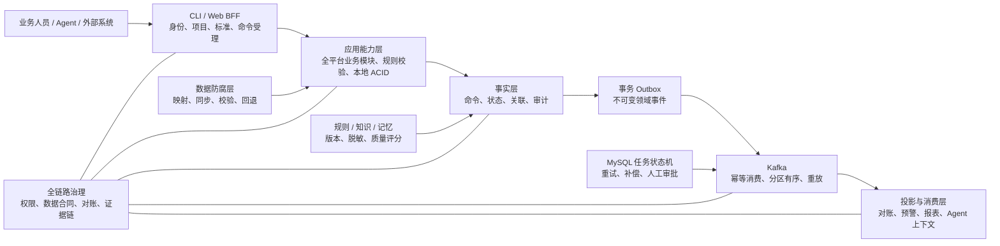

# Data Platform 全平台 CLI 化架构设计

## 1. 结论

Data Platform 将新增可通过 npm 全局安装的 `data-platform` CLI。CLI 不启动或调用 Express HTTP 服务，而是在独立 Node.js 进程中复用与 Web 相同的应用服务、权限策略、项目上下文和数据访问层，直接连接 MySQL、DataX、Kafka 与 JDBC 运行时。

架构采用“同步命令确定性受理、异步事件驱动归集”的模式：同步命令在一个本地 ACID 事务内完成业务校验、权威数据写入、审计事实和事务 Outbox 追加；daemon 将 Outbox 事件发布至 Kafka，消费者通过 Inbox 去重形成对账、预警、报表与 Agent 上下文投影。跨模块长任务使用 MySQL 持久化状态机和 daemon worker，不引入 Temporal。

本设计覆盖当前后端全部业务模块。现有 Web API 路由和行为保持兼容；CLI 不成为绕过用户权限、只读限制或项目隔离的后门。

## 2. 目标与非目标

### 2.1 目标

- 以 `npm install -g @johnason/data-platform-cli` 安装，主命令为 `data-platform`。
- 覆盖平台全部业务域，并为每条现有 Express route 建立 CLI 能力映射或书面说明其不适用原因。
- 支持一次性子命令和默认 REPL，两者使用同一个命令注册表。
- 支持 human、JSON、NDJSON 与显式文件输出，满足人员、脚本和 Agent 使用。
- 严格执行当前有效的平台登录会话、用户状态、模块权限、只读限制、项目成员关系和项目隔离规则。
- 使用系统钥匙串保存数据库密码与短期平台会话；平台用户密码不保存。
- 以事务 Outbox、Kafka、Inbox、任务状态机、重试、死信、补偿和证据链支撑可靠异步处理。
- 提供无 HTTP daemon，承载 scheduler、worker、Kafka consumer 和必要的数据服务 runtime。
- 保持 Web API 行为兼容，并使 Web 与 CLI 逐步共享相同应用服务。

### 2.2 非目标

- 不通过 HTTP 调用本机或远端 Data Platform 后端。
- 不让 CLI 直接绕过 application service 操作 repository。
- 不引入 Temporal 或其他外部工作流引擎。
- 不在首期补齐许可证或激活实现。现有 `activation` 与 `license-feature` 为空实现，CLI 保持相同行为，但预留共享 policy 扩展点。
- 不提供隐式管理员模式或权限绕过参数。
- 不把密码、Token、模型密钥或其他敏感信息写入普通配置文件、日志或命令输出。

## 3. 总体架构



同步命令成功表示平台已确定性受理，而不是所有异步投影均已完成。需要最终状态的调用方使用 `--wait`、`job wait` 或查询对应权威实体。

## 4. CLI 产品模型

### 4.1 调用方式

```bash
data-platform --json datasource list
data-platform --project prj_01 development query execute --sql-file query.sql
data-platform quality task run task_01 --wait
data-platform reporting dashboard export dash_01 --format docx --output report.docx

# 无子命令时进入 REPL
data-platform
data-platform[prod/project-a]> datasource list
```

一次性命令和 REPL 共享命令定义、校验、权限元数据、输出格式和执行上下文，不维护两套实现。

### 4.2 业务命令组

- 基础：`auth`、`config`、`project`、`platform`。
- 数据资产：`asset-search`、`data-map`、`standard`。
- 数据接入：`datasource`、`source-research`、`ingestion`、`file-import`。
- 模型与建模：`model-provider`、`data-lab`。
- 开发与质量：`development`、`quality`。
- 服务与报表：`service`、`reporting`。
- 平台管理：`knowledge-base`、`system`。
- 治理与可靠性：`event`、`job`、`reconcile`、`audit`、`daemon`。

### 4.3 统一命令规则

- 所有命令支持 `--help` 和全局 `--json`。
- 列表命令统一支持分页、筛选和字段选择。
- 复杂创建或更新通过 `--file` 接收 JSON/YAML；敏感值通过交互输入、stdin 或钥匙串引用提供。
- 长任务统一支持 `--wait`、`--timeout`，并返回可用于 `job status` 的任务 ID。
- 删除、覆盖、发布、生产执行、重放和补偿等危险命令要求交互确认；非交互调用必须显式传入 `--yes`。
- 幂等写命令接受 `--idempotency-key`。重复键返回原受理结果，不重复执行业务副作用。
- 业务支持时提供 `--dry-run`，结果明确标识未提交。
- CLI 输出包含 `auditId`；异步操作同时包含 `commandId`、`jobId` 或事件关联 ID。

## 5. 命令注册表与业务适配

命令注册表是帮助文本、参数 schema、权限校验、危险等级、文档和 `SKILL.md` 的单一事实来源。每条命令声明：

```js
{
  command: "quality task run",
  modules: ["quality"],
  action: "execute",
  mutates: true,
  destructive: false,
  idempotent: true,
  inputSchema,
  outputSchema,
  handler
}
```

命令数据流：

```text
参数 / stdin / JSON或YAML文件
          ↓
Command Schema（解析、默认值、Zod 校验）
          ↓
ExecutionContext（会话、权限、项目、审计）
          ↓
Application Service（Web 与 CLI 共享）
          ↓
Repository / MySQL / DataX / Kafka / JDBC
          ↓
Result DTO → human table / JSON / NDJSON / 文件
```

目录职责建议如下：

```text
backend/src/
├── application/                  # Web 与 CLI 共享的用例编排
│   └── <domain>/
├── common/policies/              # 会话、权限、项目、license/activation policy
├── infrastructure/events/        # Outbox、Inbox、Kafka、事件合同
├── infrastructure/jobs/          # 持久化任务状态机、租约、重试、补偿
└── modules/                       # 现有模块；controller 逐步瘦身

packages/data-platform-cli/
├── package.json                  # @johnason/data-platform-cli
├── bin/data-platform.js
└── src/
    ├── commands/<domain>/        # 参数与 Result DTO 适配
    ├── registry/                 # 命令元数据与能力清单
    ├── runtime/                  # profile、钥匙串、连接池、上下文、审计
    ├── output/                   # human、JSON、NDJSON、文件、脱敏
    ├── repl/                     # 默认交互模式
    └── daemon/                   # scheduler、worker、PID、锁、日志
```

现有 controller 不被 CLI 调用。需要共享的 controller 编排逻辑移入 application service；controller 只处理 HTTP 输入输出，CLI adapter 只处理命令行输入输出。

## 6. Profile、钥匙串与登录会话

### 6.1 环境 Profile

`data-platform config profile add <name>` 创建环境。普通配置文件只保存：

- profile 名称；
- MySQL 主机、端口、数据库名和用户名；
- Kafka、DataX、JDBC 等非敏感运行时位置或引用；
- 当前 profile 和当前项目。

数据库密码存入 macOS Keychain、Windows Credential Manager 或 Linux Secret Service。若平台无法使用系统钥匙串，命令明确失败并给出修复指引，不退化为明文文件。

### 6.2 登录

`data-platform auth login` 从钥匙串读取数据库凭据，通过隐藏输入读取平台用户密码，调用现有 `authService.login()`。用户密码只在当前进程内短暂存在，不保存。生成的短期 JWT 和会话标识保存在系统钥匙串。

`auth logout` 撤销数据库会话并删除钥匙串中的短期令牌。会话空闲超时、过期、撤销、用户停用或权限变化均在下一条命令执行时生效。

## 7. ExecutionContext 与权限一致性

每条需要登录的业务命令执行以下流程：

1. 根据 profile 建立隔离的 MySQL 连接池。
2. 验证 JWT 签名并在 `auth_sessions` 中验证活动会话。
3. 触碰会话活跃时间，重新读取用户 profile。
4. 根据命令注册表检查模块权限和只读动作权限。
5. 解析 `--project`、profile 当前项目或用户默认项目，验证项目成员关系。
6. 创建 `auditId`、`commandId`、principal 和 trace 上下文。
7. 使用现有 `AsyncLocalStorage` 项目上下文调用 application service。
8. 完成输出脱敏，释放连接、Kafka/JDBC 等本次调用资源。

Web 中间件也逐步调用相同 policy，而不是继续单独维护 URL 到权限的隐式规则。迁移期间保留契约测试，确保现有 API 权限行为不变。

License 与 activation policy 首期返回允许，与当前空中间件行为一致；调用点和接口真实存在，未来启用规则时 Web 与 CLI 可同步生效。

## 8. 同步事务、事实与 Outbox

### 8.1 本地事务边界

一个写命令在同一 MySQL 事务中完成：

1. 幂等键占用或原结果查询；
2. 权威业务数据写入；
3. 命令受理与审计事实追加；
4. 一个或多个 Outbox 事件追加；
5. 幂等结果固定；
6. 事务提交。

任一步失败则全部回滚。CLI 只在提交成功后返回成功。

### 8.2 不可变事实

Outbox 业务事实只追加，不通过更新事件正文来标记投递。事件至少包含：

- `eventId`、`eventType`、`eventVersion`；
- `occurredAt`、`projectId`、`aggregateType`、`aggregateId`；
- `actor`、`commandId`、`auditId`、`correlationId`、`causationId`；
- 数据合同版本、脱敏后的 payload 与可验证摘要。

投递租约、尝试次数、Kafka offset 和最后错误存放在独立 delivery 表，保留原始事件证据。

## 9. Kafka、Inbox 与投影

- Kafka key 使用 `projectId + aggregateType + aggregateId`，保证同一业务实体在分区内有序。
- producer 使用稳定事件 ID；consumer 先写 Inbox 幂等记录，再执行投影或副作用。
- consumer 失败根据错误分类进入立即重试、延迟重试或死信；不可重试错误直接进入人工处置。
- `event replay` 只重放选定事件范围，并要求权限、原因、确认和审计；重放不会修改原事件。
- 对账、预警、报表和 Agent 上下文优先读取派生投影；交易状态和强一致判断读取权威业务表。
- 投影必须可由不可变事件重建，并记录 projection checkpoint、版本和数据合同。

## 10. 无 HTTP Daemon 与任务状态机

### 10.1 Daemon 职责

`data-platform daemon` 不启动 Express，不监听 HTTP 端口。每个 profile 最多运行一个 daemon，负责：

- Outbox 发布；
- Kafka consumer 与投影；
- 现有 ingestion、development、data-lab、quality、备份等 scheduler；
- MySQL 持久化任务 worker；
- 必要的数据服务 runtime；
- 重试、死信、补偿与人工审批后的恢复。

命令包括 `start`、`status`、`logs`、`restart`、`stop` 和前台 `run`。PID 文件与进程锁防止同 profile 重复启动。

启动时检查数据库连接、schema 版本、DataX、Kafka、JDBC 与驱动状态，但不隐式执行 migrate 或 seed。迁移与初始化必须由显式 `system migrate`、`system seed` 完成。

### 10.2 任务状态机

任务状态为：

```text
pending → running → succeeded
             ├──→ waiting_approval → pending
             ├──→ compensating → succeeded | failed
             └──→ failed
```

worker 使用数据库租约抢占任务，租约包含 owner、截止时间与心跳。daemon 崩溃后，过期租约可被其他 worker 回收。重试策略保存尝试次数、下次执行时间、错误分类和退避参数。

不实现通用分布式事务。跨模块失败由显式补偿命令处理，原始事件与补偿事件都保留。人工审批记录审批人、理由、前后状态与证据链。

普通任务以任务创建者为执行 principal；每次实际运行前重新检查账号、模块权限和项目成员关系。系统清理、会话过期和备份任务使用明确的 `system` principal 并写审计记录。

daemon 退出时停止领取新任务，等待当前事务到安全点，提交 checkpoint，然后关闭连接池、Kafka 与 JDBC 资源。

## 11. 数据防腐层与规则、知识、记忆

DataX、外部数据库、Kafka、模型供应商和文件导入统一通过 adapter 进入应用层。adapter 负责：

- 外部字段到平台数据合同的映射；
- 类型、版本、必填项和边界校验；
- 可重试与不可重试错误分类；
- 超时、回退和熔断边界；
- 凭据引用和输出脱敏；
- 外部请求与内部审计 ID 关联。

规则、知识和 Agent 记忆均带版本、项目范围、来源、脱敏级别和质量评分。Agent 上下文从经过治理的事实与投影生成，不直接拼接原始数据库记录或日志。

## 12. 输出、文件与错误契约

### 12.1 输出

- human 模式使用表格、摘要和清晰诊断。
- JSON 模式 stdout 只输出一个 `{success,data,meta,auditId}` 文档，日志写 stderr。
- AI 流式事件和运行日志在 JSON 模式使用 NDJSON，每行包含稳定 `type`。
- DOCX、Excel、PDF、导入文件必须使用 `--output` 或 `--file`，不向 stdout 混入二进制。
- 密码、Token、模型密钥、数据库连接密码在任何模式中都不可返回。

### 12.2 错误

```json
{
  "success": false,
  "error": {
    "code": "MODULE_PERMISSION_FORBIDDEN",
    "message": "当前角色无权访问该功能模块",
    "retryable": false,
    "details": {}
  },
  "auditId": "..."
}
```

退出码稳定区分：成功、输入无效、未登录、权限不足、资源不存在、冲突、依赖不可用、部分成功和内部错误。自动重试只用于命令注册表明确标记为幂等、且错误被分类为可重试的操作。

## 13. 审计、对账与证据链

所有命令和后台任务贯穿 `auditId`、`commandId`、`correlationId` 与 `causationId`。`audit show` 可从命令受理追踪至业务事实、Outbox、Kafka、Inbox、投影、任务、补偿与最终输出。

`reconcile` 比较权威业务表、事实、Outbox 投递、Kafka 消费 checkpoint 和关键投影，生成差异而不自动覆盖。修复必须通过显式、可审计的补偿或重建命令执行。

## 14. 测试与验收

### 14.1 五层测试

1. **单元测试**：命令 schema、注册表、输出、脱敏、权限映射、幂等键、任务状态机和错误分类。
2. **共享服务契约测试**：同一输入分别经过 Web controller 与 CLI adapter，验证权限判定与业务结果一致。
3. **集成测试**：使用真实 MySQL 与 Kafka，验证本地 ACID + Outbox、Inbox 去重、分区顺序、重试、死信、重放、租约回收和补偿。
4. **CLI/daemon E2E**：全局安装后从任意目录调用，验证登录、profile、项目切换、全平台关键闭环、文件导入导出、daemon 重启和崩溃恢复。
5. **Agent 验收**：Agent 仅依赖 `--help`、`SKILL.md` 和 JSON 输出完成数据接入、开发、质量、服务与报表端到端任务。

### 14.2 全平台完成条件

- 每条现有 Express route 都映射到 CLI 命令，或在能力清单中记录经审查的不适用原因。
- 每个业务域至少有一个使用真实数据库的闭环测试。
- 所有危险命令、长任务、流式输出和文件输入输出均有 subprocess 测试。
- Outbox/Inbox、任务状态机、重试、死信、重放、补偿和证据链均有故障注入测试。
- 现有 Web API 回归测试全部通过。
- `npm pack` 后的包可全局安装，`data-platform --help`、REPL、JSON 输出和 daemon 可从任意目录运行。
- `SKILL.md` 自包含安装、命令组、JSON/NDJSON、错误处理、危险操作和真实工作流示例。

## 15. 分阶段交付

全平台能力进入首个正式版本，但采用垂直闭环分批实现：

1. CLI 基础运行时：package、registry、profile、钥匙串、登录、ExecutionContext、输出与 REPL。
2. 可靠性底座：审计事实、幂等命令、Outbox/Inbox、Kafka、任务状态机和 daemon。
3. 核心数据闭环：project、datasource、development、ingestion、quality。
4. 资产与建模：asset-search、data-map、standard、source-research、file-import、model-provider、data-lab。
5. 服务与消费：service、reporting、knowledge-base、system。
6. 能力清单收口、全域 E2E、故障注入、Agent 验收、文档与 npm 包验证。

每个阶段都必须保持 Web API 回归通过，并交付可独立验证的命令闭环。

## 16. 风险与约束

- 当前 controller 中可能包含未下沉的业务编排。必须逐用例迁入 application service，避免 CLI 复用 HTTP 对象或复制逻辑。
- 当前 URL 权限映射存在模块命名历史差异。命令注册表使用显式模块与 action，迁移时通过契约测试锁定现有行为并单独处理不一致项。
- npm 全局包直连多种原生或可选数据库驱动，安装兼容性风险高。包应按能力延迟加载驱动，并在 `system doctor` 中给出精确诊断。
- Kafka 或 daemon 暂时不可用时，同步业务事务仍可提交并积压 Outbox；系统必须暴露 backlog、最老事件年龄和恢复状态。
- 全平台范围较大，能力清单是范围控制和完成判定的唯一依据；不得以“已有通用命令”替代逐路由核对。

