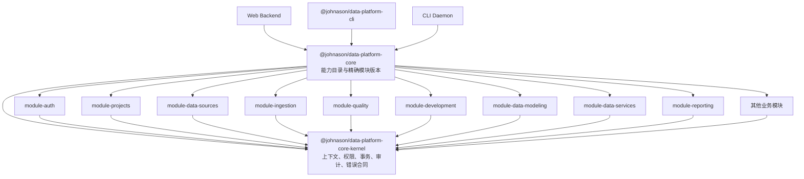
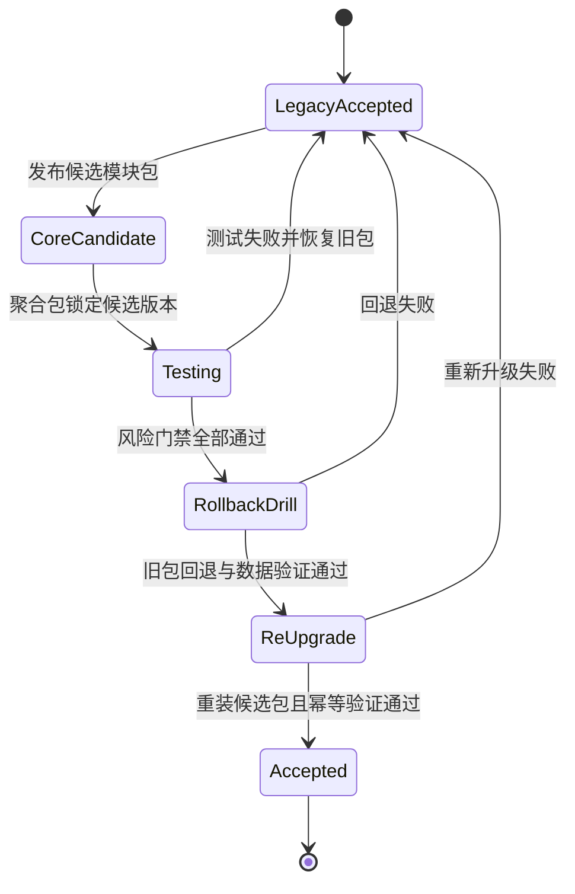

# Data Platform 共享核心风险门禁与模块版本回退设计

> 设计版本：1.0 · 适用分支：`codex/data-platform-cli` · 日期：2026-08-12

## 1. 结论

Data Platform CLI 共享核心采用“共享内核、独立业务模块包、聚合能力包、Web/CLI 双入口适配器”的结构。每个业务模块以精确版本发布和锁定；迁移时直接替换原 Service 实现，不保留生产运行时 legacy 路由。渐进升级、风险逐项验收、真实回退和重新升级全部在测试环境完成，生产不使用 shadow 或 canary。

模块只有完成风险门禁、上一验收版本回退演练、回退后数据一致性验证以及候选版本重新升级幂等验证，才能标记为 `accepted`。任一模块失败时，该模块恢复上一验收包；其他无依赖模块可继续测试，但全平台单阶段交付保持 `in_progress`。

## 2. 已确认决策

- 回退粒度：业务模块级。
- 实现切换：直接替换 Service，不提供运行时双实现路由。
- 回退载体：私有 npm Registry 中的模块版本包。
- 自动回退：只读能力可在调用级依赖故障时按既有重试策略返回明确错误；写能力进入事务或命令受理后禁止自动换版本重放。模块实现失败通过停止入口、排空任务、恢复上一验收包并重新部署完成回退。
- 渐进范围：仅测试环境执行逐模块升级、回退、重新升级；生产不执行 shadow/canary。
- 数据库回退：不运行降级脚本；Schema 使用 expand/contract，至少兼容当前候选版本与上一验收版本。
- 发布结论：生产只能使用所有模块均为 `accepted` 的聚合版本。

## 3. 包与依赖架构



### 3.1 依赖规则

允许：

```text
backend-web ─┐
             ├─> data-platform-core ─> module-* ─> core-kernel
cli/daemon ──┘
```

禁止：

- core 或 module 包依赖 Express、Commander、`backend/src/app.js` 或 CLI Keychain。
- backend 依赖 CLI。
- CLI 使用相对路径引用 backend 源码。
- module 包使用源码相对路径跨模块调用。
- 包版本使用 `latest`、`^`、`~` 或其他非精确范围。
- core-kernel 反向依赖业务 module。

跨模块协作必须通过 core-kernel 定义的 capability/port 接口。循环依赖和隐式共享单例均为门禁失败。

### 3.2 包职责

`@johnason/data-platform-core-kernel` 负责：

- `ExecutionContext`、身份、项目、权限和许可证策略。
- 数据库运行时接口、事务、幂等、审计、Outbox/Inbox 和持久化任务合同。
- 稳定错误码、结果 DTO、capability 定义和版本兼容检查。
- Kafka、DataX、文件、外部 API 和数据库 adapter 的 port 接口。

`@johnason/data-platform-module-*` 负责：

- 本模块 application capability、Service、Repository、adapter 和 schema。
- `moduleName`、`moduleVersion`、`capabilitySchemaVersion` 和来源 API/前端入口元数据。
- 本模块的单元、合同、API/数据库、故障注入和回退证据生成器。

`@johnason/data-platform-core` 负责：

- 聚合全部模块能力目录。
- 精确锁定模块版本和完整性哈希。
- 拒绝 capability 重复、缺失、schema 不兼容或来源键冲突。
- 向 Web、CLI 和 daemon 暴露相同的 capability lookup/execute 接口。

Web Backend 保留 Express、路由、参数提取、上传中间件、HTTP 文件响应、状态码转换和 Server 生命周期。CLI 保留 Commander、Profile、OS Keychain、REPL、输出、退出码和 daemon 进程控制。

## 4. 模块清单与版本 Manifest

每个现有业务模块对应一个可独立回退的模块包。聚合 manifest 至少包含：

| 现有模块目录 | 模块包 |
|---|---|
| `asset-search` | `@johnason/data-platform-module-asset-search` |
| `auth` | `@johnason/data-platform-module-auth` |
| `data-development` | `@johnason/data-platform-module-data-development` |
| `data-lab` | `@johnason/data-platform-module-data-lab` |
| `data-lab-sources` | `@johnason/data-platform-module-data-lab-sources` |
| `data-map` | `@johnason/data-platform-module-data-map` |
| `data-services` | `@johnason/data-platform-module-data-services` |
| `data-source-research` | `@johnason/data-platform-module-data-source-research` |
| `data-sources` | `@johnason/data-platform-module-data-sources` |
| `data-standards` | `@johnason/data-platform-module-data-standards` |
| `dev-ai-configs` | `@johnason/data-platform-module-dev-ai-configs` |
| `file-imports` | `@johnason/data-platform-module-file-imports` |
| `ingestion-ai-configs` | `@johnason/data-platform-module-ingestion-ai-configs` |
| `ingestion-tasks` | `@johnason/data-platform-module-ingestion-tasks` |
| `model-providers` | `@johnason/data-platform-module-model-providers` |
| `platform` | `@johnason/data-platform-module-platform` |
| `project-spaces` | `@johnason/data-platform-module-project-spaces` |
| `quality-control` | `@johnason/data-platform-module-quality-control` |
| `reporting` | `@johnason/data-platform-module-reporting` |
| `system-knowledge-base` | `@johnason/data-platform-module-system-knowledge-base` |
| `system-management` | `@johnason/data-platform-module-system-management` |

根目录使用 npm workspaces 管理 kernel、21 个模块包、聚合 core、Web backend 和 CLI。开发时使用 workspace 链接；验收、回退和生产构建必须从私有 Registry 按 lockfile 安装，不能用 workspace 链接代替独立安装证据。

```json
{
  "aggregateVersion": "0.2.0",
  "kernelVersion": "0.2.0",
  "capabilitySchemaVersion": "1.0.0",
  "modules": {
    "quality-control": {
      "package": "@johnason/data-platform-module-quality-control",
      "version": "0.2.0",
      "integrity": "sha512-<registry-generated-integrity>",
      "rollbackVersion": "0.1.0",
      "status": "accepted"
    }
  }
}
```

实际 integrity 由 npm Registry/lockfile 生成，设计文档不保存虚构哈希。加载器验证 manifest、lockfile 和已安装包导出的版本三者一致。任一不一致时返回 `MODULE_VERSION_MISMATCH`，禁止启动 Web、CLI daemon 或执行业务命令。

## 5. 直接替换规则

迁移某一模块时：

1. 将原 Service、Repository、adapter 和 transport-neutral schema 移入对应模块包。
2. Controller 改为调用聚合 core capability；不保留 runtime legacy 分支。
3. 文件上传由 Web 转为 `{ path, originalName, mimeType, size, sha256 }`；core 不接收 Express `req/res`。
4. 文件下载由 core 返回 `{ path|buffer, filename, mimeType, size, sha256 }`，Web/CLI 各自渲染。
5. 请求上下文转换为 `{ actor, projectId, source, approvedHeaders, ipAddress, userAgent, auditId }`。
6. Repository 从 `ExecutionContext.databaseRuntime` 获取执行器，禁止导入全局 `pool`。
7. 环境配置、DataX 路径、Kafka、模型和外部 API 客户端通过 RuntimeDependencies 注入。
8. 原模块包的上一验收版本保留在 Registry；候选包不能覆盖或删除旧版本。

## 6. 风险逐项门禁

| 风险 | 必须执行的测试 | 通过标准 | 回退触发 |
|---|---|---|---|
| 数据库单例改为运行时注入 | 并发 profile 隔离、连接释放、跨项目隔离 | 连接串库 0；资源泄漏 0；项目越权 0 | 任一上下文串扰 |
| 事务边界变化 | 成功提交、异常回滚、进程中断、重复请求 | 业务数据、审计、Outbox 同事务；脏写 0 | 部分提交或重复事实 |
| Web 行为回归 | 旧 Controller 黄金基线与新 capability 对照 | 状态码、响应结构、权限结果无未批准差异 | 任一未批准差异 |
| CLI/Web 结果不一致 | 相同身份、项目和输入双入口对照 | 业务 DTO、权限、审计语义一致 | 数据或权限结果不一致 |
| 模块跨包依赖 | 包边界扫描、循环依赖、独立安装 | 反向依赖 0；循环依赖 0；源码跨包引用 0 | 出现隐式跨模块调用 |
| 后台任务重复执行 | 双进程启动、租约竞争、Kafka 重投 | 同一业务键只产生一个最终事实 | 重复消费或重复写入 |
| Oracle/达梦驱动兼容 | 真实数据库连接、CRUD、事务、分页、类型 | 禁止 mock；分类能力全部通过 | 驱动缺失或方言差异 |
| DataX 路径变化 | 任意 cwd 启动、插件/JAR 发现、读写任务 | 不依赖源码相对路径；读写成功 | 插件缺失或任务失败 |
| 外部 API 重试 | 超时、限流、断流、取消、幂等 | 重试受控；写调用不重复提交 | 非幂等重放或无限重试 |
| 凭据泄漏 | stdout/stderr、日志、审计、事件、错误扫描 | secret findings = 0 | 任一敏感信息出现 |
| npm 独立安装 | 临时前缀安装并从任意 cwd 执行 | 仓库文件读取 0；Express listener 0 | 模块缺失或源码依赖 |
| 模块版本不匹配 | manifest、lockfile、导出版本验证 | 只加载批准精确版本 | capability/schema 不兼容 |
| 数据库迁移不可逆 | 新旧模块读取同一升级后 schema | 当前及上一验收版本均可运行 | 旧模块无法启动或读取 |
| 回退机制失效 | 安装旧模块包并重跑验收 | 目标模块恢复；其他模块版本不变 | 回退构建或数据验证失败 |

任何风险项不允许 `skipped`。真实 Oracle、达梦或其他强制依赖不可用时，模块状态为 `blocked`，不是 `accepted`。

## 7. 单模块验收协议

每个模块严格按以下顺序执行：

1. 包边界、依赖方向、循环依赖和源码路径检查。
2. 单元测试。
3. capability 输入、输出、权限和错误合同测试。
4. Web 黄金基线回归。
5. CLI/Web 同身份、同项目、同输入对照。
6. 依据 `executionTargets` 执行外部 API 或 MySQL/PostgreSQL/Oracle/DM 专项测试。
7. 事务、网络、进程中断、Kafka 重投、连接失败等故障注入。
8. npm 临时前缀独立安装测试。
9. 候选版本升级测试。
10. 安装上一验收版本，执行真实模块回退演练。
11. 回退后的数据、审计、Outbox、任务和版本一致性验证。
12. 重新安装候选版本，重跑写命令并验证幂等。

每个模块生成机器可读证据：

```json
{
  "module": "quality-control",
  "candidateVersion": "0.2.0",
  "rollbackVersion": "0.1.0",
  "capabilitySchemaVersion": "1.0.0",
  "riskGates": {
    "dependencyBoundary": "passed",
    "runtimeIsolation": "passed",
    "transaction": "passed",
    "webCompatibility": "passed",
    "cliParity": "passed",
    "executionTargets": "passed",
    "faultInjection": "passed",
    "packageInstall": "passed",
    "schemaCompatibility": "passed",
    "rollbackDrill": "passed",
    "reUpgradeIdempotency": "passed"
  },
  "failures": 0,
  "secretFindings": 0,
  "accepted": true
}
```

证据必须记录命令、包版本、Node 版本、驱动版本、数据库版本、开始/结束时间和脱敏环境指纹。证据不得包含凭据、Token、连接密码或完整授权头。

## 8. 渐进升级状态机



状态定义：

- `legacy-accepted`：当前生产/基线使用的已验收旧模块。
- `core-candidate`：候选包已发布但未通过全部门禁。
- `testing`：测试环境已锁定候选版本并执行风险测试。
- `rollback-drill`：全部功能门禁通过，正在验证旧包恢复。
- `re-upgrade`：旧包验证通过，正在重新安装候选包并验证幂等。
- `accepted`：候选、回退、重新升级全部通过，可进入最终聚合版本。
- `blocked`：强制基础设施或真实数据库不可用。
- `failed`：功能、兼容、回退或证据校验失败。

## 9. 回退编排

模块回退按固定顺序执行：

1. 将目标模块入口置为维护状态，拒绝新写命令。
2. 等待同步事务结束；超过租约的任务进入显式补偿，不强制接管。
3. 停止目标模块 scheduler、Kafka consumer 和 job worker。
4. 保存 manifest、lockfile、模块包完整性、未完成任务和数据库事实摘要。
5. 将聚合 manifest 的目标模块版本恢复到 `rollbackVersion`；其他模块版本必须保持字节级一致。
6. 安装锁定依赖并验证实际导出版本。
7. 执行 schema compatibility、关键读写闭环、审计、Outbox/Inbox 和任务恢复测试。
8. 验证成功后恢复入口；失败则保持维护状态并标记 `failed`。

写命令进入事务或命令已受理后禁止自动调用旧版本重放。每个长任务记录 `moduleName` 和 `moduleVersion`；回退后由原版本完成，或转入显式补偿状态。

## 10. Schema 兼容与数据安全

Schema 使用 expand/contract：

```text
版本 N：增加新表/新列，旧结构继续可用
版本 N+1：新旧模块均可读写，完成双读兼容
版本 N+2：完成数据回填并停止旧字段写入
版本 N+3：旧版本退出回退窗口后才允许删除旧结构
```

约束：

- 回退不执行数据库降级脚本。
- 候选版本写入的数据必须能被上一验收版本安全读取或忽略。
- 破坏性 DDL、字段重命名和类型收窄必须延迟到旧版本退出回退窗口之后。
- 数据回填必须可断点续跑、幂等并生成事实摘要。
- 迁移脚本记录 schema version，但不得假设应用包一定已经升级。

## 11. 测试环境与生产边界

测试环境完成模块逐项迁移、升级、回退和重新升级。生产不执行 shadow 或 canary。生产部署前必须同时满足：

- 所有业务模块状态均为 `accepted`。
- 每个模块完成真实包回退和重新升级演练。
- 596/596 API 与 84/84 前端入口覆盖通过。
- `unclassifiedBusinessCommands = 0`。
- 外部 API 门禁通过。
- MySQL、PostgreSQL、Oracle、达梦真实数据库门禁通过。
- 航空本体 CLI-only 验收连续运行两次成功且无重复业务事实。
- Web 回归、CLI 独立安装、daemon、秘密扫描通过。
- 聚合 manifest、lockfile、包完整性和回退手册完整。

生产出现模块故障时，按第 9 节恢复目标模块的上一验收包并重新构建、部署 Web/CLI；不在运行中的 Node 进程内热切换代码。

## 12. 对现有代码的影响

- 现有 22 个 Controller 和 23 个 Route 文件留在 Web 层，逐模块改为调用 core capability。
- Service、Repository、adapter 迁入独立模块包；超大 Service 允许在迁移模块内部按职责拆分，但不做无关重构。
- 51 个直接数据库单例/驱动引用迁为 Runtime 注入。
- 业务代码中的环境变量读取迁为配置接口注入。
- `app.js`、`server.js`、Express middleware、HTTP response helper 和 multer 留在 backend。
- CLI 不读取 backend 源码目录，不导入 `app.js`，不监听端口。
- DataX、JDBC 驱动、文件和知识图谱资产路径必须来自安装包资源定位或显式配置，不能依赖当前工作目录。

## 13. 设计验收标准

该设计实现完成的判定条件：

```text
module packages accepted                 = all
dependency direction violations          = 0
dependency cycles                        = 0
source-relative cross-package imports    = 0
manifest/lock/export version mismatches  = 0
web contract unapproved differences      = 0
CLI/Web parity failures                  = 0
transaction partial commits              = 0
duplicate business facts                 = 0
secret scan findings                     = 0
rollback drill failures                  = 0
re-upgrade idempotency failures          = 0
API coverage                             = 596/596
frontend coverage                        = 84/84
```

任一项不满足时，全平台 CLI 单阶段改造不能标记完成。
